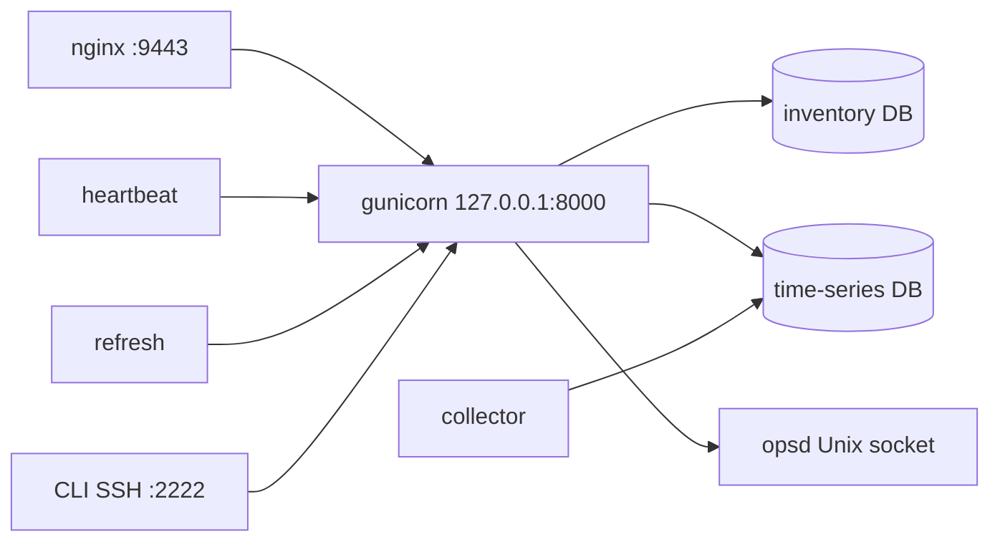

# LabVault

Lab inventory, topology, reservations, and telemetry for a network lab. One install covers the web UI, the fleet API, staff CLI, and the background workers that keep chassis and device data fresh.

LabVault is free of charge under the [MIT License](LICENSE). Community support is best-effort. There is no product SLA unless a release note says otherwise.

## Contents

- [What you can do](#what-you-can-do)
- [How a running install is put together](#how-a-running-install-is-put-together)
- [Requirements](#requirements)
- [Install](#install)
- [Sign in](#sign-in)
- [Day-to-day URLs](#day-to-day-urls)
- [Documentation](#documentation)
- [Develop](#develop)
- [What this repository does not contain](#what-this-repository-does-not-contain)
- [Contributing](#contributing)
- [Security](#security)
- [License](#license)

## What you can do

| Area | What it covers |
|------|----------------|
| Inventory | Devices and lab sites. Drivers for Arista, SONiC, FortiGate, Palo Alto, F5, Mellanox, and optical circuit switches. |
| Keysight / Ixia chassis | IxOS and KCOS/APS chassis: cards, ports, health, sensors, licenses, BMC associations, reservations. |
| Topology | LLDP discovery at `/topology/`, plus a lab designer for planned nodes, links, and scenarios. |
| Fabric | Port-level connectivity and snapshots on a lab topology. |
| Lab Pulse | Usage, timelines, and a change log stored in a separate time-series database. |
| Fleet API | Bearer-token JSON under `/api/fleet/` for automation. OpenAPI is in the tree. |
| Staff CLI | Browser console at `/cli/`, `POST /api/cli/v1/invoke/`, and SSH on port **2222**. Verbs are a fixed list. |
| Operations | `labvaultctl` and a root-owned broker (`opsd`) start and stop the app units. The broker does not mount a container socket. |
| Diagnostics | A bounded health report and support bundle for staff. |

Workers default to **idle** until you restore a dataset or set live mode. That keeps a fresh install from polling equipment before you mean it to.

## How a running install is put together



| Piece | Role |
|-------|------|
| nginx **9443** | Customer HTTPS. The first certificate is self-signed until you install `LABVAULT_TLS_CERT`. |
| gunicorn **8000** | Django, loopback only. |
| Inventory database | Devices, chassis, topologies, users, audit, CLI jobs. SQLite for a lab; PostgreSQL 15 for production on the systemd path. |
| Time-series database | Metric samples, rollups, and port-usage history. Kept separate from inventory. |
| heartbeat, collector, refresh | Fleet status, Lab Pulse samples, and the chassis port cache. |
| `opsd` | Allowlisted start/stop/restart on `/run/labvault/ops.sock`. |

The map of processes, caches, and subsystems is [docs/development/ARCHITECTURE.md](docs/development/ARCHITECTURE.md).

## Requirements

| | Minimum | Notes |
|--|---------|--------|
| OS | Rocky Linux 9 / RHEL 9, or Ubuntu 22.04 / 24.04 | Rocky is the usual bare-metal choice |
| Python | 3.10+ (3.11 preferred) | Django 5.2. Rocky’s stock `python3` is 3.9; the oneshot installs 3.11 |
| CPU / RAM / disk | 2 vCPU, 4 GiB, 40 GiB | 4 vCPU, 8 GiB, 80 GiB when telemetry is kept |
| LDAP build libraries | `openldap-devel` (Rocky) or `libldap2-dev` (Debian/Ubuntu) | Required before pip on bare metal |

Full matrix: [docs/install/REQUIREMENTS.md](docs/install/REQUIREMENTS.md).

## Install

Clone this repository, then run one oneshot **on the host that will serve LabVault**.

| Method | Command | Guide |
|--------|---------|--------|
| Docker Compose | `sudo ./deploy/install/oneshot-compose.sh` | [DOCKER](docs/install/DOCKER.md) |
| Bare metal / systemd | `sudo ./deploy/install/oneshot-systemd.sh` | [BARE_METAL](docs/install/BARE_METAL.md) |
| Air-gapped | `./deploy/install/build-wheelhouse.sh`, then `sudo ./deploy/install/oneshot-airgap.sh <wheelhouse>` | [AIRGAP](docs/install/AIRGAP.md) |
| Proxmox guest | Create a Linux VM, then run compose or systemd inside the guest | [PROXMOX](docs/install/PROXMOX.md) |

```bash
git clone https://github.com/Keysight/labvault.git
cd labvault

./labvaultctl host-deps
sudo ./deploy/install/oneshot-systemd.sh

# Optional: import a lab export on first boot (edit addresses and passwords first).
# sudo LABVAULT_RESTORE_DATASET=/path/to/export.json ./deploy/install/oneshot-systemd.sh
```

The shareable example dataset and the field checklist are in [docs/getting-started/DC8_PICKUP.md](docs/getting-started/DC8_PICKUP.md). Configuration lives in `.env` (Compose) or `/etc/labvault/labvault.env` (systemd). See [docs/install/CONFIGURATION.md](docs/install/CONFIGURATION.md).

Upgrade, rollback, and uninstall go through `./labvaultctl`. Guides: [UPGRADE](docs/install/UPGRADE.md), [ROLLBACK](docs/install/ROLLBACK.md), [UNINSTALL](docs/install/UNINSTALL.md).

## Sign in

The oneshot writes root-owned files (mode `0600`) and prints `credential_file=`.

```bash
sudo cat /var/lib/labvault/bootstrap-credentials
sudo cat /var/lib/labvault/fleet-token
```

Open `https://<host>:9443/login/`. Trust the self-signed certificate, or use `curl -k`, until you install an operator certificate ([docs/install/TLS.md](docs/install/TLS.md)).

Oneshot sets `LABVAULT_DEMO_DEFAULTS=1` so first login is `admin` / `labvault!`. A random file-only password is **not** the default unless you set `LABVAULT_BOOTSTRAP_RANDOM=1`. Rotate that password before anyone else uses the host. Steps: [docs/getting-started/FIRST_LOGIN.md](docs/getting-started/FIRST_LOGIN.md).

## Day-to-day URLs

| URL | Purpose |
|-----|---------|
| `https://<host>:9443/login/` | Web UI |
| `https://<host>:9443/health/live` | Liveness. No trailing slash. |
| `https://<host>:9443/health/ready` | Readiness. No trailing slash. |
| `https://<host>:9443/cli/` | Staff CLI |
| `https://<host>:9443/api/fleet/` | Fleet API index. Send `Authorization: Bearer <token>`. |
| `ssh -p 2222 admin@<host>` | Same staff CLI over SSH |

Browser calls use a session cookie. Fleet calls use the bearer token from `/var/lib/labvault/fleet-token`. Auth details: [docs/api/API_AUTH.md](docs/api/API_AUTH.md).

## Documentation

Start at [docs/INDEX.md](docs/INDEX.md). The module list is [docs/MODULES.md](docs/MODULES.md).

| If you need | Read |
|-------------|------|
| First lab, concepts, example import | [QUICKSTART](docs/getting-started/QUICKSTART.md), [CONCEPTS](docs/getting-started/CONCEPTS.md), [FIRST_LAB](docs/getting-started/FIRST_LAB.md) |
| Devices, chassis, topology, fabric, reservations, insights | [docs/user/](docs/user/) |
| Services, backup, users, monitoring | [docs/admin/](docs/admin/) |
| CLI verbs and service control | [docs/cli/](docs/cli/) |
| Fleet OpenAPI and tokens | [docs/api/](docs/api/) |
| Hardening, ports, threat model | [docs/security/](docs/security/) |
| Architecture, data flow, where to add a feature | [ARCHITECTURE](docs/development/ARCHITECTURE.md), [DATA_FLOW](docs/development/DATA_FLOW.md), [EXTENDING](docs/development/EXTENDING.md), [subsystems](docs/development/subsystems/) |

## Develop

```bash
export DJANGO_SECRET_KEY=$(python3 -c 'import secrets;print(secrets.token_urlsafe(48))')
export DJANGO_ALLOWED_HOSTS=localhost,127.0.0.1,testserver
python manage.py test connect.tests.test_hard_dump connect.tests.test_bootstrap_defaults --verbosity=1
python tools/check_public_source.py
python tools/check_docs.py
```

Local setup and the release process: [docs/development/DEVELOPMENT.md](docs/development/DEVELOPMENT.md), [docs/development/TESTING.md](docs/development/TESTING.md).

## What this repository does not contain

Capex, Hyperview, LAAS reserve, AI Nexus, Snappi, Demo Stage, and UHD hardware (bfshell/ucli). There is no free-form device shell. Distribution notes: [docs/distribution/CUSTOMER_DISTRIBUTION.md](docs/distribution/CUSTOMER_DISTRIBUTION.md).

## Contributing

Issues are welcome. External pull requests are reviewed after the repository’s contributor policy is confirmed.

1. Branch from `main`.
2. Keep the change inside the features this tree already ships.
3. Run the tests and both checkers in [Develop](#develop).
4. Leave out the product surfaces listed above.

Details: [CONTRIBUTING.md](CONTRIBUTING.md).

## Security

- Customer HTTPS is **9443**. Gunicorn stays on loopback **8000**.
- Do not mount `docker.sock`. Lifecycle goes through `opsd`.
- Health probes return status only. They do not list inventory.
- Report undisclosed vulnerabilities in private. See [SECURITY.md](SECURITY.md) and [docs/security/HARDENING.md](docs/security/HARDENING.md).

## License

[MIT License](LICENSE). Copyright (c) 2026 LabVault contributors.

The MIT grant lets someone who receives a copy share it. It does not sell licenses to this distribution. Read the notice at the top of [LICENSE](LICENSE) before you redistribute.
