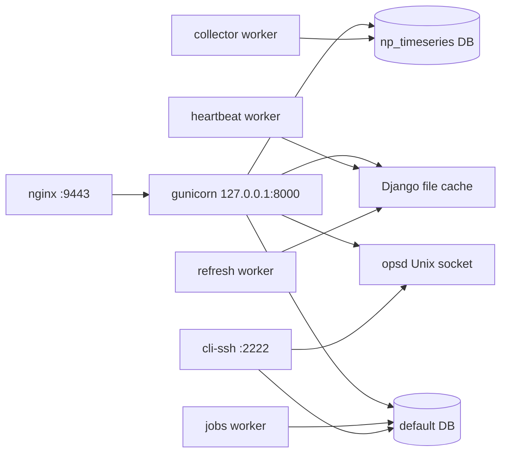

# Architecture

LabVault is one Django project (`labvault`) and one application (`connect`).
The same code runs as a web process, several long-running workers, an SSH CLI,
and a small root-owned operations broker. Customer installs omit Capex,
Hyperview, LAAS reserve, AI Nexus, Snappi, Demo Stage, and UHD hardware; those
packages are not in this tree.

This page is the map. Each subsystem has its own guide under
[subsystems/](subsystems/) with data-flow diagrams, module tables, and
extension steps. [DATA_FLOW.md](DATA_FLOW.md) follows the main pipelines end to
end. [EXTENDING.md](EXTENDING.md) is the short "where do I change X" index.
The app-level file list is [connect/README.md](../../connect/README.md).

## Processes

| Process | What it runs | Writes |
|---------|--------------|--------|
| `web` | Django via gunicorn (3 sync workers) | Pages, fleet JSON, device cache on demand |
| `heartbeat` | `run_fleet_heartbeat` | `fleet_heartbeat:v1`, chassis port cache |
| `collector` | `run_metric_collector` | `LabMetricSample` / events, insights snapshots |
| `refresh` | `run_labvault_refresh` | Keysight chassis cache, change-log rows |
| `jobs` | `run_cli_worker` | `CliJob` status (does not execute handlers) |
| `cli-ssh` | `run_cli_ssh` | `CliInvocation` audit rows |
| `opsd` | `opsd/opsd.py` | start/stop/restart of the units above |

nginx terminates TLS on **9443** and proxies to gunicorn on loopback **8000**.
opsd listens on `/run/labvault/ops.sock` and does not mount a container
socket. Full unit names, intervals, and deploy layouts:
[operations.md](subsystems/operations.md).

## Two databases

| Alias | Holds | Router |
|-------|--------|--------|
| `default` | Inventory, topologies, chassis, audit, CLI, settings | everything else |
| `np_timeseries` | Metric samples, hourly rollups, resource events, port-usage episodes | `connect/db_routers.py` |

Time-series tables are never mixed into the inventory database. Retention is
`cleanup_np_timeseries` (raw about 7 days, rollups and events about 31 days).

## Request path

`SecurityHeadersMiddleware` and the request-audit middleware wrap every HTTP
call. `connect/urls.py` dispatches to view modules. Login is session-based
(optional LDAP). Fleet and some chassis APIs also accept `Authorization:
Bearer <APIToken>`. Staff-only surfaces (CLI, diagnostics, Django admin) check
`is_staff`. Details: [core-web.md](subsystems/core-web.md).

Under gunicorn the in-process "refresh every 20s" thread in `views.py` does
**not** start. Device pages serve the shared file cache and refresh in the
background only when someone opens a stale page. Automatic device-down alerts
from that thread therefore do not fire in production.

## Subsystems

| Guide | Code | What it owns |
|-------|------|----------------|
| [core-web.md](subsystems/core-web.md) | `views.py`, `models.py`, `urls.py`, `settings.py`, auth | Pages, models, device cache, login |
| [drivers.md](subsystems/drivers.md) | `connect/drivers/`, `connect/keysight_drivers/` | How LabVault talks to switches, firewalls, OCS, IxOS, KCOS |
| [keysight-chassis.md](subsystems/keysight-chassis.md) | `keysight_*.py` | Chassis inventory, cards, ports, BMC, reservations |
| [fleet-api.md](subsystems/fleet-api.md) | `fleet_*.py` | `/api/fleet/*`, OpenAPI, heartbeat store |
| [topology.md](subsystems/topology.md) | `topology*.py`, `lldp_persistence.py` | Discovered LLDP map at `/topology/` |
| [lab-topology-designer.md](subsystems/lab-topology-designer.md) | `lab_topology_*.py` | Planned lab topologies, fabric, import/export |
| [ocs.md](subsystems/ocs.md) | `ocs_*.py`, `views_ocs_xconnect.py`, `drivers/ocs.py` | Optical switch panel, patches, snapshots |
| [metrics-insights.md](subsystems/metrics-insights.md) | `lab_metrics.py`, `metric_collectors.py`, `lab_usage_*.py` | Time series, Lab Pulse, change log |
| [diagnostics.md](subsystems/diagnostics.md) | `diagnostics*.py`, `log_ring.py` | Health report and support bundle |
| [cli.md](subsystems/cli.md) | `connect/labvault_cli/` | Staff CLI (browser, JSON, SSH) |
| [operations.md](subsystems/operations.md) | `management/commands/`, `opsd/`, `deploy/` | Workers, bootstrap, backup, install |

## Caches (shared file cache unless noted)

| Key / store | TTL | Writer | Reader |
|-------------|-----|--------|--------|
| `device_data:v1:<id>` | 600 s stored; OCS treated fresh for 180 s | `fetch_device_data` | Device page, OCS patch poll |
| `keysight:chassis_data:<id>` | 600 s | refresh worker, heartbeat port refresh | Chassis pages, fleet ports |
| `fleet_heartbeat:v1` | 24 h | heartbeat worker | Fleet summary, diagnostics |
| `keysight:node_assoc:v1` | 180 s | dashboard "refresh nodes" | Node slots on the dashboard |
| Port-fabric snapshot | DB row + 45 s / 600 s cache | fabric views, `refresh_topology_fabric_cache` | Fabric pages |
| LLDP persistent store | 24 h JSON file | discovery, `refresh_lldp` | Topology graph |
| Insights snapshot | file cache | collector | Lab Pulse page |

Cache helpers that tolerate permission errors are `connect/cache_utils.py`.

## What is intentionally absent

- Free-form device shells (`device_terminal`, `api_execute_command`) are not routed.
- CLI verbs are a fixed registry. `push_config` and lab-topology "push port config" are explicit, audited commands, not a shell.
- OCS `xconnect_deleteall` is only emitted by snapshot restore when the caller sets clear-first. The driver has no reboot operation.
- SNMP helpers on this SKU are stubs (`connect/snmp_utils.py`).
