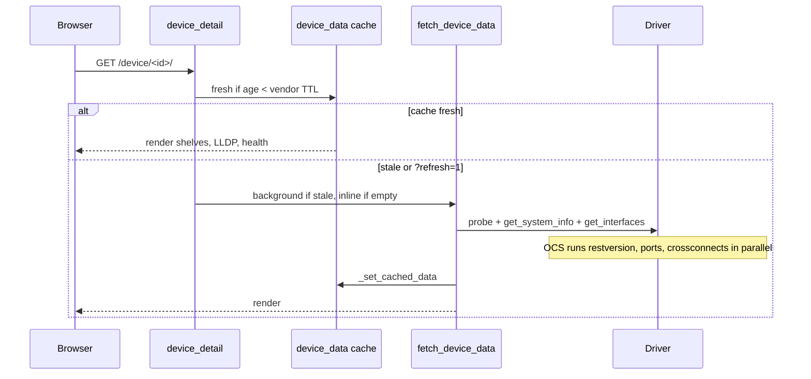
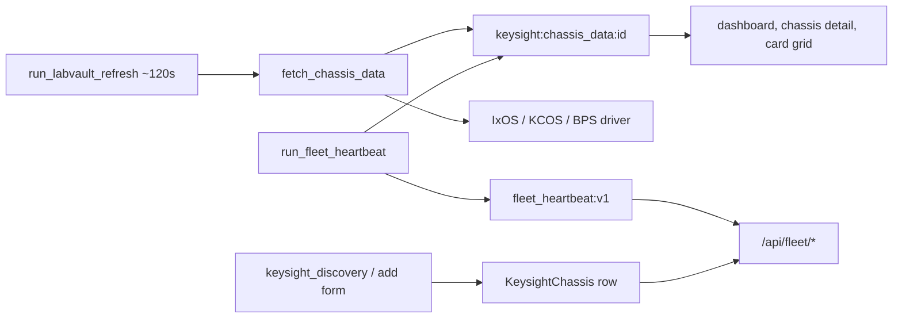
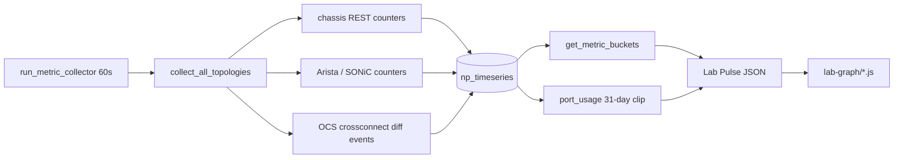
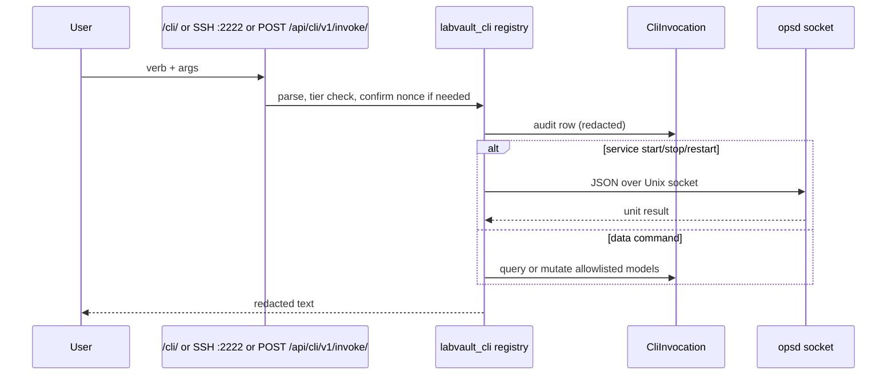

# Data flow

End-to-end pipelines. Each box names the function that does the work. Subsystem
pages linked from [ARCHITECTURE.md](ARCHITECTURE.md) have the sequence diagrams.

Addresses below are examples (`192.0.2.10`), not a lab.

## 1. Device page (switch, firewall, or OCS)

- Non-OCS: `probe()` then `get_system_info()` then `get_interfaces()` then LLDP.
  Driver choice is `connect.drivers.get_driver(device)` from `vendor_type`.
- OCS: `OcsDriver.fetch_ocs_sources_parallel()` (three REST calls), then
  `views._fetch_ocs_device_data` shapes shelves, patch pairs, and path-verify
  rows via `ocs_helpers`. The page polls `/device/<id>/ocs-patch.json` every
  25 s; `?refresh=1` clears the cache and fetches again.
- A successful cross-connect add/delete (`views_ocs_xconnect`) deletes the
  cache key and schedules a background refresh.
- Credentials stay on the `Device` row. Drivers do not log passwords.

Guide: [ocs.md](subsystems/ocs.md), [drivers.md](subsystems/drivers.md),
[core-web.md](subsystems/core-web.md).

## 2. Keysight chassis and fleet heartbeat

Card grids on the detail page are built from cached `/ports` telemetry when a
full fetch has not finished. The detail page may start one background full
fetch per chassis. Fleet clients authenticate with a Bearer `APIToken` or a
logged-in session.

Guide: [keysight-chassis.md](subsystems/keysight-chassis.md),
[fleet-api.md](subsystems/fleet-api.md).

## 3. Discovered topology vs planned lab topology

Two models, easy to confuse:

| | Discovered map `/topology/` | Lab designer `/lab-topology/` |
|--|-----------------------------|-------------------------------|
| Source of truth | LLDP from devices and chassis | Operator-drawn nodes and links |
| Tables | `TopologyLink`, `ChassisDeviceLink` | `LabTopology`, `LabTopologyNode`, `LabTopologyLink` |
| Refresh | `lldp_check`, `refresh_lldp`, rescan button | Import, save, `refresh_topology_fabric_cache` |
| Live overlay | neighbor match by hostname / IP / MAC | fabric view merges plan + live OCS + LLDP + DAC serials |

LLDP neighbors are also written to a 24-hour JSON store
(`lldp_persistence`) so a graph can still be drawn when a device is briefly
unreachable.

Guide: [topology.md](subsystems/topology.md),
[lab-topology-designer.md](subsystems/lab-topology-designer.md).

## 4. Metrics and Lab Pulse

`collector_mode` (runtime setting) defaults to idle on this SKU, so the
collector does not poll hardware until an operator sets it to live.
`CollectorState` keeps byte-counter baselines in memory; only those baselines
survive a process restart. Insights snapshots are refreshed at the end of
each collector tick.

Guide: [metrics-insights.md](subsystems/metrics-insights.md).

## 5. Staff CLI and service control

There is no OS shell and no free-form device shell. Service control is the
only path that starts or stops processes, and it goes through opsd.

Guide: [cli.md](subsystems/cli.md), [operations.md](subsystems/operations.md).

## 6. Import and export

| Format | Writer | Reader | Contains |
|--------|--------|--------|----------|
| `labvault-full-export` JSON | `export_labvault_dataset` / UI | `import_labvault_dataset` | Inventory, topologies, runtime modes |
| Multibundle `.tar.gz` | `export_labvault_bundle` | `import_labvault_bundle` | Inventory, topologies, site files, optional SQLite and secrets |
| Diagnostics tarball | `export_diagnostics --bundle` | support hand-off | Health JSON, optional logs |
| Site JSON | external or `import_ocs_site_config` | OCS helpers, topology populate | OCS triplets, switch ports, chassis |

Secrets are omitted unless the caller passes the include-secrets flag.
Guide: [operations.md](subsystems/operations.md).

## 7. First boot

Installer (`oneshot-systemd.sh`, Compose entry, or air-gap script) runs
migrations, then `bootstrap_labvault`. That command creates the admin user,
writes the initial password to a root-only file (not into the docs or the
database in clear text for later reads), creates the fleet API token file,
and applies runtime-setting defaults. `validate_external_config` runs before
gunicorn binds. Login steps for an operator are
[FIRST_LOGIN.md](../getting-started/FIRST_LOGIN.md).
