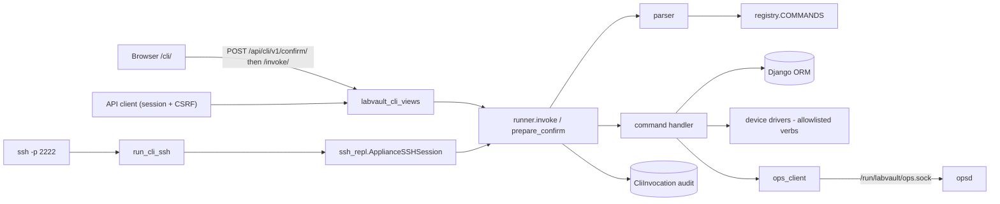

# LabVault CLI subsystem

The LabVault CLI is a staff-only command console with three front ends — the browser page
`/cli/`, a JSON API under `/api/cli/v1/`, and an SSH REPL on port 2222 — that all run the
same registry, parser, permission checks, and audit trail. It never exposes an OS shell or a
free-form device shell: every verb is a registered Python handler.

User-facing docs: [LABVAULT_CLI.md](../../cli/LABVAULT_CLI.md),
[COMMAND_REFERENCE.md](../../cli/COMMAND_REFERENCE.md),
[SERVICE_CONTROL.md](../../cli/SERVICE_CONTROL.md). Process and opsd details:
[operations.md](operations.md).

Related code:

| Module | Role |
|---|---|
| `connect/labvault_cli/registry.py` | `Command` dataclass, `@command` decorator, `COMMANDS` / `ALIASES`, `get_command()` |
| `connect/labvault_cli/commands/__init__.py` | Every command handler (importing it registers them) |
| `connect/labvault_cli/parser.py` | `parse_line()` (shlex, longest-match command names) and `parse_invoke_body()` |
| `connect/labvault_cli/runner.py` | `CliContext`, `invoke()`, `prepare_confirm()`, nonce store, `can_control_services()`, audit writer |
| `connect/labvault_cli/redact.py` | `redact_payload()` for args, results, and audit rows |
| `connect/labvault_cli/ops_client.py` | Unix-socket client for opsd (`list_services`, `status_service`, `lifecycle`) |
| `connect/labvault_cli/service_catalog.py` | Re-exports `opsd/service_catalog.py` so Django and opsd share one catalog |
| `connect/labvault_cli/ssh_auth.py` | CIDR allowlist, persistent auth throttle, staff password auth |
| `connect/labvault_cli/ssh_repl.py` | `ApplianceSSHSession` line REPL and the AsyncSSH `handle_client` callback |
| `connect/labvault_cli_views.py` | Browser page and `/api/cli/v1/*` views |
| `connect/management/commands/run_cli_ssh.py` | AsyncSSH server (`labvault-cli-ssh` unit / `cli-ssh` Compose service) |
| `connect/management/commands/run_cli_worker.py` | `CliJob` worker (`labvault-cli-worker` unit / `jobs` Compose service) |
| `connect/models.py` | `CliInvocation`, `CliJob`, `CliAuthThrottle`, `RuntimeSetting` |



## Registry

`@command(name, help, *, mutating=False, requires_confirm=False, tier="read", aliases=(), fields=(), guided=False)`
stores a `Command` in `COMMANDS[name]`.

- `name` may contain spaces (`"service restart"`); the parser matches the longest registered
  name first.
- Each alias is also stored as its own `COMMANDS` entry pointing at the same handler, with
  help text `Alias for \`name\``, and in `ALIASES`. `help` hides entries whose help starts
  with `Alias for`.
- `tier` is `read`, `privileged`, or `service_control`.
- `fields` and `guided` are UI hints: the browser form prompts for those fields in order.
- `Command.meta()` is what `GET /api/cli/v1/commands/` and `catalog_meta()` return.

Handlers take `request` as the first positional argument and keyword arguments for
everything else. `request` is a small stand-in object carrying `user`, `cli_source`
(`web`/`ssh`), `cli_request_id`, and `META["REMOTE_ADDR"]`. A handler returns a `dict`;
`state` defaults to `ok`, and `failed`, `denied`, or `partial_failure` mark the audit
outcome as not-ok.

### Command catalog

| Command (aliases) | Tier | Confirm | Does |
|---|---|---|---|
| `help [cmd]`, `commands` | read | — | Lists canonical names, or one command's help |
| `whoami` | read | — | Username, staff/superuser flags, `can_control_services` |
| `context` | read | — | Product and SKU identity |
| `show devices` (`device list`) | read | — | First `limit` devices |
| `device show <id_or_ip>` (`show device`) | read | — | One device by id, IP, or hostname |
| `show chassis` (`chassis list`) | read | — | Keysight chassis |
| `chassis show <id_or_ip>` (`show chassis detail`) | read | — | One chassis |
| `show topologies` (`topo list`) | read | — | Lab topologies |
| `show fleet` (`fleet health`) | read | — | Heartbeat mode and counts |
| `show settings` (`settings list`), `settings get <key>` | read | — | Runtime settings |
| `show insights` (`insights status`) | read | — | Collector and heartbeat modes |
| `show services [name]` (`service list`, `service status`) | read | — | opsd `list` / `status` |
| `reserve list` (`show reservations`) | read | — | Keysight reservations |
| `audit list` (`show audit`), `alerts list` (`show alerts`) | read | — | Recent audit / alert rows |
| `token list` | read | — | Caller's API tokens (4-character prefix only) |
| `history` | read | — | Recent `CliInvocation` rows |
| `smoke` | read | — | In-process GET of `/health/live` and `/health/ready` |
| `diag cheap` | read | — | Row counts and runtime modes |
| `settings set <key> <value>` | privileged | yes | `runtime_settings.set_setting` (validated against `SCHEMA`) |
| `device add ...` (`add device`) | privileged | yes | `Device.get_or_create` by IP |
| `device command <id_or_ip> <verb>` | privileged | yes | Driver call; `verb` ∈ `status`, `probe`, `lldp` |
| `lldp refresh <ip>` | privileged | yes | Driver `get_lldp_neighbors_detail()` |
| `reserve create <name> [notes]`, `reserve cancel <id>` | privileged | yes | One-hour reservation / set `cancelled` |
| `topo import <path>` | privileged | yes | Checks the file exists; import itself is done in the UI |
| `service start\|stop\|restart <name\|all> reason="..."` | service_control | nonce | opsd lifecycle; `all` only for `restart` |

## Parsing

`parse_line(line)`:

1. Reject empty input, more than 4096 characters, or more than 64 tokens; split with
   `shlex` (POSIX quoting).
2. Pick the longest registered name that prefixes the tokens; else `unknown_command`.
3. `key=value` tokens become keyword args (keys must be alphanumeric/underscore).
4. Remaining bare tokens fill the handler's unfilled parameters in signature order; extras
   go to `_extra` (never passed to handlers — the runner drops `_`-prefixed keys).
5. Values are coerced: integers, `true`/`false`, otherwise strings.

`parse_invoke_body(body)` accepts `{"line": "..."}` or `{"command": "...", "args": {...}}`;
a `command` that contains spaces and is not a registered name is re-parsed as a line.

Errors raise `ParseError(code, detail)`; the runner turns them into HTTP 400 with
`{"error": code, "detail": ..., "state": "failed"}`.

## Tiers and confirmation

`invoke()` always requires an authenticated, active, **staff** user (`staff_required` → 403).

| Tier | Extra requirement |
|---|---|
| `read` | none |
| `privileged` (mutating, `requires_confirm`) | superuser or `connect.control_labvault_services`; plus either a valid one-time nonce or the literal token `confirm` |
| `service_control` | `reason="..."`, superuser or `connect.control_labvault_services`, and a valid one-time nonce |

`can_control_services(user)` = staff and (superuser or `has_perm("connect.control_labvault_services")`).
The permission is defined on `CliInvocation.Meta.permissions`; `bootstrap_labvault` grants it
to the bootstrap admin.

Nonce lifecycle (`runner.py`):

1. `prepare_confirm()` (`POST /api/cli/v1/confirm/` or the SSH REPL before each line) parses
   the command, checks tier and reason, and stores a `secrets.token_urlsafe(24)` nonce bound
   to user id, source, session id, command, and reason. TTL 120 s. Non-mutating commands
   return 400 `confirmation_not_required`, which callers treat as "invoke directly".
2. `invoke()` pops the nonce (single use) and rejects `nonce_user_mismatch`,
   `nonce_source_mismatch`, `nonce_session_mismatch`, `nonce_command_mismatch`,
   `nonce_reason_mismatch`, or `invalid_or_expired_nonce`.

The nonce store is an in-memory dict guarded by a lock, so it is per process. The SSH server
is one process; gunicorn runs three workers (see
[operations.md](operations.md#known-limitations)).

## Invoke API

All endpoints are wrapped in `staff_required` (login + `is_staff`, else 403) and use the
Django session and CSRF cookie. There is no Bearer-token path for the CLI.

| Method + path | View | Body / response |
|---|---|---|
| `GET /cli/` | `cli_page` | HTML console; sets the CSRF cookie |
| `GET /api/cli/v1/commands/` | `cli_commands` | `{"commands": [Command.meta(), ...]}` |
| `POST /api/cli/v1/confirm/` | `cli_confirm` | `{"line": "..."}` or `{"command", "args"}` → `{"ok": true, "state": "accepted", "confirmation_required": true, "confirmation_nonce", "command", "args" (redacted), "action", "target", "reason", "expires_in_sec": 120}` |
| `POST /api/cli/v1/invoke/` | `cli_invoke` | `{"line": "..."}` or `{"command", "args"}`, optional `confirmation_nonce` (or `confirmation_token`) and `idempotency_key` → `{"ok": true, "result": {...redacted...}, "request_id"}` |
| `GET /api/cli/v1/jobs/<id>/` | `cli_job` | `{"id", "command", "status", "result"}` |
| `GET /api/cli/v1/history/` | `cli_history` | Last 100 `CliInvocation` rows |

Status codes from `invoke()`: 200 ok (the handler's own `state` may still be `failed`), 400
parse/validation/nonce errors and `invalid_args` (handler `TypeError`), 403
`staff_required`/`permission_denied`, 404 `unknown_command`, 500 `handler_failed` (the
exception text is not returned).

Example service restart from a script holding a staff session:

```bash
curl -sk -b cookies -H "X-CSRFToken: $CSRF" -H 'Content-Type: application/json' \
  -d '{"line":"service restart collector reason=\"rotate env\""}' \
  https://<host>:9443/api/cli/v1/confirm/
# → {"confirmation_nonce": "<nonce>", ...}
curl -sk -b cookies -H "X-CSRFToken: $CSRF" -H 'Content-Type: application/json' \
  -d '{"line":"service restart collector reason=\"rotate env\"","confirmation_nonce":"<nonce>"}' \
  https://<host>:9443/api/cli/v1/invoke/
```

The client address recorded for audit is the first `X-Forwarded-For` entry, else
`REMOTE_ADDR`.

## Redaction and audit

`redact_payload(obj)` walks dicts and lists. Any key matching
`password|passwd|secret|token|api[_-]?key|authorization|cookie|private[_-]?key|credential`
(case-insensitive) becomes `***REDACTED***`; strings have URL userinfo (`scheme://user:pass@`)
replaced with `***:***`. It is applied to the confirm echo, every invoke result, and the
audit row.

Every invoke that reaches a handler writes one `CliInvocation` (errors in the audit write
are swallowed):

| Field | Source |
|---|---|
| `actor`, `source` (`web`/`ssh`), `remote_addr` | `CliContext` |
| `command`, `args_redacted`, `reason`, `target` | parsed command; `target` = `name` or `target` arg |
| `outcome`, `result_state`, `result_redacted` | handler result (`ok`, `error`, or the handler `state`) |
| `idempotency_key`, `correlation_id`, `duration_ms` | request; `correlation_id` = `request_id` |

Parse errors and permission denials return before the handler and are not audited.
`idempotency_key` is recorded only; duplicate keys are not rejected.

## Service control path

`service start|stop|restart` handlers call `_lifecycle()`:

1. Require `name` and `reason`; reject names not in `SERVICES` (canonical names only on the
   Django side — opsd aliases are not accepted here).
2. For `all` (restart only): iterate `restart_all_targets(source)` in order
   heartbeat → collector → refresh → jobs → web (web omitted when the source is web), call
   opsd once per service, count failures, and return `partial_failure` if any failed.
3. Otherwise one `ops_client.lifecycle(action, name, source, reason, request_id)` call.

opsd then applies its own capability flags (for example `web` restart is `ssh_only`), so a
browser restart of `web` or an SSH restart of `cli-ssh` is denied even for superusers. See
[operations.md](operations.md#opsd--operations-broker) for the wire protocol.

## SSH front end

`run_cli_ssh` starts an AsyncSSH server:

- Host key: `LABVAULT_CLI_SSH_HOST_KEY` (default `/var/lib/labvault/cli-ssh/ssh_host_ed25519_key`),
  generated as ed25519 on first start, directory forced to 0700 and key to 0600.
- Password auth only. `validate_password` runs `ssh_auth.authenticate_staff` in a worker
  thread (`sync_to_async(thread_sensitive=False)`) because the ORM cannot run on the event
  loop.
- `authenticate_staff`: remote address must be inside `LABVAULT_CLI_SSH_ALLOW_CIDRS`
  (default loopback, RFC 1918, ULA); then the `CliAuthThrottle` row for
  `(username, remote_addr)` must not be locked; then Django `authenticate()` (falling back to
  `check_password`); then active + staff. Each failure sets `locked_until` with exponential
  backoff (1, 2, 4 … 60 s) and a 5-minute lock from the 8th failure; success deletes the row.
- No port forwarding, no SFTP/SCP, at most `LABVAULT_CLI_SSH_MAX_SESSIONS` (20) sessions,
  `LABVAULT_CLI_SSH_AUTH_TIMEOUT` (60 s) login timeout.
- The REPL prints `labvault> `, calls `prepare_confirm()` for each line, asks
  `Confirm <action> target=<t> reason=<r> [y/N]` when a nonce was issued, then `invoke()`.
  Output is JSON, truncated at 20 000 characters. `exit`, `quit`, or `logout` disconnect.

`deploy/scripts/cli_ssh_smoke.py` is a scripted client for acceptance runs.

## CliJob and the CLI worker

`CliJob` (`command`, `args_redacted`, `status` ∈ queued/running/succeeded/failed,
`result_redacted`, `idempotency_key`, `actor`) is the intended home for long-running CLI
work, and `GET /api/cli/v1/jobs/<id>/` reads it. Today no handler creates jobs, and
`run_cli_worker` only flips each queued row to `running` then `succeeded` with
`{"ok": true}` every 2 seconds. Treat it as a placeholder.

## Adding a CLI command

1. **Write the handler** in `connect/labvault_cli/commands/__init__.py`. Import models and
   helpers inside the function (the module is imported by `urls.py` at startup):

   ```python
   @command(
       "topo show",
       "Show one topology by id",
       aliases=("show topology",),
       fields=("id",),
       guided=True,
   )
   def topo_show(request, id: str = ""):
       from connect.models import LabTopology

       if not str(id).isdigit():
           return {"ok": False, "error": "id_required", "state": "failed"}
       row = LabTopology.objects.filter(pk=int(id)).first()
       if row is None:
           return {"ok": False, "error": "not_found", "state": "failed"}
       return {"topology": {"id": row.id, "name": row.name}, "state": "ok"}
   ```

2. **Pick the tier.** Anything that writes the DB or touches gear: `mutating=True,
   requires_confirm=True, tier="privileged"`. Anything that goes through opsd:
   `tier="service_control"` and a `reason` parameter.
3. **Keep it allowlisted.** Do not accept arbitrary shell or device command strings; take a
   verb from a fixed set (see `device command`). `test_hard_dump` checks that the old
   free-form device shell routes (`device_terminal`, `api_execute_command`) stay unrouted.
4. **Name parameters for positional use.** Bare tokens map onto parameters in signature
   order, so put the most common argument first. Never name a parameter `request`, `ctx`,
   or `kwargs`.
5. **Return a dict with `state`.** Put secrets under keys that `redact_payload` matches, or
   leave them out entirely.
6. **Opsd changes** (new service or capability) go in `opsd/service_catalog.py` only; the
   Django side re-exports it.
7. **Test** in `connect/tests/test_labvault_cli_commands.py` or
   `test_labvault_cli_appliance.py` (build a `CliContext` with a staff user and call
   `invoke(ctx, line="topo show 1")`), and update `test_labvault_cli_catalog.py` if the
   catalog contract changes.
8. **Document** the verb in [COMMAND_REFERENCE.md](../../cli/COMMAND_REFERENCE.md).
