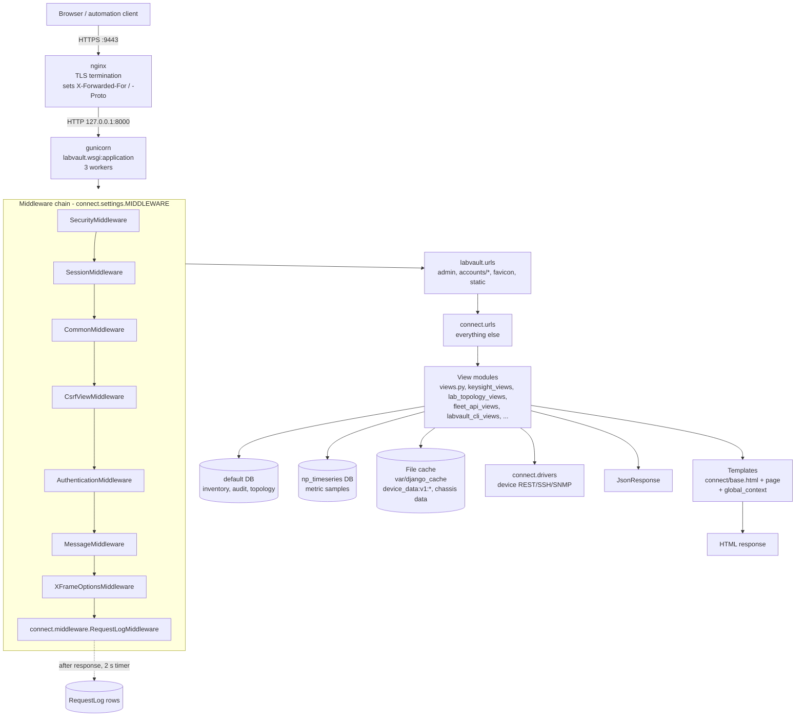
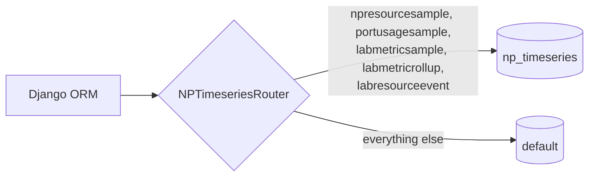
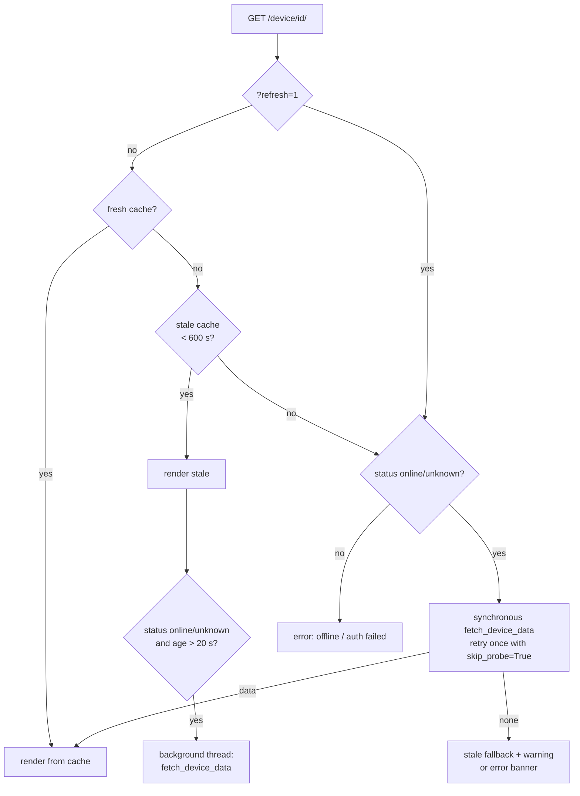
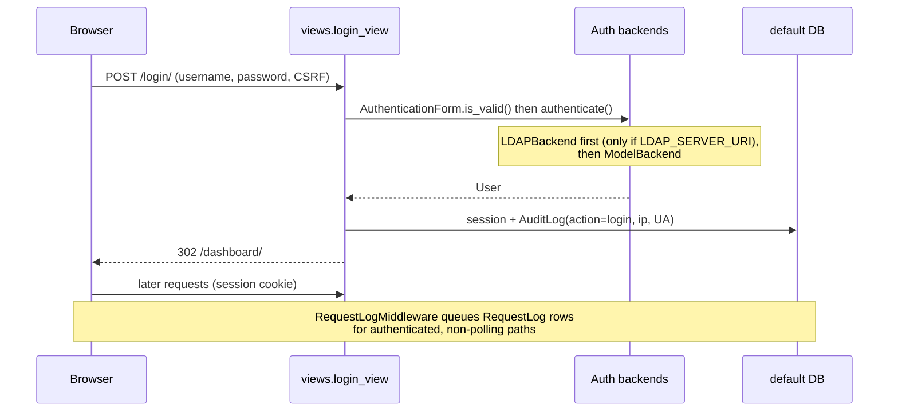

# Core web layer

The core web layer is the Django plumbing that every LabVault page and API goes through:
the project package (`labvault/`), settings, URL routing, middleware, authentication,
the ORM models, the generic device views in `connect/views.py`, templates, template
tags and static assets.

Other subsystems (Keysight chassis, Lab Topology Designer, Fleet API, CLI, diagnostics,
drivers, metric collectors) plug into this layer through `connect/urls.py` and share the
models, the file cache and the base template described here.

Related docs: [ARCHITECTURE.md](../ARCHITECTURE.md), [MODULES.md](../../MODULES.md),
[CONFIGURATION.md](../../install/CONFIGURATION.md), [API_AUTH.md](../../api/API_AUTH.md),
[USERS_AND_ROLES.md](../../admin/USERS_AND_ROLES.md).

Directory guides: [`labvault/README.md`](../../../labvault/README.md),
[`connect/templates/README.md`](../../../connect/templates/README.md),
[`connect/templatetags/README.md`](../../../connect/templatetags/README.md),
[`connect/static/README.md`](../../../connect/static/README.md).

---

## 1. Request lifecycle

Key facts:

- nginx listens on **9443** (customer default, `LABVAULT_TLS_PORT`) and proxies to gunicorn on
  **127.0.0.1:8000** (`deploy/systemd/labvault-web.service`, `deploy/compose/nginx-tls.conf`).
- `DJANGO_SETTINGS_MODULE` is `connect.settings` (set in `manage.py` and `labvault/wsgi.py`).
  There is no `labvault/settings.py`.
- `RequestLogMiddleware` is last in the chain, so it sees `request.user` and the final
  `status_code`. It never blocks: rows are queued in memory and bulk-inserted by a timer thread.
- Views read device state from the **file cache** first and only poll hardware when the cache
  is missing (see [section 5](#5-device-cache-connectviewspy)).

---

## 2. Settings and environment variables

All settings live in `connect/settings.py`. `.env` at the repository root is loaded if
`python-dotenv` is installed. The variables that change behaviour of the web layer:

| Variable | Default | Effect |
|---|---|---|
| `DJANGO_SECRET_KEY` (or `SECRET_KEY`) | empty | Must be set; Django refuses to sign sessions without it. |
| `DJANGO_DEBUG` | `False` | `True` enables debug pages and DEBUG static/media serving. |
| `DJANGO_ALLOWED_HOSTS` | `localhost,127.0.0.1` | Comma list. `*` raises `RuntimeError` at import. |
| `LABVAULT_USE_TLS` | `true` | Sets `SECURE_PROXY_SSL_HEADER`, secure session/CSRF cookies. |
| `LABVAULT_TLS_PORT` | `9443` | Port used to build default `CSRF_TRUSTED_ORIGINS`. |
| `LABVAULT_ALLOW_LOCAL_HTTP_API` | `true` | When `true`, `SECURE_SSL_REDIRECT` stays off so loopback HTTP probes to :8000 work. |
| `LABVAULT_HSTS_SECONDS` | `0` | Positive value enables HSTS (with subdomains). |
| `LABVAULT_CSRF_TRUSTED_ORIGINS` | empty | Explicit origin list. Otherwise built from `LABVAULT_PUBLIC_HOSTNAME`, `127.0.0.1`, `localhost` on the TLS port. |
| `LABVAULT_PUBLIC_HOSTNAME` | empty | Public hostname added to trusted origins. |
| `LABVAULT_SESSION_COOKIE_AGE` | `3600` | Session idle timeout (seconds). |
| `LABVAULT_SESSION_SAVE_EVERY_REQUEST` | `true` | Sliding session expiry. |
| `LABVAULT_SESSION_EXPIRE_AT_BROWSER_CLOSE` | `false` | Browser-session cookies. |
| `LABVAULT_CACHE_DIR` | `<repo>/var/django_cache` | File cache location (falls back to the default if not writable). `MAX_ENTRIES=20000`. |
| `DATABASE_URL` | SQLite `db.sqlite3` | `postgres…` uses `dj_database_url`; `sqlite:///…` sets a custom path. |
| `NP_TIMESERIES_DATABASE_URL` | SQLite `np_timeseries.sqlite3` | Same syntax, second database. |
| `LABVAULT_PASSWORD_LOCKED_USERNAMES` | empty | Accounts that may not change their own password. |
| `LABVAULT_PASSWORD_BREAKGLASS_USERNAMES` | `godmode` | Accounts that see the break-glass reset page. |
| `LABVAULT_BREAKGLASS_RESETTABLE_USERNAMES` | `admin mgmt finance` | Accounts break-glass users may reset (plus non-break-glass superusers). |
| `LABVAULT_DJANGO_ADMIN_USERNAMES` | `godmode` | Only these (active, staff) users may open `/admin/`. |
| `LDAP_SERVER_URI` + `LDAP_*` | unset | Enables `django_auth_ldap` (see [section 7](#7-authentication-authorization-and-audit)). |
| `TZ` | `UTC` | `TIME_ZONE`. |
| `DJANGO_LOG_LEVEL` | `INFO` | Root log level. Handlers: console + `connect.log_ring.RingBufferHandler` (WARNING+, used by diagnostics). |
| `EMAIL_*`, `DEFAULT_FROM_EMAIL` | console backend | Outbound mail. |
| `KEYSIGHT_EMAIL_RECIPIENTS` | empty | Reservation notification recipients. |
| `BMC_DEFAULT_USER` / `BMC_DEFAULT_PASS` / `BMC_DOMAIN_SUFFIX` | — | IPMI defaults for BMC pages. |
| `ARESONE_ROOT_SSH_USER` / `ARESONE_ROOT_SSH_PASSWORD`, `KCOS_ROOT_SSH_USER` / `KCOS_ROOT_SSH_PASSWORD` / `KCOS_ROOT_SSH_PORT` | empty | Optional chassis root SSH for LLDP/PCPU. Empty = off. |
| `CHANGELOG_TEMP_DOWN_DAYS` / `CHANGELOG_EXTENDED_DOWN_DAYS` | `1` / `3` | Thresholds for change-log down classifications. |
| `LABVAULT_DISABLE_INPROCESS_REFRESH` | unset | Read by `views._inprocess_refresh_disabled` (not settings). |
| `LABVAULT_WORKER_MODE` | empty | Exposed as `WORKER_MODE_ENV`. |

Hard-coded customer-SKU flags at the end of the file: `LABVAULT_CUSTOMER_SKU=True`,
`LABVAULT_EXTERNAL_PLUGINS_ENABLED=False`, `LABVAULT_TOPOLOGY_WIZARD_V1_ENABLED=False`,
`LABVAULT_DEEP_DIAGNOSTICS_ENABLED=False`, `LABVAULT_DEMO_MODE=False`, `LABVAULT_AUTO_SEED=False`,
`LABVAULT_WORKER_DEFAULT_MODE="idle"`, `LABVAULT_CLI_ENABLED=True`.

Upload limits: `DATA_UPLOAD_MAX_MEMORY_SIZE` is 5 GB and `FILE_UPLOAD_MAX_MEMORY_SIZE` 50 MB
(larger uploads spool to disk). nginx `client_max_body_size` must be raised to match for
large package uploads.

Static files: `STATIC_URL=/static/`, `STATICFILES_DIRS=[connect/static]`,
`STATIC_ROOT=<repo>/staticfiles` (filled by `collectstatic`). Media: `MEDIA_ROOT=<repo>/media`.

---

## 3. Dual database routing

- `connect/db_routers.py` — `NPTimeseriesRouter` routes reads and writes for the five models
  in `NP_TIMESERIES_MODEL_NAMES` to `np_timeseries`. `allow_migrate` only lets those models
  migrate on `np_timeseries` and blocks them on `default`. Run both:
  `python manage.py migrate` and `python manage.py migrate --database np_timeseries`.
- `allow_relation` returns `True` when either side is a time-series model. The only real FK,
  `NPResourceSample.chassis`, uses `db_constraint=False` and `on_delete=DO_NOTHING` because the
  chassis row is in the other database. Deleting a chassis does **not** delete its samples;
  `cleanup_np_timeseries` retention does that.
- `connect/np_timeseries_db.py` — on every new `np_timeseries` SQLite connection it sets
  `journal_mode=WAL`, `busy_timeout=5000`, `synchronous=NORMAL`, `temp_store=MEMORY`,
  `cache_size=-262144` (about 256 MB page cache). Registered once from `ConnectConfig.ready()`.
  PostgreSQL connections are untouched.
- PostgreSQL connections use `CONN_MAX_AGE=0` and `CONN_HEALTH_CHECKS=True` so the many
  background threads do not exhaust the pool. SQLite uses `timeout=30`.
- `health_views.health_ready` checks both aliases, the cache, and pending migrations on both.

---

## 4. Models (`connect/models.py`)

All models are in one file and one app. Choice lists at the top
(`PREFERRED_IP_VERSION_CHOICES`, `CONNECT_VIA_UI_CHOICES`, `MGMT_IPV6_SOURCE_CHOICES`,
`KEYSIGHT_*_CHOICES`, `DEPLOY_*_CHOICES`, `BMC_*_CHOICES`, SNMP/sensor/alarm choices) are
shared with forms and templates. Some choice lists (SNMP, sensor, alarm, PDU) have no model
using them in this SKU.

Device and chassis credentials (`password`, `api_key`, `enable_password`, per-OS passwords,
BMC password, subnet-scan default password) are stored in cleartext columns because drivers
need them to log in.

### 4.1 Network devices

| Model | Key fields / relations | Written by | Read by |
|---|---|---|---|
| `Device` | `ip_address` (IPv4/hostname/FQDN), `mgmt_ipv6`, `mgmt_ipv6_source`, `preferred_ip_version`, `hostname`, `username`/`password`, `vendor_type` (`arista`, `sonic`, `fortigate`, `paloalto`, `keysight`, `ocs`), `transport`, `api_port`, `api_key` (Arista may store JSON options such as `auto_enable_eapi`), discovery fields (`version`, `serial_number`, `model_name`, `mac_address`, `uptime`, `status`, `last_seen`), org fields (`tags`, `site`, `rack`, `group_name`, `contact`, `notes`), `maintenance_mode`, FK `device_group`, per-OS creds and `dual_os_mode`, `cpu_threshold`/`memory_threshold` | `views.add_device`/`edit_device`/`import_devices`, `views.fetch_device_data` (discovery + status), bundle/dataset import | Almost every view; drivers; topology builders |
| `DeviceGroup` | `name` (unique), self-FK `parent_group`; `full_path` property | `views.create_device_group` | Settings page |
| `DeviceSnapshot` | FK `device`, CPU/memory/temperature/uptime/interface counts | `views.fetch_device_health` | `device_health_history`, `fleet_report`, `sla_report` |
| `InterfaceSnapshot` | FK `device`, `interface_name`, byte/packet/error counters | `views.device_counters_json` | `device_interface_trending` |
| `Alert` | FK `device`, `alert_type`, `severity`, `acknowledged(_by/_at)` | `_check_health_thresholds`, `_refresh_single_device` | Alerts page, dashboard, `api_alerts` |
| `ConfigBackup` | FK `device`, `config_type`, `content`, `diff_from_previous`, `created_by` | `backup_config`, `bulk_action` | Config page/timeline/diff, `config_search`, change-log report |
| `ComplianceRule` / `ComplianceResult` | regex `pattern`, `should_exist`, `vendor_type` / FK `device`, FK `rule`, `passed` | `seed_compliance` command / `run_compliance_check` | Compliance page |
| `SavedCommand` | FK `user`, `name`, `command` | `save_command` | (UI only) |
| `TopologyLink` | `device_a`/`port_a` ↔ `device_b`/`port_b`, `discovered_via`, `link_status`; unique on the 4-tuple | `connect.topology.discover_topology`, lab topology builders | Topology views/graph |
| `ChassisDeviceLink` | FK `chassis` (KeysightChassis) ↔ FK `device`, ports | topology discovery, Keysight views | `views._merge_lldp_from_keysight_topology`, topology graph |

### 4.2 Ops settings

| Model | Notes |
|---|---|
| `ScheduledJob` | `job_type`, `schedule`, `next_run`, `target_devices`. Created from Settings. No scheduler in this tree executes these rows. |
| `MaintenanceWindow` + `MaintenanceWindowDevice` | Time window with `suppress_alerts` / `skip_polling`. Created from Settings; not consulted by the refresh loop (which uses `Device.maintenance_mode`). |
| `WebhookEndpoint` | Slack/Teams/PagerDuty/generic URL, `severity_filter`. Used by `views._send_webhooks` and `connect.keysight_slack`. `secret` is stored but not sent. |
| `APIToken` | 64-hex `token`, FK `user`, `enabled`, `expires_at`, `last_used`; `is_valid`. Created in Settings (`create_api_token`) or bootstrap. Checked by `keysight_views._api_token_authenticate` (Bearer). |

### 4.3 Keysight hardware (default DB)

| Model | Notes |
|---|---|
| `KeysightChassis` | Unique `ip_address`, dual-stack fields like `Device`, `chassis_type`, discovered IxOS/KCOS fields, `status`, `chassis_state`, `team_tags`, `hardware_error_reported`, JSON-in-text `ixos_applications`. Owned by `keysight_views`. |
| `KeysightChassisSnapshot` | CPU/memory history per chassis. |
| `KeysightSubnetScan` | Subnet discovery config (`auto_scan`, `scan_interval`). |
| `KeysightReservation` + `KeysightReservationItem` | Time-window reservation; `save()` recomputes `status` from the window unless cancelled; `_aware_window` coerces ISO strings from JSON import. Items reserve chassis, slot or port (`level`). |
| `KeysightDeploymentJob` | Package deploy/upgrade job with `status`, `progress`, `batch_id`, actor IP/UA. |
| `KeysightBmcEndpoint` | BMC hostname/IP, FK `chassis`, node name, FRU info, relocation tracking, hardware-error flag, optional credential override. |

### 4.4 Time series (`np_timeseries` DB)

| Model | Writer | Retention (per docstrings) |
|---|---|---|
| `NPResourceSample` | `keysight_views` chassis polling | `cleanup_np_timeseries` |
| `PortUsageSample` | `connect.port_usage` (reservation / run episodes) | 31 days |
| `LabMetricSample` | `connect.metric_collectors` via `collect_topology_metrics` / `run_metric_collector` | 7 days raw |
| `LabMetricRollup` | `connect.lab_metrics` (hourly buckets, unique per topology/resource/metric/bucket) | 31 days |
| `LabResourceEvent` | `connect.metric_collectors` (ownership, patches, link up/down intervals) | 31 days |

These models store `topology_id` / `chassis_id` as plain integers (no FK) so they can live in
a separate database.

### 4.5 Lab Topology Designer

| Model | Notes |
|---|---|
| `LabTopology` | `name`, `source`, `tags`, JSON `extra`, `metrics_collection_enabled`. |
| `LabTopologyNode` | FK `topology`, optional FK `device`, `node_key`, `node_type`, `x`/`y`, JSON `extra`. |
| `LabTopologyLink` | FK `topology`, `node_a`/`port_a` ↔ `node_b`/`port_b`, `cable_type`, JSON `extra`. |
| `TestSetupTemplate` / `TestSetupRun` | Requirements + computed plan JSON / execution steps and log (`connect.test_setup_engine`). |
| `OcsPatchSnapshot` | FK `device` (OCS), `raw_xconns`, `patch_pairs`, `patch_count`. Written/restored by `views.api_ocs_snapshot_*`. |
| `LabTopologyFabricSnapshot` | Pre-built fabric JSON per (`topology`, `kind`) — unique. `connect.topology_fabric_cache`. |
| `TopologyAuditLog` | Topology edit trail (`connect.topology_audit`). |

### 4.6 Audit and change tracking

| Model | Writer | Reader |
|---|---|---|
| `AuditLog` | `views._log_action`, Keysight views, CLI | `audit_log`, `access_by_ip` |
| `RequestLog` | `middleware.RequestLogMiddleware` | `access_by_ip` |
| `ChangeLogEvent` | `connect.changelog` (e.g. `log_status_transition` from `_refresh_single_device`), Keysight deploy/operation views | `change_log_report` |
| `DeviceStateBaseline` | `connect.changelog` scanners (unique per `target_kind`/`target_id`) | `connect.changelog_display` |

### 4.7 Preferences, runtime settings, CLI

| Model | Notes |
|---|---|
| `LabvaultUserPrefs` | One-to-one with `User`; `ui_column_profiles` JSON. |
| `LabvaultGlobalPrefs` | Singleton (`singleton_key='default'`). |
| `RuntimeSetting` | Versioned key → JSON (`connect.runtime_settings`, `connect.labvault_flags`). |
| `CliInvocation` | Audit row per CLI command; defines the `control_labvault_services` permission. |
| `CliJob` | Queued CLI job (`run_cli_worker`). |
| `CliAuthThrottle` | SSH auth failure lockout, unique per (`username`, `remote_addr`). |

---

## 5. Device cache (`connect/views.py`)

Live device data (interfaces, LLDP, port-channels, OCS cross-connects) is **not** stored in
the database. It lives in the Django file cache so every gunicorn worker and management
command sees the same entries.

| Constant | Value | Meaning |
|---|---|---|
| `_DEVICE_CACHE_PREFIX` | `device_data:v1:` | Key is `device_data:v1:<device_id>`. |
| `_DEVICE_CACHE_TTL` | 600 s | Hard expiry in the file cache. |
| `_DEFAULT_CACHE_FRESH_SECONDS` | 60 s (`REFRESH_INTERVAL * 3`) | "Fresh" for non-OCS devices. |
| `_OCS_CACHE_FRESH_SECONDS` | 180 s | "Fresh" for OCS (slow REST). |
| `REFRESH_INTERVAL` | 20 s | Poll loop sleep and dashboard auto-refresh hint. |

Entry format: `{'data': <dict>, 'timestamp': <ISO string>}`. All access goes through
`connect.cache_utils.cache_get/set/delete`, which log and swallow permission errors
(mixed root/service-user writes to the cache directory).

Helper functions:

| Function | Behaviour |
|---|---|
| `_get_cache_entry(device_id)` | Returns `{'data', 'timestamp'}` (timestamp parsed and made aware) or `None`. |
| `_get_cached_data(device_id, vendor_type=None)` | Data only if age < fresh window (180 s for `ocs`, else 60 s). |
| `_get_stale_cached_data(device_id, max_age_seconds=600)` | Data up to 10 minutes old, for fallback. |
| `_set_cached_data(device_id, data)` | Writes with current timestamp and 600 s TTL. |
| `_clear_cached_data(device_id)` | Deletes the entry (edit, delete, OCS restore, `?refresh=1` on OCS patch API). |
| `_cache_entry_age_seconds(device_id)` | Age for UI "cache age" badges. |
| `_should_skip_device_probe(device)` | True if the device was online and seen within 300 s. |
| `_schedule_device_data_refresh(device)` | Spawns a daemon thread running `fetch_device_data`. Also used by `views_ocs_xconnect`. |

### 5.1 `device_detail` read path

### 5.2 `fetch_device_data(device, skip_probe=False)`

1. `driver = get_driver(device)` (`connect.drivers`, plugin registry with built-in fallback).
2. Probe:
   - **OCS:** `driver.fetch_ocs_sources_parallel()` fetches REST version, ports and
     cross-connects concurrently; `probe_from_sources` derives the status; a plain `probe()` is
     tried only if that says `unreachable`.
   - Others: `probe()` unless `skip_probe` and the device was seen recently.
3. `auth_failed` / `unreachable` → save `status` (`auth_failed` / `offline`) and return `None`.
4. `get_system_info()` → update hostname, version, serial, model, MAC, uptime, `status='online'`,
   `last_seen`, and `device.save()`.
5. `get_interfaces()` (OCS reuses `ports_rows` from step 2).
6. **OCS branch** → `_fetch_ocs_device_data(device, driver, data, raw_rows=xc_rows)`:
   - One cross-connect list feeds both `get_ocs_crossconnects` and `get_lldp_neighbors_detail`.
   - Merge chassis-learned LLDP (`_merge_lldp_from_keysight_topology`).
   - `ocs_helpers.build_ocs_triplet_map` maps OCS port triplets to switch ports using
     every device's `notes`.
   - `_build_peer_switch_lldp_for_triplets` reads **peer switches' cache entries** to create
     synthetic LLDP rows (`source='peer_switch_lldp'`) so path verification works even though
     the OCS has no LLDP agent.
   - `_build_path_verify_rows` → badges (`ocs_ok`, `chassis_ok`, `mismatch`, `no_lldp`, `no_cache`).
   - `ocs_helpers.enrich_ocs_xconns`, `build_ocs_shelves`, `ocs_patch_pairs_for_ui`,
     `compute_ocs_summary`; sets `is_ocs=True`; caches and returns.
7. **Other vendors:** `get_lldp_neighbors_detail()`, merged with `ChassisDeviceLink` rows and
   online Keysight chassis cache entries (`keysight_views._get_cached`) whose LLDP mentions this
   device; `get_port_channel_members()` enrichment (member status, breakout/alias fallbacks,
   LLDP peers per member); cache the result. For Arista with `api_key` JSON
   `{"auto_enable_eapi": true}`, call `driver.promote_to_eapi()` after caching.

### 5.3 Background refresh

`start_refresh_thread()` is called on every dashboard load and starts
`_refresh_all_devices` once per process: a loop that loads all non-maintenance devices,
runs `_refresh_single_device_safe` in a `ThreadPoolExecutor(max_workers≤10)` with a 45 s
completion timeout, records worker health via `connect.worker_status.record_device_refresh`,
then sleeps 20 s. `_refresh_single_device` creates `device_down` (critical + webhooks) and
`device_up` alerts on transitions and calls `connect.changelog.log_status_transition`.

`_inprocess_refresh_disabled()` returns `True` when `'gunicorn' in sys.modules` or
`LABVAULT_DISABLE_INPROCESS_REFRESH` is truthy. **Under gunicorn the loop never runs.**
The shipped worker `run_labvault_refresh` only refreshes Keysight chassis
(`keysight_views.ks_refresh_once`). In production, `Device` caches are therefore filled on
demand (page loads, stale-triggered threads, bulk "refresh", OCS APIs), and the automatic
online/offline alerts from `_refresh_single_device` are not produced.

---

## 6. URL map

`labvault/urls.py` (project level, matched first):

| Path | View | Notes |
|---|---|---|
| `admin/` | Django admin | Allowlisted usernames only (`django_admin_access`). |
| `accounts/breakglass-reset-password/` | `auth_views.breakglass_reset_user_password` | Break-glass accounts. |
| `accounts/password_change/`, `…/done/` | `auth_views.LabvaultPasswordChangeView`, Django `PasswordChangeDoneView` | Locked users redirected. |
| `favicon.ico` | redirect to `static/branding/mark-light-favicon.png` | |
| `static/…` | `django.views.static.serve` (non-DEBUG) | nginx normally serves `/static/` itself. |
| `''` | `include('connect.urls')` | |

`connect/urls.py`, grouped by owner module:

| Area | Paths | Owner module |
|---|---|---|
| Health | `health/live`, `health/ready` (no auth) | `connect/health_views.py` |
| CLI | `cli/`, `api/cli/v1/{commands,confirm,invoke,jobs/<id>,history}/` | `connect/labvault_cli_views.py` |
| Auth | `login/`, `logout/` | `connect/views.py` |
| Dashboard | `''` (`home`), `dashboard/` | `connect/views.py` |
| Device pages | `device/<id>/` + `health/`, `health/history/`, `routing/`, `vlans/`, `config/`, `config/backup/`, `config/timeline/`, `arp/`, `mac/`, `lldp/`, `enable-lldp/`, `policies/`, `vpn/`, `quick-status/`, `bgp/`, `ospf/`, `environment/`, `dom/` | `connect/views.py` |
| Device AJAX | `device/<id>/{bgp,ospf,environment,counters}/json/`, `interface-trending/`, `ocs-patch.json` | `connect/views.py` |
| Device CRUD / bulk | `add_device/`, `edit_device/<id>/`, `delete_device/<id>/`, `bulk_action/` | `connect/views.py` |
| Alerts / compliance | `alerts/…`, `compliance/…` | `connect/views.py` |
| Config | `config-search/`, `config/diff/<backup_id>/`, `command/save/`, `command/<id>/delete/` | `connect/views.py` |
| Network topology | `topology/`, `topology/{data,refresh,rescan,export}/` | `connect/views.py` (+ `connect/topology*.py`) |
| Lab Topology Designer | `lab-topology/…` (list, new, detail, data, nodes, links, import/export, fabric, port-fabric, graph, scenario, portmap, usage, test-setup), `test-setup/<id>/…`, `api/port-usage/episodes/` | `connect/lab_topology_views.py`, `connect/lab_topology_onboard.py`, `connect/lab_timeline_views.py`, `connect/lab_usage_insights_views.py`, `connect/lab_usage_graph_views.py` |
| Compare / reports | `compare/`, `reports/`, `reports/{inventory,sla,changes}/` | `connect/views.py` |
| Settings | `settings/`, `about/`, `settings/{webhook,token,maintenance,job,group}/…` | `connect/views.py` |
| Export / import | `export_devices/`, `export/labvault/`, `export/labvault/bundle/`, `import_devices/` | `connect/views.py` (+ `labvault_dataset`, `labvault_bundle`) |
| Audit | `audit_log/`, `audit_log/access_by_ip/` | `connect/views.py` |
| Legacy REST (session) | `api/live-status/`, `api/devices/`, `api/device/<id>/`, `api/device/<id>/health/`, `api/alerts/`, `api/topology/`, `api/device-ocs-mapping/<id>/` | `connect/views.py` |
| OCS snapshots (session or Bearer) | `api/ocs/<id>/snapshots/`, `api/ocs/snapshots/<id>/{,download/,restore/}` | `connect/views.py` |
| OCS cross-connects | `api/ocs/<ip>/crossconnects/`, `api/ocs/<ip>/crossconnect/` | `connect/views_ocs_xconnect.py` |
| Diagnostics | `diagnostics/`, `diagnostics/{export,bundle}/`, `diagnostics/live.json`, `api/diagnostics/ingest/`, `api/diagnostics.json` | `connect/diagnostics_views.py` |
| Fleet API | `api/fleet/…`, `api/docs` | `connect/fleet_api_views.py` |
| Keysight | `keysight/…`, `api/keysight/resources/` | `connect/keysight_views.py` |
| Slack | `api/slack/keysight/` | `connect/keysight_slack_views.py` |
| Not shipped (404 JSON stubs) | `api/hw-assignments/release`, `api/nexus/*`, `api/research/*` | `views._customer_sku_gone` |

`views.device_terminal` and `views.api_execute_command` exist only as "not available" stubs
and are **not routed**; the customer-SKU gate requires free-form device shells to stay absent.

---

## 7. Authentication, authorization and audit

- **Login** (`views.login_view`): renders `connect/login.html` with `ldap_enabled`. Success →
  `login()`, `AuditLog` `login`, flash message, redirect. Logout logs `logout` and redirects to
  `login`. `LOGIN_URL=/login/`, `LOGIN_REDIRECT_URL=/dashboard/`.
- **LDAP** (settings): with `LDAP_SERVER_URI` set, `AUTH_LDAP_*` is configured from `LDAP_BIND_DN`,
  `LDAP_BIND_PASSWORD`, `LDAP_USER_SEARCH_BASE`, `LDAP_USER_SEARCH_FILTER` (default
  `(sAMAccountName=%(user)s)`), `LDAP_GROUP_SEARCH_BASE`, `LDAP_STAFF_GROUP_DN`,
  `LDAP_SUPERUSER_GROUP_DN`, `LDAP_MIRROR_GROUPS`, `LDAP_START_TLS`, `LDAP_IGNORE_CERT`.
  Attributes `givenName`/`sn`/`mail` map to user fields and are refreshed on each login.
  `python-ldap` and `django-auth-ldap` are imported only in that branch. See
  [LDAP.md](../../install/LDAP.md).
- **Page protection**: views use `@login_required`. Some staff checks are inline
  (`export_labvault_dataset`, `export_labvault_bundle`, `import_devices`).
  `keysight_views._api_auth_required` accepts a session **or** `Authorization: Bearer <APIToken>`
  (updates `last_used`); OCS snapshot APIs use it together with `@csrf_exempt`.
- **Password policy** (`connect/password_policy.py`): usernames in
  `LABVAULT_PASSWORD_LOCKED_USERNAMES` get a relaxed policy (no validators) when a break-glass
  user resets them; everyone else goes through `AUTH_PASSWORD_VALIDATORS`. Self-service change
  always uses the full validators.
- **Self-service change** (`auth_views.LabvaultPasswordChangeView`): locked usernames are
  redirected to the dashboard with a warning; the Password link is hidden via
  `password_change_allowed` from `context_processors.global_context`.
- **Break-glass reset** (`auth_views.breakglass_reset_user_password`): only
  `LABVAULT_PASSWORD_BREAKGLASS_USERNAMES`. Candidates = active users in
  `LABVAULT_BREAKGLASS_RESETTABLE_USERNAMES` plus superusers that are not break-glass.
  Target id is validated against that list twice; password validated with
  `validate_password_for_user` then saved with `set_user_password(validate=False)`.
- **Django admin** (`connect/django_admin_access.py`): `ConnectConfig.ready()` monkey-patches
  `AdminSite.has_permission` so only active staff in `LABVAULT_DJANGO_ADMIN_USERNAMES` get in.
  Being `is_staff` alone is not enough.
- **First login**: the initial credential comes from a generated file, not a published
  password — see [FIRST_LOGIN.md](../../getting-started/FIRST_LOGIN.md).
- **Audit trails**: `AuditLog` (explicit actions, `views._log_action`), `RequestLog` (every
  authenticated page visit except `/static/`, `/media/`, `/api/live-status/`,
  `/keysight/api/dashboard/`, `/keysight/api/deploy/status/`, `/favicon.ico`,
  `/keysight/api/chassis/*`), `ChangeLogEvent` (status/deploy/move timeline with actor context
  from `connect.request_audit`). `access_by_ip` joins AuditLog and RequestLog per client IP and
  does reverse DNS per IP.

Client IP everywhere is the **first** `X-Forwarded-For` entry, falling back to `REMOTE_ADDR`.

---

## 8. Templates, context and static assets

- Templates live in `connect/templates/connect/` (`APP_DIRS=True`; no project-level `DIRS`).
- `base.html` provides the sidebar, topbar, flash messages and blocks `title`, `extra_css`,
  `head_extra`, `body_attrs`, `topbar`, `topbar_class`, `page_title`, `topbar_actions`,
  `content_area_class`, `content`, `extra_js`. 61 templates extend it.
- The sidebar DEVICES group iterates `devices` from the page context, which is why most views
  in `views.py` pass `'devices': Device.objects.all()`. The KEYSIGHT / IXIA group regroups
  `keysight_chassis` by type using ``.
- `context_processors.global_context` adds `labvault_customer_sku`, `labvault_cli_enabled`,
  `product_name` (`LabVault`), `support_no_sla`, `password_change_allowed`,
  `show_breakglass_password_reset` to every template.
- `connect/templatetags/ip_display.py` renders dual-stack management addresses and hardware
  login links; `sidebar_tags.py` slugifies sidebar group ids.
- `base.html` and `login.html` load Bootstrap 5.3 and Font Awesome 6.4 from public CDNs.
  `connect/static/css/bootstrap.min.css` and `connect/static/js/jquery-3.6.0.min.js` exist
  but no template references them.

---

## 9. Per-module reference

### `labvault/`

| File | Contents |
|---|---|
| `urls.py` | `urlpatterns` — see section 6. |
| `wsgi.py` | `application = get_wsgi_application()`; defaults `DJANGO_SETTINGS_MODULE=connect.settings`. |
| `__init__.py` | Package marker. |

### `connect/settings.py`

- `_https_origin(host: str, port: int) -> str` — `https://host[:port]` (port omitted for 443/0).
- `_ensure_writable_dir(preferred: str, fallback: Path) -> Path` — create/chmod 0775 the cache
  dir, falling back when not writable. Side effect: creates directories at import.
- `_database_from_url(env_name: str, default_sqlite_path: Path) -> dict` — PostgreSQL via
  `dj_database_url.parse` (not `config`, so the time-series DB never silently reuses
  `DATABASE_URL`), or SQLite path.
- Module-level constants described in section 2.

### `connect/urls.py`

`urlpatterns` only (section 6). Adds DEBUG media serving at the end.

### `connect/apps.py`

- `ConnectConfig.ready()` — calls `patch_django_admin_site_access()` and
  `register_np_timeseries_pragmas()`.

### `connect/admin.py`

Loops over `vars(connect.models)` and `admin.site.register`s every concrete `connect` model
(ignores `AlreadyRegistered`). `BaseUserAdmin`, `User` and `_SKIP` are imported/defined but not
used.

### `connect/middleware.py`

- `_should_skip(path) -> bool` — exclusion lists above.
- `_get_client_ip(request) -> str | None`.
- `_flush_queue()` — swaps out the module-level `_queue` under `_queue_lock`, then
  `RequestLog.objects.bulk_create(items, ignore_conflicts=True)`; errors ignored.
- `class RequestLogMiddleware(get_response)` — `__call__` runs the view first, then (for
  authenticated, non-skipped paths) appends a `RequestLog` instance and starts a 2 s daemon
  `threading.Timer(_flush_queue)` if none is pending.

### `connect/auth_views.py`

- `is_password_locked_user(user) -> bool`, `is_breakglass_user(user) -> bool`.
- `_breakglass_password_reset_candidates(request) -> list[User]`.
- `breakglass_reset_user_password(request)` — GET/POST; renders
  `connect/auth/breakglass_reset_password.html`; POST sets the target password and redirects.
- `LabvaultPasswordChangeView` — template `connect/auth/password_change_form.html`, success
  `password_change_done`. Contains a dead `if False:` branch left from a removed product gate.

### `connect/password_policy.py`

- `password_locked_usernames() -> frozenset[str]`
- `uses_relaxed_password_policy(user) -> bool`
- `password_validators_for_user(user) -> list`
- `validate_password_for_user(password, user) -> None` — raises `ValidationError`.
- `set_user_password(user, raw_password, *, validate=True) -> None` — saves `password` only.

### `connect/django_admin_access.py`

- `django_admin_allowed_usernames() -> frozenset[str]`
- `user_may_access_django_admin(user) -> bool`
- `patch_django_admin_site_access() -> None` — idempotent monkey-patch of
  `admin.AdminSite.has_permission` (class-level, so it affects every `AdminSite` instance).

### `connect/context_processors.py`

- `global_context(request) -> dict` — see section 8.

### `connect/health_views.py`

- `health_live(request)` — `{"status": "live"}`; GET only; no auth.
- `health_ready(request)` — checks `ensure_connection()` on `default` and `np_timeseries`,
  cache write/read of `labvault_ready_probe`, empty `STATIC_ROOT` when not DEBUG, and pending
  migrations on both DBs. Returns `{"status": "ready"}` or 503 with an `errors` list
  (`db_<alias>_unreachable`, `cache_unwritable`, `cache_error`, `static_empty`,
  `migrations_pending_<alias>`, `migrations_check_failed`). Never touches lab hardware.

### `connect/db_routers.py`, `connect/np_timeseries_db.py`

See section 3. Public names: `NP_TIMESERIES_MODEL_NAMES`, `NPTimeseriesRouter`,
`configure_np_timeseries_connection(sender, connection, **kwargs)`,
`register_np_timeseries_pragmas()`.

### `connect/request_audit.py`

- `client_ip(request) -> str | None`, `client_user_agent(request, *, max_len=500) -> str`
- `parse_user_agent(ua) -> {'browser', 'os', 'device'}`
- `request_actor_context(request) -> dict` — username, IP, UA, browser, OS, device.
- `actor_from_body(body, request) -> dict` — lets scripts override actor/IP/UA (truncated).
  Used by `keysight_changelog_record_operation`; values are caller-supplied, not verified.
- `version_key(version) -> tuple`, `classify_version_change(old, new) -> 'upgrade' | 'downgrade' | 'deploy_start'`.

### `connect/request_context.py`

- `_client_ip_from_meta(meta) -> str`, `ptr_lookup(ip) -> str`, `parse_user_agent(ua)`,
  `request_context(request) -> dict` (user, username, ip, hostname, UA, browser, os, path).
  Not imported anywhere in this tree.

### `connect/forms.py`

- `MgmtIpv6FormMixin.clean_mgmt_ipv6()` — normalize via `ip_addressing.normalize_ip`.
- `ConnectViaFormMixin` — `preferred_ip_version` / `mgmt_ipv6_source` fields; `clean()` rejects
  a typed IPv6 when source is DHCPv6 and sets `mgmt_ipv6_display_hint`.
- `ConnectionForm` (add device), `EditDeviceForm` (edit; plain-text credential inputs),
  `KeysightChassisForm`, `KeysightEditChassisForm` (used by `keysight_views`),
  `DeviceImportForm` (CSV), `CommandForm` and `ComplianceRuleForm` (not rendered by any view).

### `connect/models.py`

See section 4. Behavioural methods: dual-stack properties on `Device` / `KeysightChassis`
(`effective_mgmt_ipv6`, `connect_mgmt_ipv6`, `connect_address`, `connect_targets`,
`address_summary`, `mgmt_display`, `mgmt_label`, `mgmt_ip_fields`), `Device.vendor_*`,
`uptime_display`, `is_firewall`; `DeviceGroup.full_path`; `ScheduledJob.is_due`;
`MaintenanceWindow.is_active`; `APIToken.is_valid`; `KeysightReservation.is_active`,
`computed_status`, `save()`; `KeysightReservationItem.level`.

### `connect/views.py`

Grouped by section header in the file:

| Section | Functions |
|---|---|
| Cache + helpers | `_get_client_ip`, `_log_action(user, action, device=None, details='', request=None)`, cache helpers (section 5), `_ocs_devices_for_triplet_map`, `_build_peer_switch_lldp_for_triplets(triplet_map, ocs_device) -> list`, `_build_path_verify_rows(triplet_map, lldp_neighbors, ocs_device) -> list`, `_fetch_ocs_device_data`, `_chassis_lldp_neighbor_matches_device(nbr, device) -> bool`, `_merge_lldp_from_keysight_topology(device, lldp_neighbors) -> None` (mutates list), `_enrich_device_lldp_neighbors` |
| Connectivity | `probe_device(device) -> str`, `fetch_device_data(device, skip_probe=False) -> dict | None`, `fetch_device_health(device) -> dict | None`, `_check_health_thresholds` |
| Webhooks | `_send_webhooks(device, alert_type, severity, message)` (synchronous `requests.post`, 5 s timeout each), `_build_webhook_payload` |
| Background refresh | `_refresh_all_devices`, `_refresh_single_device_safe`, `_refresh_single_device`, `_inprocess_refresh_disabled`, `start_refresh_thread` |
| Auth | `login_view`, `logout_view` |
| Pages | `dashboard`, `device_detail`, `device_health`, `device_health_history` (`?hours=`), `device_bgp/ospf/environment` (+ `_json`), `device_counters_json` (writes `InterfaceSnapshot` per interface), `device_interface_trending`, `device_dom`, `device_routing`, `device_vlans`, `device_config` (startup vs running diff), `backup_config` (POST), `device_arp`, `device_mac`, `device_lldp`, `device_policies`, `device_vpn` |
| CRUD | `add_device` (duplicate-IP check), `edit_device`, `delete_device` (POST), `bulk_action` (POST) |
| Alerts / compliance / config | `alerts_view`, `acknowledge_alert`, `acknowledge_all_alerts`, `compliance_view`, `run_compliance_check`, `config_search` (searches latest running backup, not live), `config_timeline`, `config_diff_view` (JSON), `save_command`, `delete_saved_command` |
| Export / import | `export_labvault_dataset`, `export_labvault_bundle`, `export_devices`, `import_devices` |
| Audit | `audit_log` (`?ip=`), `access_by_ip` |
| Topology | `topology_map`, `_topology_scan_background`, `_append_external_topology_peers`, `topology_data` (graph v3 via `topology_graph.build_global_graph` when `topology_flags.TOPOLOGY_GRAPH_V3`), `topology_refresh`, `topology_rescan` (POST, background thread), `topology_export` (`format=drawio|json`, `tags=`), `device_enable_lldp` |
| Reports | `device_compare`, `fleet_report`, `inventory_report` (`format=csv`), `sla_report` (availability = snapshots with `uptime>0` / all snapshots), `change_log_report` |
| Settings | `settings_view`, `about_view`, `create_webhook`, `delete_webhook`, `create_api_token` (token shown once in a flash message), `revoke_api_token`, `create_maintenance_window`, `create_scheduled_job`, `create_device_group` |
| Live / REST | `device_live_status`, `device_quick_status`, `api_devices`, `api_device_detail`, `api_device_health`, `api_device_ocs_patch` (`?refresh=1`), `api_alerts`, `api_device_ocs_mapping` (parses `[ocs_site_mapping] {json}` from `Device.notes`), `api_topology` |
| OCS snapshots | `api_ocs_snapshot_create` (GET list / POST capture live), `_normalize_ocs_restore_connections`, `api_ocs_snapshot_detail` (GET/DELETE), `api_ocs_snapshot_download`, `api_ocs_snapshot_restore` (POST; `clear_first` defaults to `true`; clears device cache; 207 on partial failure) |
| Stubs | `device_terminal`, `api_execute_command`, `_customer_sku_gone(feature)` and the `api_hw_assignments_*`, `ai_nexus`, `api_nexus_*`, `api_research_*` functions — all "not shipped in this SKU" |

`views.py` imports `_api_auth_required` from `keysight_views` at module load, so
`keysight_views` must stay importable without importing `views` at top level.

### `connect/templatetags/`

See [`connect/templatetags/README.md`](../../../connect/templatetags/README.md).

---

## 10. Cross-subsystem data flows

- **views → drivers**: every device page calls `connect.drivers.get_driver(device)` and a driver
  verb (`get_bgp_summary`, `get_routes`, `get_running_config`, …). Most sub-pages poll live on
  every request; only `device_detail` and the JSON cache APIs use the device cache.
- **views ↔ keysight_views**: LLDP for switches is merged from Keysight chassis cache entries
  (`keysight_views._get_cached`); chassis pages are fully owned by `keysight_views` with their
  own cache and worker (`run_labvault_refresh`).
- **views → ocs_helpers / drivers.ocs**: OCS shelf grid, patch pairs, triplet maps, snapshot
  restore (`restore_patch_snapshot`).
- **views → topology / topology_graph / topology_export**: LLDP discovery writes
  `TopologyLink` / `ChassisDeviceLink`; graph builder reads them plus caches.
- **views → changelog / worker_status**: status transitions and refresh-loop health.
- **views → labvault_dataset / labvault_bundle**: full JSON and tarball export/import.
- **views_ocs_xconnect → views**: reuses `_clear_cached_data` and `_schedule_device_data_refresh`
  after cross-connect changes.
- **middleware → RequestLog**, **context_processors → settings**, **apps → django_admin_access,
  np_timeseries_db**.

---

## 11. Extension points

**Add a page**

1. Write a view (in `views.py` for device-generic pages, or the owning subsystem module).
   Decorate with `@login_required` (or `_api_auth_required` for JSON that automation calls).
2. Template in `connect/templates/connect/<name>.html` extending `connect/base.html`; fill
   `page_title` and `content`. Pass `'devices': Device.objects.all()` if you want the sidebar
   device list populated.
3. Add `path(...)` with a `name=` in `connect/urls.py` in the matching group, and a sidebar
   link in `base.html` using `request.resolver_match.url_name` for the active state.
4. If the page polls, consider adding its path to the middleware skip lists.

**Add a model**

1. Define it in `connect/models.py` with a class docstring; it is auto-registered in admin.
2. For high-volume time series, add its lower-case model name to
   `db_routers.NP_TIMESERIES_MODEL_NAMES`, avoid FKs (or `db_constraint=False`), and migrate
   with `--database np_timeseries`.
3. `python manage.py makemigrations connect`, then run both migrate commands.
4. If it should be exported, update `connect/labvault_dataset.py`.

**Add a URL to an existing API**

Keep JSON errors as `JsonResponse({'error': ...}, status=...)`. For Bearer access use
`keysight_views._api_auth_required` and `@csrf_exempt` (as the OCS snapshot APIs do). Fleet
automation endpoints belong in `fleet_api_views.py` and its OpenAPI document.

**Add a setting**

Read it from `os.environ` in `connect/settings.py` with a safe default, document it in
`.env.example` and `docs/install/CONFIGURATION.md`, and access it with
`getattr(settings, 'NAME', default)` so tests without the variable still work.

**Add a template variable for every page**

Extend `context_processors.global_context` (keep it cheap — it runs on every render).

---

## 12. Gotchas

- **No device poller under gunicorn.** See section 5.3. Devices only refresh when someone opens
  them or triggers a refresh.
- **Many device sub-pages block on hardware.** `device_bgp`, `device_routing`, `device_config`,
  `bulk_action` refresh/backup and `run_compliance_check` run driver calls inside the request; slow devices hold a gunicorn worker (timeout 300 s).
- **Cache is the file system.** Mixed ownership of `var/django_cache` (root vs service user)
  shows up as "cache get/set failed" warnings, not errors. Clear per device with
  `_clear_cached_data` or delete the directory.
- **Fresh vs stale windows differ from TTL.** An entry can exist (TTL 600 s) but be "stale";
  `api_device_detail` returns `{}` for stale entries while `device_detail` renders them.
- **Two DBs, two migrate commands.** Forgetting `migrate --database np_timeseries` makes
  `health/ready` return `migrations_pending_np_timeseries`.
- **CSRF origins.** When serving on a hostname or port other than the defaults, set
  `LABVAULT_CSRF_TRUSTED_ORIGINS` or `LABVAULT_PUBLIC_HOSTNAME`, or POSTs fail with 403.
- **`is_staff` is not admin access.** Only `LABVAULT_DJANGO_ADMIN_USERNAMES` reach `/admin/`.
- **Locked accounts and Django admin.** The password lock is enforced in the LabVault UI only;
  `connect.admin` uses the stock `UserAdmin`.
- **RequestLog is best effort.** Per-process queue, lost on worker restart, errors swallowed.
- **`access_by_ip` does blocking reverse DNS** for every distinct IP on each page load.
- **CDN assets.** `base.html` pulls Bootstrap and Font Awesome from public CDNs; air-gapped
  installs render without them unless those URLs are reachable or vendored.
- **Sidebar data comes from the page context**, not a context processor. Pages that do not pass
  `devices` show an empty DEVICES group. No view in this tree was found passing
  `keysight_chassis`, so the per-chassis links under KEYSIGHT / IXIA appear to render empty.
- **Duplicate settings block.** `CHANGELOG_*` is defined twice in `settings.py` (identical values).
