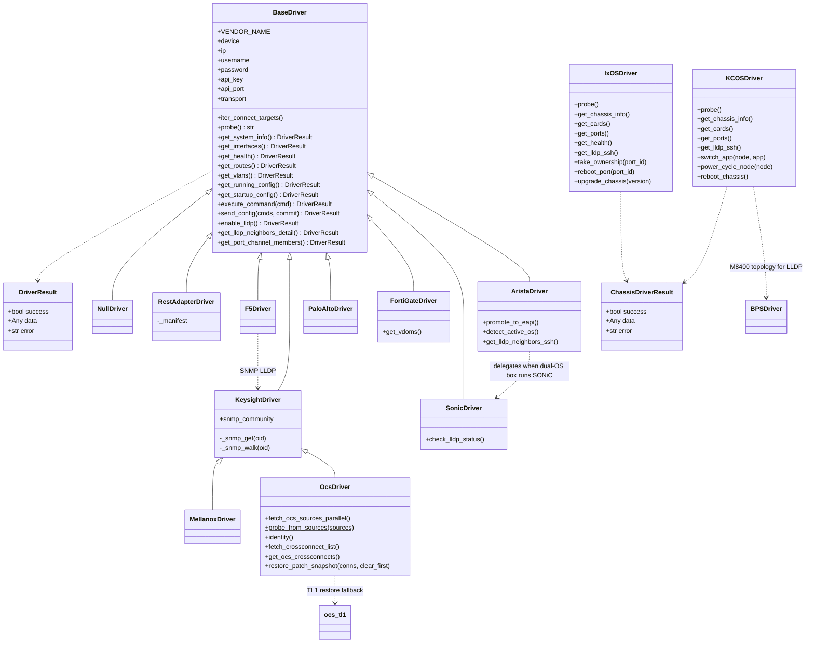
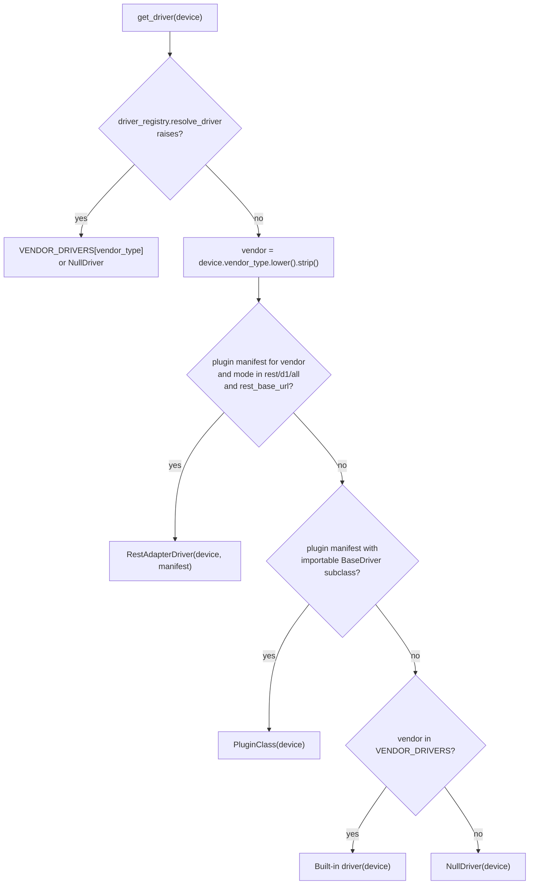

# Device drivers & device access

Developer reference for the code that talks to lab hardware: the vendor drivers in
`connect/drivers/`, the Keysight chassis drivers in `connect/keysight_drivers/`, the plugin
registry, and the helper modules for SSH hops, IPMI/Redfish, reachability, and hardware
links. Pages that sit on top of this layer: [ocs.md](ocs.md), [keysight-chassis.md](keysight-chassis.md),
[topology.md](topology.md), [fleet-api.md](fleet-api.md), [metrics-insights.md](metrics-insights.md).

## Contents

1. [Purpose and scope](#purpose-and-scope)
2. [Two driver families](#two-driver-families)
3. [Class hierarchy](#class-hierarchy)
4. [How a driver is selected](#how-a-driver-is-selected)
5. [The driver contract](#the-driver-contract)
6. [Transports, timeouts and fallback order](#transports-timeouts-and-fallback-order)
7. [Connect targets and dual-stack addressing](#connect-targets-and-dual-stack-addressing)
8. [Credential sources](#credential-sources)
9. [Allowlisted verbs — no free-form shell](#allowlisted-verbs--no-free-form-shell)
10. [OCS driver](#ocs-driver)
11. [Keysight chassis drivers (IxOS / KCOS)](#keysight-chassis-drivers-ixos--kcos)
12. [Plugin registry and manifests](#plugin-registry-and-manifests)
13. [Who calls the drivers](#who-calls-the-drivers)
14. [Module reference](#module-reference)
15. [How to add a new vendor driver](#how-to-add-a-new-vendor-driver)
16. [Gotchas and known issues](#gotchas-and-known-issues)
17. [Tests](#tests)

---

## Purpose and scope

Every read from or write to a switch, firewall, optical circuit switch (OCS), or Keysight
chassis goes through a driver object. A driver:

- is built from an ORM row (`Device` or `KeysightChassis`) and does **no network I/O in its
  constructor**;
- hides the vendor transport (JSON-RPC, REST, XML API, SSH, SNMP, TL1);
- returns a `DriverResult(success, data, error)` instead of raising for device-side failures;
- exposes only fixed, named operations. There is no generic "run this shell command" path.

The helper modules in scope (`kcos_ssh`, `aresone_ssh`, `bmc_ipmi`, `redfish_utils`,
`reachability`, `hardware_links`, `pcpu_versions`, `eos_sonic_switch`, `snmp_utils`) are
used by the drivers or sit right next to them.

## Two driver families

| Family | Package | Built from | Factory | Base class | Result type |
|---|---|---|---|---|---|
| Network devices | `connect/drivers/` | `Device` (`vendor_type`) | `connect.drivers.get_driver(device)` | `BaseDriver` | `connect.drivers.base.DriverResult` |
| Keysight / Ixia chassis | `connect/keysight_drivers/` | `KeysightChassis` (`chassis_type`) | `connect.keysight_drivers.get_driver(chassis)` | none (duck-typed) | `connect.keysight_drivers.ixos.DriverResult` |

The two `DriverResult` dataclasses have the same fields but are **different classes**.

`Device.vendor_type == 'keysight'` is a third, smaller case: it uses the SNMP-only
`KeysightDriver` from the network family, not the chassis drivers.

## Class hierarchy



`ChassisDriverResult` above is `connect.keysight_drivers.ixos.DriverResult` (renamed in the
diagram only to keep the two classes apart). `F5Driver` and `MellanoxDriver` are **not**
registered in `VENDOR_DRIVERS` — see [Gotchas](#gotchas-and-known-issues).

## How a driver is selected

### Network devices — `connect.drivers.get_driver(device)`



Built-in map (`connect/drivers/__init__.py`):

| `vendor_type` | Class | Topology node type (`topology_node_type_for_vendor`) |
|---|---|---|
| `arista` | `AristaDriver` | `switch` |
| `sonic` | `SonicDriver` | `switch` |
| `fortigate` | `FortiGateDriver` | `firewall` |
| `paloalto` | `PaloAltoDriver` | `firewall` |
| `keysight` | `KeysightDriver` | `chassis` |
| `ocs` | `OcsDriver` | `ocs` |

Plugins are **off by default** (`LABVAULT_DRIVER_PLUGIN_MODE=off`), so on a stock customer
install the path is always "built-in or `NullDriver`".

### Keysight chassis — `connect.keysight_drivers.get_driver(chassis)`

- `chassis.chassis_type in KCOS_TYPES` (`aps_m1010`, `aps_m8400`, `aps_standalone`,
  `aresone_htrex`, `trex`) → `KCOSDriver(ip, username, password)`.
- Anything else → `IxOSDriver(ip, username, password, hostname=..., chassis_type=...)`.
- With more than one `connect_targets` entry, the factory builds a driver per target and
  calls `probe()` on each until one returns `'ok'` (live auth request per target). If none
  do, it returns the driver for the first target. With a single target it does no I/O.

## The driver contract

### Probe

`probe()` returns one of three strings: `'ok'`, `'auth_failed'`, `'unreachable'`.
`views.fetch_device_data` maps `auth_failed` → `Device.status='auth_failed'` and
`unreachable` → `'offline'`, then stops. Anything else (including `'ok'`) continues.

### `DriverResult.data` shapes

| Method | `data` on success |
|---|---|
| `get_system_info` | dict: `hostname`, `version`, `serial_number`, `model_name`, `mac_address`, `uptime` (+ vendor extras such as `vendor_detail`, `active_os`, `dual_os`) |
| `get_interfaces` | dict of lists: `physical_data`, `vlan_data`, `port_channel_data`, `management_data` (OCS/Keysight use `logical_data`). Rows: `name`, `short_name`, `status`, `admin_status`, `status_color`, `speed_label`, optional `description`, `mtu`, `mac`, `alias`, `display_name`, `bandwidth` |
| `get_health` | dict: `cpu_utilization`, `memory_used`, `memory_total`, `memory_percent`, `uptime`, `temperature` |
| `get_routes` | list of `{vrf, prefix, protocol, next_hop, interface, metric, preference}` |
| `get_vlans` | list of `{id, name, status, interfaces}` |
| `get_running_config` / `get_startup_config` / `execute_command` | text (FortiGate may return parsed JSON `results`) |
| `get_lldp_neighbors` / `get_lldp_neighbors_detail` | list of `{local_port, remote_device, remote_port, chassis_id, mgmt_ip}` (+ `system_description`, `source`) |
| `get_port_channel_members` | dict `{po_name: [member, ...]}` |
| `get_bgp_summary` | list of `{neighbor, asn, state, prefixes_received, uptime, vrf}` |
| `get_ospf_neighbors` | list of `{neighbor_id, address, state, interface, area, priority}` |
| `get_environment` | dict `{sensors: [...], fans: [...], power_supplies: [...]}` |
| `get_interface_counters` | list of `{name, bytes_in, bytes_out, packets_in, packets_out, errors_in, errors_out}` (Arista adds `input_discards`) |
| `get_dom_info` | list of `{interface, media_type, vendor, rx_power, tx_power, temperature, voltage}` |
| `send_config` | dict, usually `{outputs, errors, commands_sent}`; OCS: `{results, commit}` |
| `enable_lldp` | dict `{enabled_count, details}` |

### Implementation matrix

`Y` = overridden in that class, `inh` = inherited from a parent other than `BaseDriver`,
`base` = `BaseDriver` default (see notes), `NI` = `BaseDriver` raises `NotImplementedError`.

| Method | Arista | SONiC | FortiGate | PaloAlto | Keysight | OCS | F5* | Mellanox* | RestAdapter |
|---|---|---|---|---|---|---|---|---|---|
| `probe` | Y | Y | Y | Y | Y | Y | Y | Y | Y |
| `get_base_url` | NI | NI | NI | NI | Y | Y | Y | inh | NI |
| `get_system_info` | Y | Y | Y | Y | Y | Y | Y | Y | NI |
| `get_interfaces` | Y | Y | Y | Y | Y (empty) | Y | Y | Y | Y |
| `get_health` | Y | Y | Y | Y | Y (zeros) | inh | Y (zeros) | inh | Y |
| `get_routes` / `get_vlans` | Y | Y | Y | Y (vlans empty) | Y (empty) | inh | Y (empty) | inh | NI |
| `get_running_config` / `get_startup_config` | Y | Y | Y | Y | Y (not supported) | inh | Y (not supported) | inh | NI |
| `execute_command` | Y | Y | Y | Y | NI | NI | Y (refuses) | NI | Y |
| `send_config` | Y | Y | Y | Y | base | Y | base | base | base |
| `enable_lldp` | Y | Y | Y | Y | Y (refuses) | inh | base | inh | base |
| `get_lldp_neighbors` | Y | Y | Y | Y | Y | inh | base | inh | base |
| `get_lldp_neighbors_detail` | Y | Y | Y | Y | Y | Y | Y (SNMP) | inh | base |
| `get_port_channel_members` | Y | Y | Y (empty) | Y (empty) | base | base | base | base | base |
| BGP / OSPF / environment / counters / DOM | Y | Y | Y (DOM empty) | Y (DOM empty) | base | base | base | base | base |
| ARP / MAC | Y | base | Y (MAC empty) | Y (MAC empty) | base | base | base | base | base |
| Security policies / VPN / HA | base | base | Y | Y | base | base | base | base | base |

\* not registered in `VENDOR_DRIVERS`. `base` defaults: `send_config`, `enable_lldp`,
`get_lldp_neighbors`, ARP/MAC and firewall helpers return `success=False`; BGP, OSPF,
environment, counters, DOM and port-channel return `success=True` with empty data;
`get_lldp_neighbors_detail` calls `get_lldp_neighbors`.

Vendor-specific extras worth knowing:

- `AristaDriver.promote_to_eapi()` — pushes `management api http-commands` over SSH, throttled
  to once per hour per device via the Django cache (bypass with `eapi_config_force_retry`).
  Called from `views.fetch_device_data` only when `api_key` JSON has `auto_enable_eapi: true`.
- `AristaDriver.detect_active_os()` / `get_lldp_neighbors_ssh()` — dual-OS helpers.
- `SonicDriver.check_lldp_status()` — diagnostic dict used by `enable_lldp`.
- `FortiGateDriver.get_vdoms()` — cached VDOM list per IP.
- `OcsDriver` extras — see [OCS driver](#ocs-driver).

## Transports, timeouts and fallback order

TLS certificate verification is **disabled** in every HTTP driver in scope (`verify=False`
or `session.verify = False`); the OCS driver makes it configurable (`verify_ssl`, default
false).

| Driver | Transport | Default port | Order / fallback | Timeouts (s) |
|---|---|---|---|---|
| Arista | eAPI JSON-RPC `POST /command-api` (`jsonrpclib` for commands, `requests` for probe); SSH via Paramiko running `FastCli -c '<cmd> \| json'`, `Cli -c`, or the direct shell | 443 (https) / 80 (http) / SSH 22 | Per connect target: eAPI https → http (unless `transport` pins one, or `transport='ssh'` / `prefer_ssh`), then SSH | eAPI probe 8; SSH connect 16, banner 22, command 200; SSH session pooled for `SSH_IDLE_SEC` = 90 |
| SONiC | RESTCONF `GET /restconf/data/...`; CLI-over-HTTP `POST /api/v1/cli`; SSH | 443 (both schemes) | Per call: https → http, 2 rounds; REST → CLI API → SSH | 10 default; 12–25 for probe/interfaces; SSH connect 10 |
| FortiGate | FortiOS REST `/api/v2/monitor/*`, `/api/v2/cmdb/*` | 443 | HTTPS only; re-login once on 401/403 | 10 default; 8 probe; 20 config backup |
| Palo Alto | PAN-OS XML API `GET /api/?type=op\|config\|commit` | 443 | HTTPS only | 12 default; 10 keygen; 120 commit |
| Keysight | SNMP (`connect.snmp_utils`) | UDP 161 | Each connect target | get 5, walk 10 |
| OCS | REST under `rest_base` (default `/rest`), HTTP Basic | scheme default or `api_port` | Per connect target: https → http (a timeout skips http for that target); SNMP probe fallback; TL1 for restores | 5 probe/restversion, 15 GET, 20 crossconnect list, 30 POST/DELETE, 60 deleteall |
| OCS TL1 | `sshpass` + OpenSSH → `telnet 127.0.0.1 <tl1_port>` on the OCS | SSH 22, TL1 3083 | Only after REST permission denial | SSH connect 15; overall ≥ 120 |
| F5 | iControl REST `GET /mgmt/tm/...`, HTTP Basic | 443 | HTTPS only | 20 |
| Mellanox | ONYX `POST /json/login` + JSON GETs; SNMP IF-MIB | 443 | ONYX JSON → SNMP | 15–20 |
| RestAdapter | JSON `POST` to `rest_base_url` | from manifest | — | 15 |
| IxOS | REST `https://<host>/chassis/api/v2/ixos`, auth `POST /platform/api/v1/auth/session` → `x-api-key`; SSH CLI | 443 / 22 | HTTPS only; re-auth once on 401; SSH tries `hostname` then IP, and `chassis <cmd>` prefix on XGS-family | 12 default; 15 auth; 60 operations; 300 upgrade; async poll every 2 s |
| KCOS | REST `https://<host>/api/v2`, Keycloak password grant → Bearer | 443 | HTTPS only; re-auth once on 401 | GET 15, POST 30, 60–120 for long operations |
| KCOS LLDP | Paramiko root SSH to mgmt node, then `ssh root@<node>` hops / `kubectl exec` | `KCOS_ROOT_SSH_PORT` (default 9022) | Producer pods (M8400) or compute hops (APS100/M1010) | connect 15, command 45 |
| AresONE PCPU | Paramiko root SSH to chassis, then `ssh root@10.0.<card>.<port>` | 22 | Chassis root password | connect 15, command 25–30 |
| BMC IPMI | `ipmitool -I lanplus` subprocess | UDP 623 | — | 8 per call |
| Redfish | `redfish` Python client, session auth | 443 | — | 5–10 |

Per-IP module-level caches (process-local; cleared by each module's `clear_cache(ip)` where one
exists): Arista (`_sessions`, `_protocol_cache`, `_SSH_POOL`), SONiC (`_sessions`,
`_alias_cache`), FortiGate (`_sessions`, `_vdom_cache`, `_lockout_until`, `_auth_time`),
Palo Alto (`_sessions`, `_api_key_cache`), IxOS (`_api_key_cache`, `_session_pool`), KCOS
(`_token_cache`, `_session_pool`).

## Connect targets and dual-stack addressing

`Device.connect_targets` and `KeysightChassis.connect_targets` come from
`connect.ip_addressing.resolve_connect_targets(ipv4, ipv6, preferred, hostname)`:

- `preferred='ipv4'` (and `auto` / `dual`): FQDN hostname (if it is an FQDN) → IPv4 → IPv6.
- `preferred='ipv6'` / `ipv6_slaac`: FQDN → IPv6 → IPv4 (→ short hostname).

`BaseDriver.__init__` stores the list and sets `self.ip` to the first entry. Which drivers
actually iterate the list:

| Iterates targets | Uses only the first target |
|---|---|
| `AristaDriver.probe`, `KeysightDriver._snmp_get/_snmp_walk`, `OcsDriver._rest_request` / `probe`, `keysight_drivers.get_driver` | SONiC, FortiGate, Palo Alto, F5, Mellanox (ONYX path), RestAdapter |

`OcsDriver`, `IxOSDriver` and `KCOSDriver` wrap IPv6 literals in brackets via
`ip_addressing.bracket_host`. The other HTTP drivers build URLs as `f"{proto}://{self.ip}:{port}"`
without bracketing, so a bare IPv6 first target will not form a valid URL for them.

## Credential sources

Nothing in this layer reads credentials from files it ships. Sources, by driver:

| Source | Used by |
|---|---|
| `Device.username` / `Device.password` | all network drivers (HTTP Basic, login forms, SSH, keygen) |
| `Device.arista_username` / `arista_password`, `sonic_username` / `sonic_password` | `AristaDriver` dual-OS credential selection (falls back to `username` / `password`) |
| `Device.api_key` as a literal token | FortiGate (`access_token` query parameter), Palo Alto (`key` parameter), OCS (`X-API-Key` header when not JSON) |
| `Device.api_key` as a JSON object | Arista and OCS options (tables below) |
| `Device.snmp_community` | `KeysightDriver`, `OcsDriver`, `MellanoxDriver` |
| `Device.api_port`, `Device.transport` | port override; `transport` pins http/https or forces SSH (Arista) |
| `Device.tags` | `ocs-lab` (OCS TL1 fallback values), `eos-sonic` / `eos_sonic` / `dual-os` / `eos-sonic-rotate` (`eos_sonic_switch`) |
| `KeysightChassis.username` / `password` | `IxOSDriver`, `KCOSDriver`, `BPSDriver` |
| Django settings `KCOS_ROOT_SSH_USER`, `KCOS_ROOT_SSH_PASSWORD`, `KCOS_ROOT_SSH_PORT` | `KCOSDriver.get_lldp_ssh` → `kcos_ssh.collect_kcos_lldp` |
| Django settings `ARESONE_ROOT_SSH_USER`, `ARESONE_ROOT_SSH_PASSWORD` | `IxOSDriver.get_pcpu_*` → `aresone_ssh` |
| Caller-supplied dicts | `bmc_ipmi.fetch_all_bmcs(targets)`, `redfish_utils.*(ip, username, password)` |

**Arista `api_key` JSON options**

| Key | Effect |
|---|---|
| `ssh_port` | SSH port (default 22) |
| `prefer_ssh` | `true` → probe SSH first/only |
| `auto_enable_eapi` | after a refresh over SSH, call `promote_to_eapi()` |
| `eapi_vrf` | adds `vrf <name>` under `management api http-commands` |
| `eapi_config_force_retry` | bypass the one-hour push throttle |
| `eapi_cmd_schema_version` | `2` to use eAPI schema v2 (default 1) |
| `vendor_type_secondary` | alternative to the `Device` field for dual-OS |
| `active_os_detected` | cached `eos` / `sonic` hint read by `probe()` |

**OCS `api_key` JSON options**

| Key | Effect |
|---|---|
| `verify_ssl` | enable TLS verification (default false) |
| `rest_base` | REST base path (default `/rest`) |
| `headers` | extra HTTP headers |
| `bearer_token` / `token` | `Authorization: Bearer ...` |
| `rest_paths` | extra legacy LLDP URLs to try |
| `ssh_user`, `ssh_password` (`ssh_pass`), `tl1_user`, `tl1_password` (`tl1_pass`), `tl1_port` | TL1 restore fallback |

Never log, echo, or copy these values into docs, fixtures, or exported datasets.

## Allowlisted verbs — no free-form shell

The customer SKU ships **no free-form device shell**. `views.device_terminal` and
`views.api_execute_command` exist only as stubs that return HTTP 404 and have no URL routes;
`connect/tests/test_hard_dump.py` asserts that `reverse('device_terminal')` and
`reverse('api_execute_command')` fail and that `/device/1/terminal/` and
`/api/device/1/command/` return 404. Do not re-add them.

What remains is a fixed set of named driver methods. Where a driver accepts a command string,
it checks a prefix allowlist:

| Driver | `execute_command` allowlist |
|---|---|
| Arista | starts with `show` |
| SONiC | starts with `show` |
| Palo Alto | starts with `show` (then converted to XML tags, stripping non `[A-Za-z0-9_-]` characters) |
| FortiGate | `get`, `show`, `diagnose`, `exec ping`, `exec traceroute` |
| F5 | always refuses |
| Keysight / OCS / Mellanox | not implemented (`NotImplementedError`) |

`VENDOR_COMMANDS` in `connect/drivers/__init__.py` is a list of **suggestions** rendered on
the device detail page; it is not an execution allowlist.

`send_config` is a separate, write-capable path. Its callers are listed under
[Who calls the drivers](#who-calls-the-drivers); treat any new caller as a privileged
operation.

## OCS driver

`connect/drivers/ocs.py` — `OcsDriver(KeysightDriver)`, `vendor_type='ocs'`. Targets
Calient-style photonic switches with a REST controller. Swagger is served at `/api/` on
the device; live calls use `basePath` `/rest`. See also [ocs.md](ocs.md) for the views,
snapshots and site-mapping code that sits on top.

### Read path

| Method | REST calls | Returns |
|---|---|---|
| `probe()` | `GET info/?id=restversion` (5 s) | `ok` on 200, `auth_failed` on 401/403, else SNMP sysDescr fallback |
| `fetch_ocs_sources_parallel()` | restversion, `ports/?id=summary`, `crossconnects/?id=list` in 3 threads | `{restversion, restversion_status, ports_rows, xc_rows, errors}` — never raises |
| `probe_from_sources(sources)` (static) | none | `ok` / `auth_failed` / `unreachable` derived from the dict above |
| `identity()` | `info/?id=softwareversion`, `node/?id=summary&detail=SOFTWARE\|HARDWARE\|SYSCFG`, restversion | dict with `serial`, `partnumber`, raw blobs and `*_error` keys |
| `get_system_info()` | softwareversion, node SOFTWARE, node SYSCFG | always `success=True`; `hostname` is the connect address |
| `get_interfaces(ports_rows=None)` | `ports/?id=summary` unless rows are passed | `{physical_data, logical_data: [], ocs_rest: True}`; rows include `ocs_conn`, `ocs_connid`, `ocs_power` |
| `fetch_crossconnect_list(raw_rows=None)` | `crossconnects/?id=list` unless rows are passed | raw list, `[]` on error |
| `get_ocs_crossconnects(raw_rows=None)` | same | rows `{name, n, group, dir, band, port_a, port_b, h1, h2}` with both halves normalised to strings |
| `get_lldp_neighbors_detail(crossconnect_rows=None)` | SNMP LLDP + cross-connects; legacy LLDP URLs as a last resort | each `A>B` cross-connect becomes two rows with `source='ocs_crossconnect'`; SNMP rows win on the same `local_port` |

`views.fetch_device_data` uses the parallel path for OCS devices: one
`fetch_ocs_sources_parallel()` call, `probe_from_sources()`, a real `probe()` only if that
says `unreachable`, then `get_interfaces(ports_rows=...)` and the cross-connect rows are
handed to `_fetch_ocs_device_data`.

### Write path — cross-connect operations

`send_config(commands)` takes a list of **JSON strings**, one operation each, and stops at
the first failure:

| `op` | REST call |
|---|---|
| `xconnect_add` | `POST crossconnects/?id=add` body `{in, out, group, conn, dir, band?, nolight?, deadreckon?}` |
| `xconnect_badd` | `POST crossconnects/?id=badd` body = `connections` list |
| `xconnect_delete` | `DELETE crossconnects/?id=delete&conn=&group=&name=` |
| `xconnect_activate` / `xconnect_deactivate` | `POST crossconnects/?id=activate\|deactivate&conn=&group=&name=` |
| `xconnect_deleteall` | `POST crossconnects/?id=deleteall` (60 s) — **deletes every cross-connect** |
| `port_config` | `POST ports/?id=config` |

Defaults: `group='SYSTEM'`, `dir='bi'` (normalised from `bidir` / `bidi` / `uni` / `u`).
The `commit` argument is echoed only; the controller applies changes immediately.

`restore_patch_snapshot(connections, *, clear_first=True)`:

1. Builds `[xconnect_deleteall]` (if `clear_first`) + `[xconnect_badd connections]` and calls
   `send_config`.
2. On success returns `data['method']='rest'`.
3. If the REST error looks like a permission denial (`ocs_tl1.is_rest_permission_denied`:
   `403`, `forbidden`, `permission`) and `ocs_tl1.tl1_credentials_from_device` returns creds,
   replays via TL1: `DLT-CRS-ALL` (if `clear_first`), `ENT-CRS::<in>,<out>:::,2WAY` per row,
   then `ACT-CRS::::<conn>` per row. `data['method']='tl1'`.

### Safety

- `xconnect_deleteall` / `DLT-CRS-ALL` wipe the whole optical fabric. In-tree they are
  emitted **only** by `restore_patch_snapshot` with `clear_first=True`, which is reached from
  the explicit snapshot-restore API (`views.api_ocs_snapshot_restore`). The
  `repair_ocs_patches` command re-adds missing pairs with `xconnect_badd` and does not clear.
  Do not call them from polling, refresh, validation, or test-setup code.
- `api_ocs_snapshot_restore` defaults `clear_first` to **true** when the body omits it.
- Generic `send_config` passthroughs (`lab_topology_views.lab_topology_push_port_config`,
  the `push_config` command) forward caller-supplied lists and can therefore carry any `op`,
  including `xconnect_deleteall`.
- The OCS driver has **no reboot or restart operation**. Do not add one.
- Do not issue cross-connect mutations against lab gear unless an operator asked for them.

## Keysight chassis drivers (IxOS / KCOS)

### IxOSDriver (`connect/keysight_drivers/ixos.py`)

For Ixia/Keysight chassis running IxOS (XGS, AresONE, Novus/other Linux and Windows
chassis). Main reads:

| Method | Endpoint | `data` |
|---|---|---|
| `probe()` | auth + `GET /chassis` | `ok` / `auth_failed` (see gotchas) |
| `get_chassis_info()` | `/chassis`, Platform `/platform/api/v1/chassis` | `management_ip`, `chassis_type`, `serial_number`, `controller_serial`, `state`, `num_physical_cards`, `ixos_applications`, `ixos_version` |
| `get_cards()` | `/cards` | list of `{id, card_number, type, state, serial_number, num_ports}` |
| `get_ports()` | `/ports` | list of `{id, card_number, port_number, owner, link_state, led_color, speed, phy_mode, transmit_state, transceiver_*, pcpu_status, port_memory_kb, management_ip, port_display, resource_group_number?}` |
| `get_health()` | `/perfcounters` (latest sample) | `{cpu_utilization, memory_used, memory_total, disk_io_bps}` |
| `get_sensors()` | `/sensors` | list of `{name, unit, value, type, card_number}` |
| `get_port_stats()` / `get_services()` | `/portstats`, `/services` | raw |
| `get_lldp_peers()` | `/lldpneighbors` and variants, then `/ports` | LLDP rows |
| `get_topology_ssh()` | SSH `show topology` | cards → resource groups → ports |
| `get_lldp_ssh()` | SSH `show lldp-peer-info data` | LLDP rows |
| `get_pcpu_health_by_mgmt_ip()` / `get_pcpu_apps_by_mgmt_ip()` | `get_ports()` + `aresone_ssh` hops | `{mgmt_ip: {...}}` (empty without `ARESONE_ROOT_SSH_USER` / `ARESONE_ROOT_SSH_PASSWORD`) |
| `get_licenses()` | Platform licensing API (POSTs a retrieve operation) | license list |

Writes: `take_ownership`, `release_ownership`, `reboot_port`, `reset_port`
(factory defaults), `hotswap_card`, `upgrade_chassis`, `enable_lldp_peer_info`
(restarts IxServer after an interactive `yes`; `enable_lldp` is an alias). There is no
chassis-reboot method on IxOS. Snapshot methods are stubs.

`fill_inferred_pcpu_mgmt_ips(ports)` fills missing per-port PCPU management IPs only when
every reported IP on that card matches `10.0.<card>.<port>`; otherwise it leaves the card
alone.

### KCOSDriver (`connect/keysight_drivers/kcos.py`)

For KCOS (Kubernetes-based) APS chassis and HTRex/T-Rex. Maps KCOS nodes to cards/slots and
`/introspection/connections` rows to ports so callers can treat it like IxOS:

| Method | Endpoint(s) | Notes |
|---|---|---|
| `probe()` | Keycloak token + `/vital/hostname` | |
| `get_chassis_info()` | `/vital/hostname`, `/introspection/nodes`, `/deployment/helm/cluster/releases`, `/introspection/bmcs` | IxOS keys plus `kcos_version`, `kcos_chart_name`, `k8s_version`, node counts |
| `get_cards()` | nodes, apps, bmcs, connections, firmware | mgmt node (`role='merlin'`) first as `is_mgmt_slot` |
| `get_ports()` | `/introspection/connections` (fallbacks: logical ports, front panel, node placeholders) | `panel_type` front/back, `owner` from introspection fields |
| `get_health()` | nodes | `nodes_ready`, `nodes_total`, `cluster_health`; CPU/memory are 0 |
| `get_lldp_ssh(bps_topology, chassis_type)` | `kcos_ssh.collect_kcos_lldp` | M8400: producer pods + BPS fanout filter; others: compute-node hops |
| `get_node_inventory()` | nodes, BMCs, hosts, firmware in 4 threads | per-node hardware inventory |

Writes (explicit calls only): `switch_app`, `set_default_app`, `power_cycle_node`,
`power_off_node`, `power_on_node`, `restart_node`, `upgrade_firmware`, `stage_build`,
`deploy_staged`, `create_snapshot`, `restore_snapshot`, `delete_snapshot`, `reboot_chassis`.
Port ownership / reboot / reset / hotswap are no-op successes.

`KCOSDriver` memoises every GET per path for the lifetime of the instance
(`_req_cache`), including failures. Create a new driver per refresh cycle.

### Who consumes chassis drivers

- `keysight_views` — chassis detail/dashboard pages and JSON APIs; writes
  `KeysightChassis.ixos_applications` etc. from `get_chassis_info`.
- `metric_collectors.collect_chassis` — ports, stats, health, PCPU data into the time-series
  database and cache (`pcpu_apps:<topo_id>`).
- `fleet_heartbeat` — `reachability.probe_hosts` first, then `get_driver(chassis)` for the API
  check and port cache refresh.
- `fleet_api_views.fleet_chassis_recover` — `reboot_chassis`, `power_cycle_node`,
  `restart_node`, `reboot_port` (mutations; not to be triggered against lab gear without an
  operator request).
- `topology_resource_catalog`, `lab_topology_views`, `enable_chassis_lldp` command, LLDP
  topology code.

## Plugin registry and manifests

`connect/driver_registry.py` + `connect/driver_manifest.py` let an operator add a vendor
without patching the repo. Off by default.

| `LABVAULT_DRIVER_PLUGIN_MODE` | Discovery |
|---|---|
| `off` / `none` / `false` / `0` (default) | none |
| `dropin` / `default` / `b1` | `LABVAULT_DRIVER_PATH` (default `/opt/labvault-drivers`) `*/manifest.yaml` |
| `entrypoint` / `c1` | Python entry points in group `labvault.drivers` (`name = module:Class`) |
| `rest` / `d1` | `manifest.yaml` files that set `rest_base_url` → `RestAdapterDriver` |
| `all` | entry points + REST manifests (not plain drop-ins) |

Manifest fields: `vendor_type`, `display_name`, `module`, `class_name`,
`topology_node_type`, `transport`, `commands`, `ui_panels`, `collector_hook`
(`module:function` used by `metric_collectors`), `rest_base_url`, `rest_probe_path`.

Discovery results are cached per process; use `discover_plugin_manifests(force=True)` to
rescan. Importing a plugin runs its code and may prepend its directory to `sys.path` — only
point `LABVAULT_DRIVER_PATH` at trusted code. `registry_summary()` is exposed through the
Diagnostics Center.

Note: `list_vendor_choices()` exists but the Django model field still uses the static
`Device.VENDOR_CHOICES`, so a plugin `vendor_type` must also be accepted by the model/form to
be selectable in the UI (unclear whether any path does this today).

## Who calls the drivers

| Caller | Driver calls |
|---|---|
| `views.fetch_device_data` / `probe_device` | `probe`, `get_system_info`, `get_interfaces`, `get_lldp_neighbors_detail`, `get_port_channel_members`; OCS parallel path; `promote_to_eapi` |
| `views.fetch_device_health` | `get_health` → `DeviceSnapshot` + thresholds |
| other `views.*` device APIs | routes, VLANs, config, ARP/MAC, BGP/OSPF, environment, counters, DOM, `enable_lldp`, OCS snapshot restore |
| `views_ocs_xconnect` | `probe`, `fetch_crossconnect_list`, `send_config` (`xconnect_add` / `xconnect_delete` only) |
| `lab_topology_views` | `send_config` passthrough (push port config), OCS/chassis reads for the designer |
| `topology`, `topology_graph`, `topology_device_ports`, `topology_dac_finder` | LLDP, interfaces, OCS cross-connects |
| `topology_link_validate` | `get_interfaces` / `get_dom_info` reads, and `send_config` to shut / no-shut a switch port during link validation |
| `test_setup_engine` | OCS `xconnect_add`, switch `send_config` |
| `metric_collectors` | switch `get_interface_counters` and chassis drivers |
| `fleet_heartbeat`, `fleet_api_views` | chassis drivers |
| `diagnostics` | OCS/device probes, `registry_summary` |
| `ocs_site_validate` | `ensure_eos_sonic_vendor_type`, driver reads |
| `labvault_cli` commands | `get_lldp_neighbors_detail`, `get_system_info`, `get_lldp_neighbors` (read-only) |
| management commands | `push_config` (`send_config`), `enable_lldp`, `lldp_check`, `sonic_lldp`, `repair_ocs_patches` (`fetch_crossconnect_list`, `xconnect_badd`), `validate_ocs_ipv6_mgmt`, `enable_chassis_lldp` |

Background refresh: `views._refresh_all_devices` (a long-running thread, see
`connect/worker_status.py`) loops over non-maintenance devices every `REFRESH_INTERVAL`
seconds with a 10-thread pool and calls `fetch_device_data` for each; the Keysight equivalent
is `keysight_views._ks_refresh_all`. Neither instantiates drivers differently from the
interactive views. See [operations.md](operations.md) for the process model.

## Module reference

### `connect/drivers/__init__.py`

- `VENDOR_DRIVERS: dict[str, type[BaseDriver]]` — built-in vendor map.
- `class NullDriver(BaseDriver)` — for unknown vendors; `probe()` returns the device address
  string, other calls return `success=False`.
- `get_driver(device) -> BaseDriver` — see [selection](#how-a-driver-is-selected). No I/O.
- `VENDOR_CHOICES` — `(value, label)` list; duplicated in `Device.VENDOR_CHOICES`.
- `VENDOR_COMMANDS` — per-vendor suggestion strings for the device page.

### `connect/drivers/base.py`

- `@dataclass DriverResult(success=False, data=None, error='')`.
- `class BaseDriver` — constructor copies `connect_targets`, `username`, `password`,
  `api_key`, `api_port`, `transport`. `iter_connect_targets()` yields the ordered list.
  Helpers: `_speed_label(bps)`, `_status_color(link, admin)`, `_short_name(ifname)`.

### `connect/drivers/arista.py`

- `AristaDriver(BaseDriver)` — see transport table and `api_key` options.
- Module helpers: `clear_cache(ip)`, `parse_show_version_text(text)`,
  `is_physical_ethernet_iface(name)`, `extract_input_discards_from_interface_info(info)`,
  SSH pool helpers (`_arista_pool_sweep`, `_arista_ssh_pool_close_device`, ...).
- `promote_to_eapi()` side effects: config push (`management api http-commands`,
  `write memory`), Django cache key `arista_eapi_config_push_dedup_<device_id>` for 1 h,
  closes pooled SSH, re-probes.
- `enable_lldp()` pushes `lldp run` + `write memory`.

### `connect/drivers/sonic.py`

- `SonicDriver(BaseDriver)`; `clear_cache(ip)`.
- `enable_lldp()` uses `check_lldp_status()`; when LLDP is not visible it runs
  `sudo config feature state lldp enabled`, `... autorestart lldp enabled`,
  `sudo config save -y` via the CLI API or SSH.
- `send_config(commands, commit=True)` sends each command verbatim; `commit` adds
  `sudo config save -y`.

### `connect/drivers/fortigate.py`

- `FortiGateDriver(BaseDriver)`; `clear_cache(ip)` (logs out first — network call).
- `send_config` accepts dicts `{method: 'PUT', path, data, params}` (PUT) or GET for other
  methods; string commands are skipped.
- `enable_lldp()` PUTs `lldp-reception` / `lldp-transmission` = `enable` on every physical
  or hard-switch interface.

### `connect/drivers/paloalto.py`

- `PaloAltoDriver(BaseDriver)`; `clear_cache(ip)`.
- `send_config` accepts dicts `{xpath, element}` (config set) or op-mode strings; commits
  (`type=commit`, 120 s) only when all succeed and `commit=True`.
- `enable_lldp()` sets LLDP globally and per Ethernet interface by mode, then commits.

### `connect/drivers/keysight.py`

- LLDP-MIB OID constants, `KeysightDriver(BaseDriver)` with `_snmp_get` / `_snmp_walk`
  over connect targets. On the customer SKU SNMP is stubbed (see `snmp_utils`).
- `get_lldp_neighbors_detail()` walks `lldpLocPortId`, `lldpRemChassisId`,
  `lldpRemPortId`, `lldpRemSysName`.

### `connect/drivers/ocs.py`, `connect/drivers/ocs_tl1.py`

See [OCS driver](#ocs-driver). `ocs_tl1` functions:

- `tl1_credentials_from_device(device) -> dict | None` — reads `api_key` JSON; devices
  tagged `ocs-lab` get built-in fallback values for missing fields.
- `run_tl1_over_ssh(host, creds, commands, *, timeout=180) -> (ok, output_tail)` —
  subprocess `sshpass ... ssh ... bash -s`.
- `restore_connections_via_tl1(host, creds, connections, *, clear_first=True) -> DriverResult`.
- `is_rest_permission_denied(err) -> bool`.

### `connect/drivers/f5.py`, `connect/drivers/mellanox.py`

Read-only F5 BIG-IP (iControl REST) and ONYX/SNMP drivers. Not registered.

### `connect/drivers/rest_adapter.py`

`RestAdapterDriver(device, manifest)` — POSTs `probe`, `/health`, `/interfaces`,
`/command` to the manifest's `rest_base_url`. The device password is not forwarded.

### `connect/driver_registry.py`

- `plugin_mode() -> str`
- `discover_plugin_manifests(*, force=False) -> dict[str, DriverManifest]`
- `resolve_driver(device) -> BaseDriver`
- `list_vendor_choices() -> list[tuple[str, str]]`
- `topology_node_type_for_vendor(vendor_type) -> str`
- `registry_summary() -> dict`

### `connect/driver_manifest.py`

`@dataclass DriverManifest` with `from_dict(data)` / `to_dict()`. Pure data.

### `connect/keysight_drivers/__init__.py`

`KCOS_TYPES`, `_build_driver(chassis, host)`, `get_driver(chassis)`.

### `connect/keysight_drivers/ixos.py`, `connect/keysight_drivers/kcos.py`

See [Keysight chassis drivers](#keysight-chassis-drivers-ixos--kcos).
`connect/keysight_drivers/bps.py` (`BPSDriver`, BreakingPoint session API, read-only
topology/slot data) is used by `KCOSDriver.get_lldp_ssh` on M8400.

### `connect/snmp_utils.py`

Customer-SKU stubs: `snmp_get(...)` raises `RuntimeError`, `snmp_walk(...)` returns `[]`.

### `connect/redfish_utils.py`

- `redfish_is_available(ip, username, password, timeout=5) -> bool` — login/logout.
- `redfish_get_sensors(ip, username, password, timeout=10) -> list[dict]` — thermal, power
  and telemetry sensors as `{name, type, value, unit}`.
- Requires the optional `redfish` package. Used by the `ipmi_discover` command.

### `connect/bmc_ipmi.py`

- `@dataclass BmcInfo`.
- `fetch_bmc_info(hostname, ip, user, password, timeout=8) -> BmcInfo` — four read-only
  ipmitool calls.
- `fetch_all_bmcs(targets, max_workers=12, timeout=8) -> list[BmcInfo]` — threaded, same
  order as `targets` (`[{hostname, ip, user, password}]`). Used by `keysight_views`.

### `connect/kcos_ssh.py`

- `collect_kcos_lldp(mgmt_hosts, compute_nodes, *, ...) -> {node: [rows]}`.
- Parsers: `parse_lldpcli_json(raw)`, `parse_lldpcli_text(raw)`.
- Side effects on the chassis: starts `lldpd`, sets interface patterns; optional short-lived
  Kubernetes pod (disabled in the in-tree caller).

### `connect/aresone_ssh.py`

- `collect_pcpu_health(chassis_hosts, management_ips, *, ...) -> {ip: {cpu_pct, mem_pct}}`.
- `collect_pcpu_app_versions(chassis_hosts, management_ips, *, ...) -> {ip: versions}`.
- Parsers: `parse_free_m_mem_pct(output)`, `parse_proc_stat_cpu_pct(output)`.

### `connect/eos_sonic_switch.py`

- `DUAL_STACK_TAGS`, `device_has_eos_sonic_tag(device)`,
  `ensure_eos_sonic_vendor_type(device) -> bool` — probes the current and alternate driver and
  saves `vendor_type` when the alternate answers.

### `connect/reachability.py`

- `DEFAULT_TCP_PORTS`, `dns_suffixes()` (`LABVAULT_DNS_SUFFIXES`), `icmp_ping(host)`,
  `tcp_connect(host, port)`, `expand_probe_hosts(*candidates)`,
  `probe_host(host, ports=None, ...) -> {host, icmp, open_ports, alive, probe}`,
  `probe_hosts(hosts, ...)` (first alive).

### `connect/hardware_links.py`

- `reverse_dns_hostname(ip)` (LRU-cached PTR), `hardware_web_host`, `hardware_login_url`,
  `hardware_login_url_for_object`, `mgmt_address_for`, `labvault_detail_path`,
  `enrich_topology_node(node, device=..., chassis=...)` (adds `mgmt_display`,
  `hardware_login_url`, `labvault_url`).

### `connect/pcpu_versions.py`

- `normalize_ixos_applications(raw)`, `version_fields_from_chassis(ch)`,
  `parse_pcpu_ixos_blob(output)`, `load_pcpu_apps_index(topo_id)`,
  `load_chassis_apps_by_parent(topo_id)`, `merge_chassis_and_pcpu_versions(...)`,
  `attach_versions_to_device(...)`, `attach_versions_to_pcpu_group(...)`.
  Chassis-level IxOS/IxNetwork versions win over per-PCPU values.

## How to add a new vendor driver

Example: a read-only driver for vendor `acme`.

1. **Driver module** — create `connect/drivers/acme.py` with `class AcmeDriver(BaseDriver)`
   and `VENDOR_NAME = 'acme'`. Implement at least `probe`, `get_base_url`,
   `get_system_info`, `get_interfaces`, `get_health`, `get_routes`, `get_vlans`,
   `get_running_config`, `get_startup_config`, `execute_command` (the `NotImplementedError`
   set). Return `DriverResult` shapes from [the contract](#driverresultdata-shapes).
   - Iterate `self.iter_connect_targets()` and bracket IPv6 with
     `connect.ip_addressing.bracket_host` when building URLs.
   - Set explicit timeouts on every request; catch transport errors and return
     `DriverResult(error=...)`.
   - Allowlist `execute_command` prefixes (normally `show`). Do not add a generic shell.
   - Keep `send_config` returning the base "not supported" result unless writes are required
     and reviewed.
   - Never log credentials or tokens.
2. **Registry** — import the class in `connect/drivers/__init__.py`, add it to
   `VENDOR_DRIVERS` and `VENDOR_CHOICES`, and optionally `VENDOR_COMMANDS`.
3. **Model choices** — add the same tuple to `Device.VENDOR_CHOICES` in `connect/models.py`
   (separate copy). Choice-only changes still produce a Django migration; run
   `python manage.py makemigrations connect` and commit it. Add icon/colour entries to
   `Device.vendor_icon` / `vendor_color` if wanted.
4. **Topology** — add `'acme': '<node type>'` to `_BUILTIN` in
   `driver_registry.topology_node_type_for_vendor`.
5. **Forms** — `DeviceForm` / `DeviceEditForm` in `connect/forms.py` use the model field, so
   the new choice appears automatically; update `api_key` help text if the driver reads JSON
   options.
6. **Tests** — add `connect/tests/test_acme_driver.py` with mocked HTTP/SSH (see
   `test_ocs_driver_parallel.py`, `test_arista_driver.py`). No live devices in CI.
7. **Docs** — update this page (selection table, matrix, transport table, credential table),
   `connect/drivers/README.md`, and user docs in `docs/user/DEVICES.md` if operators see it.
8. **Gates** — `python tools/check_public_source.py`, `python tools/check_docs.py`, and the
   quick regress in `AGENTS.md`.

Out-of-tree alternative: ship the class as a plugin (`manifest.yaml` in
`LABVAULT_DRIVER_PATH`, or a `labvault.drivers` entry point) and set
`LABVAULT_DRIVER_PLUGIN_MODE`. See [Plugin registry](#plugin-registry-and-manifests).

## Gotchas and known issues

These are observations from reading the code; none are fixed by this page.

- **SNMP is stubbed on the customer SKU.** `snmp_get` raises `RuntimeError`. That exception
  is not caught in `KeysightDriver._snmp_get`, so `KeysightDriver.probe()` /
  `get_system_info()` and `OcsDriver.probe()` (after a failed REST probe) raise instead of
  returning `'unreachable'`. `views.fetch_device_data` calls `OcsDriver.probe()` when
  `probe_from_sources` says `unreachable`.
- **`NullDriver.probe()` returns an address string**, which callers treat as reachable.
- **`KeysightDriver.get_system_info` returns `model`, not `model_name`**, so
  `fetch_device_data` stores an empty model for `vendor_type='keysight'`.
- **`execute_command` is not implemented** for Keysight / OCS / Mellanox and
  `get_base_url` is not implemented for Arista / SONiC / FortiGate / Palo Alto — calling them
  raises `NotImplementedError`.
- **F5 and Mellanox drivers are unreachable** through `get_driver` (not in `VENDOR_DRIVERS`,
  not in `Device.VENDOR_CHOICES`).
- **IPv6 literals** are not bracketed in Arista, SONiC, FortiGate, Palo Alto, F5, Mellanox URLs.
- **`probe()` reports unreachable devices as `auth_failed`** in `IxOSDriver`, `KCOSDriver`
  and `PaloAltoDriver`, because their auth helpers swallow connection errors.
- **Secrets in URLs / process lists**: Arista's `jsonrpclib` URL embeds `user:password`;
  FortiGate sends the API token as a query parameter; Palo Alto keygen sends the password as
  a query parameter; `bmc_ipmi` passes `-P <password>` and `ocs_tl1` passes `sshpass -p`
  on the command line.
- **Hard-coded fallback credentials** exist in `ocs_tl1.tl1_credentials_from_device` (for
  devices tagged `ocs-lab`) and a default-password retry exists in `SonicDriver._ssh_run`.
  Several constructors and helpers (`IxOSDriver`, `KCOSDriver`, `redfish_utils`,
  `aresone_ssh`) have vendor-default keyword defaults. Always pass real credentials.
- **Host keys are auto-accepted** everywhere SSH is used (Paramiko `AutoAddPolicy`,
  `StrictHostKeyChecking=no`).
- **Arista `execute_command` over SSH**: the `show` prefix check does not stop `;`-separated
  follow-on commands, which FastCli treats as separators; on direct-EOS sessions the string is
  passed to `exec_command` unquoted.
- **`send_config` passthroughs** (`lab_topology_push_port_config`, `push_config`) accept
  arbitrary command lists from the caller, including OCS `xconnect_deleteall`.
- **`api_ocs_snapshot_restore` defaults `clear_first=True`.**
- **Nested shell quoting**: `kcos_ssh` and `aresone_ssh` wrap remote scripts in single quotes
  while the scripts themselves contain single quotes (`pattern '*'`, `-H 'Content-Type: ...'`).
  Whether this breaks on real hardware is unclear; treat changes here carefully.
- **`KCOSDriver.get_lldp_ssh` is defined twice** (identical bodies); the second definition wins.
  `kcos.py` also repeats the `ip_addressing` import three times.
- **KCOS token cache key mismatch**: tokens are stored under the bracketed host but looked
  up with the raw address in `__init__`, so IPv6 chassis never reuse cached tokens.
- **`KCOSDriver._req_cache`** keeps failed GETs for the instance lifetime.
- **`connect.changelog.scan_bmc_endpoint` imports `probe_bmc_reachable` from `bmc_ipmi`**,
  which does not exist; that call path raises `ImportError`.
- **`ixos.fill_inferred_pcpu_mgmt_ips` annotates with `Dict`** without importing it; harmless
  because local annotations are not evaluated.
- **`topology_link_validate.read_switch_oper_state`** expects `get_interfaces().data` to be a
  list, but every driver returns a dict, so it always falls through to `get_dom_info`.
- **Per-process caches** (sessions, tokens, VDOMs, SSH pool) are not shared between gunicorn
  workers or worker processes.

## Tests

| Test module | Covers |
|---|---|
| `connect/tests/test_ocs_driver_parallel.py` | `fetch_ocs_sources_parallel` concurrency, `probe_from_sources`, prefetched rows for `get_interfaces` / `fetch_crossconnect_list` |
| `connect/tests/test_arista_driver.py` | Arista parsing helpers |
| `connect/tests/test_driver_registry.py` | plugin mode default `off`, drop-in manifest discovery (skips when sample drivers are absent) |
| `connect/tests/test_kcos_lldp.py`, `test_kcos_chassis_api.py` | `kcos_ssh` parsers, KCOS LLDP mapping |
| `connect/tests/test_ixos_lldp_peer.py` | IxOS `lldp-peer-info` parsing |
| `connect/tests/test_aresone_ssh.py`, `test_pcpu_versions.py` | PCPU parsers and version merge |
| `connect/tests/test_hardware_links.py` | hardware URL building |
| `connect/tests/test_hard_dump.py` | free-form shell routes absent |

Run the OCS unit tests without Django setup:

```bash
python3 -m unittest connect.tests.test_ocs_driver_parallel
```
