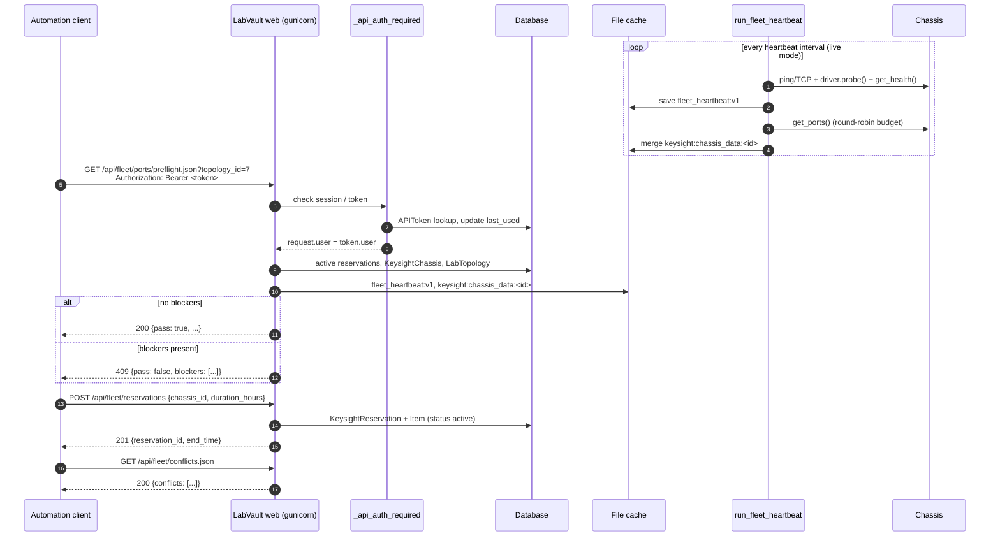

# Fleet API

Developer reference for the `/api/fleet/*` automation surface, its OpenAPI document, and the heartbeat worker behind it. For how chassis data is collected and cached, see [keysight-chassis.md](keysight-chassis.md). Operator-level docs: [../../api/API_AUTH.md](../../api/API_AUTH.md), [../../api/OPENAPI.md](../../api/OPENAPI.md).

## Contents

- [Purpose](#purpose)
- [Authentication](#authentication)
- [Data sources](#data-sources)
- [Endpoints](#endpoints)
- [OpenAPI and Swagger UI](#openapi-and-swagger-ui)
- [Heartbeat worker](#heartbeat-worker)
- [Worker status](#worker-status)
- [Client sequence](#client-sequence)
- [Adding a fleet endpoint](#adding-a-fleet-endpoint)
- [Gotchas](#gotchas)

## Purpose

The fleet APIs give scripts and CI jobs read access to the Keysight chassis inventory, including health, heartbeat, ports, ownership, reservations and SLA rollups. They also offer a few write operations: create a reservation, set team tags, and trigger a recovery action. Almost every endpoint is a pure read of the database plus the shared file cache, so calling it does not generate traffic to the lab hardware. The exceptions are listed under [Data sources](#data-sources).

Code: `connect/fleet_api_views.py` (views), `connect/fleet_heartbeat.py` (heartbeat store and probes), `connect/fleet_openapi.py` (OpenAPI document), `connect/worker_status.py` (diagnostics), `connect/management/commands/run_fleet_heartbeat.py` (worker).

## Authentication

Every data endpoint is wrapped in `keysight_views._api_auth_required`:

1. If `request.user.is_authenticated` (Django session cookie), the request proceeds.
2. Otherwise `_api_token_authenticate` reads `Authorization: Bearer <token>`, loads `APIToken.objects.get(token=..., enabled=True)`, checks `is_valid` (enabled and not past `expires_at`), updates `last_used`, and sets `request.user = token.user`.
3. Otherwise the response is `401 {"error": "Authentication required"}`.

`APIToken` (`connect/models.py`) has `user`, `name`, `token` (unique, 64 chars, stored in plaintext), `enabled`, `expires_at`, `last_used`, `created_at`. Tokens are created and revoked under **Settings → API Tokens** (`/settings/`). A fresh install seeds one token named `demo-api`, which should be rotated as described in [FIRST_LOGIN.md](../../getting-started/FIRST_LOGIN.md).

Every token has the same authority as its user. There are no scopes, and the views perform no permission checks beyond authentication.

The POST views are `csrf_exempt` so that Bearer clients work without a CSRF token. `/api/fleet/openapi.json` and `/api/docs/` are public.

## Data sources

| Source | Written by | Read via |
|---|---|---|
| `KeysightChassis`, `KeysightChassisSnapshot`, `KeysightReservation(+Item)`, `LabMetricSample`, `LabTopology` | UI, refresh worker, metric collectors | ORM |
| `keysight:chassis_data:<id>` (TTL 600 s) | `run_labvault_refresh` (full fetch), heartbeat port refresher | `keysight_views._get_cached` |
| `fleet_heartbeat:v1` (TTL 24 h) | `run_fleet_heartbeat` | `fleet_heartbeat.fleet_heartbeat_payload()`; `_hb_by_chassis()` in the views |

Only these calls reach hardware:

- `GET /api/fleet/heartbeat.json?tick=1` runs a full heartbeat tick synchronously.
- `GET /api/fleet/chassis/<id>/health.json?refresh=1` probes that one chassis.
- `GET /api/fleet/heartbeat/stream` ticks on every event, but only in seeded mode, where a tick is synthetic.
- `POST /api/fleet/chassis/<id>/recover` runs a driver action.

Port rows come from `_iter_ports_for_chassis(ch, reserved_keys)`, which normalises cached ports to `{chassis_id, chassis_hostname, chassis_ip, slot, port, label, owner, link_up, link_state, speed, reserved, hardware_error, bps_in, bps_out, cpu_pct, mem_pct, sample_age_s}`. `reserved` checks chassis-, slot- and port-level keys from active reservations. `hardware_error` is true when either the port or the chassis-wide flag is set. When the cache is cold in live mode, the chassis contributes **no** ports. Only seeded mode invents an 8-port placeholder.

## Endpoints

All responses are JSON unless noted. Most include `ok`, `source`, and `generated_at`. Every `/api/fleet/*` route is defined in `connect/urls.py`, and each backing function lives in `fleet_api_views`.

### Meta

| Method | Path | Function | Params | Response |
|---|---|---|---|---|
| GET | `/api/fleet/` | `fleet_index` | none | `{ok, name, auth, keng_note, endpoints: [{method, path, story}]}`: a static list |
| GET | `/api/fleet/openapi.json` | `fleet_openapi` | none | OpenAPI 3.0.3 document. **Public.** |
| GET | `/api/docs/` (and `/api/docs`) | `fleet_swagger_ui` | none | HTML `connect/fleet_swagger.html`. **Public.** |

### On-caller

| Method | Path | Function | Params | Response / behaviour |
|---|---|---|---|---|
| GET | `/api/fleet/health.json` | `fleet_health` | none | `{chassis: [...], counts: {total, online, halt_suspect}}`. Row fields: `chassis_id, hostname, ip_address, chassis_type, status, last_seen, team_tags, hardware_error_reported, cpu_pct` (heartbeat, else cached `cpu_utilization`)`, mem_pct, heartbeat_ok, halt_suspect, halt_reason, ports_up, ports_free, total_ports, recovery_actions[], source`. Port counts come from `_cached_port_fields`, which derives them from `ports` when summary counts are missing. |
| GET | `/api/fleet/heartbeat.json` | `fleet_heartbeat` | `tick=1` (optional) | `fleet_heartbeat_payload()`: `{mode, interval_seconds, updated_at, chassis: [entry + heartbeat_age_s, heartbeat_ok, halt_suspect, halt_reason, chassis_id], counts: {total, heartbeat_ok, halt_suspect, icmp_ok, api_ok}}` |
| GET | `/api/fleet/heartbeat/stream` | `fleet_heartbeat_stream` | none | `text/event-stream`, `event: heartbeat` + payload, up to 120 events, one every `heartbeat_interval_seconds()` |
| GET | `/api/fleet/chassis/<id>/health.json` | `fleet_chassis_health` | `refresh=1` (optional) | `{chassis_id, hostname, ip_address, chassis_type, status, heartbeat, cached_summary: {ports_up, ports_free, total_ports, cpu_utilization}, pcpu, recovery_actions}`. 404 for an unknown id. |
| POST | `/api/fleet/chassis/<id>/recover` | `fleet_chassis_recover` | JSON/form `action` = `reboot_chassis` (default) \| `power_cycle_chassis` \| `power_cycle_node` + `node_name` \| `restart_node` + `node_name` \| `port_reboot` + `port_id` | `{ok, action, chassis_id, error, data}`: 200 on success, 400 for an unsupported action or missing `port_id`, 502 on driver failure or exception. **This changes real hardware.** Only call it when an operator has asked for it. |

`recovery_actions` is advisory. It suggests `recover` plus `health.json?refresh=1` when `halt_suspect` is set, and a UI review when the chassis HW flag is set. Otherwise it returns `{"action": "none"}`.

### Test user

| Method | Path | Function | Params | Response |
|---|---|---|---|---|
| GET | `/api/fleet/ports/telemetry.json` | `fleet_ports_telemetry` | none | `{count, ports: [port row]}` for every chassis |
| GET | `/api/fleet/ports/preflight.json` | `fleet_ports_preflight` | `topology_id` (optional) | `{ok, pass, ports_checked, blocker_count, blockers: [{type, chassis_id, label?, hostname?, detail}], chassis: [{chassis_id, hostname, chassis_api_ok, halt_suspect, halt_reason}], topology}`. Blocker types: `chassis_api_stall`, `chassis_offline`, `port_reserved`, `link_down`, `owned_by_other`, `hardware_error`, `topology_not_found`. **HTTP 409** when any blocker exists. |
| GET | `/api/fleet/chassis/<id>/ports.json` | `fleet_chassis_ports` | none | `{chassis_id, hostname, count, ports}` |

### EM / director

| Method | Path | Function | Params | Response |
|---|---|---|---|---|
| GET | `/api/fleet/sla.json` | `fleet_sla` | `hours` (default 24) | `{mode, window_hours, fleet_uptime_pct, breach_count, chassis: [{chassis_id, hostname, uptime_pct, status, snapshot_count, halt_suspect, heartbeat_ok, icmp, api_probe, source}]}`. `uptime_pct` is a heuristic bucket, not a measured availability (see gotchas). |
| GET | `/api/fleet/summary.json` | `fleet_summary` | none | `{chassis_total, chassis_online, halt_suspect, ports_total, ports_link_up, ports_free, ports_reserved, aggregate_bps_in, aggregate_bps_out, active_reservations}` |
| GET | `/api/fleet/metrics/transmission.json` | `fleet_transmission` | `window` = `15m` \| `1h` (default) \| `4h` \| `24h` | `{mode, window, count, series: [{resource_key, metric, value, sampled_at}]}` from `LabMetricSample` (`bps_in`/`bps_out`, max 10 000 rows) |

### Lab admin

| Method | Path | Function | Params | Response |
|---|---|---|---|---|
| GET | `/api/fleet/inventory.json` | `fleet_inventory` | none | `{count, chassis: [{chassis_id, hostname, ip_address, chassis_type, status, serial_number, ixos_version, team_tags, hardware_error_reported, heartbeat_ok, halt_suspect, port_count, ports_free, ports_reserved, ports}]}` |
| GET | `/api/fleet/inventory.csv` | `fleet_inventory_csv` | none | CSV attachment `labvault_fleet_inventory.csv`, one row per chassis |
| GET | `/api/fleet/reservations.json` | `fleet_reservations` | none | `{count, reservations: [{id, title, user, status, start_time, end_time, items: [{chassis_id, chassis, slot, port, notes}]}]}` |
| POST | `/api/fleet/reservations` | `fleet_reservations_create` | JSON `chassis_id` (required), `title`, `description`, `duration_hours` (default 4), `slot`, `port`, `notes` | 201 `{reservation_id, title, start_time, end_time, chassis_id}`. Starts now and is owned by the token's user. There is no overlap check and no email. |
| POST | `/api/fleet/chassis/<id>/team-tags` | `fleet_team_tags` | JSON/form `team_tags` (list or comma string) | `{ok, chassis_id, team_tags}`. Replaces the existing tags. |

### Infra / SRE

| Method | Path | Function | Params | Response |
|---|---|---|---|---|
| GET | `/api/fleet/ownership.json` | `fleet_ownership` | none | `{count, ports: [{chassis_id, chassis, label, ixos_owner, reserved, team_tags, link_up}]}` |
| GET | `/api/fleet/conflicts.json` | `fleet_conflicts` | none | `{count, conflicts: [...]}`. Types are `reservation_overlap` (overlapping windows on the same chassis/slot/port scope, with both reservations) and `owned_and_reserved` (IxOS-owned port under a LabVault reservation). |
| GET/POST | `/api/ocs/<device_ip>/crossconnects/`, `/api/ocs/<device_ip>/crossconnect/` | `views_ocs_xconnect.*` | see OpenAPI | Listed in the index and OpenAPI but implemented outside this slice. The mutate call changes optical crossconnects and must only be run on explicit operator request. |

None of these endpoints add HTTP caching headers. Freshness is whatever the underlying cache holds: up to 600 s for port data, and one heartbeat interval for heartbeat rows.

## OpenAPI and Swagger UI

`fleet_openapi.fleet_openapi_document(server_url='/', absolute_server_url=...)` returns a hand-written OpenAPI 3.0.3 dict (`info.version` `1.2.0`):

- `get_op(...)` / `post_op(...)` helpers attach `security: [bearerAuth]`, a persona tag, and default responses (401/403/409 for GET; 400/401/403/502 plus 200/201 for POST).
- Tags: `meta`, `oncaller`, `test_user`, `em_director`, `lab_admin`, `infra_sre`.
- `components.securitySchemes.bearerAuth` is HTTP bearer. `components.schemas` defines only the OCS crossconnect schemas; most fleet responses are undocumented beyond `description`.
- `servers[0]` is same-origin `/`, which keeps the browser's host and port for Swagger "Try it out". The view derives an absolute URL from `X-Forwarded-Host`, `Host` and `X-Forwarded-Proto` and appends it when it differs.

The document is **not** generated from `urls.py`. The `fleet_index` endpoint list is a third, separate copy.

## Heartbeat worker

### Modes

Two independent switches decide what a tick does:

| Switch | Source | Values | Effect |
|---|---|---|---|
| `heartbeat_mode()` | `RuntimeSetting` `heartbeat_mode`, else `LABVAULT_WORKER_MODE`, else `settings.LABVAULT_WORKER_DEFAULT_MODE` (`idle`) | `idle` \| `live` | `idle` makes `run_heartbeat_tick()` return immediately (`{'mode': 'idle', counts: 0}`) |
| `seeded_mode()` | env `LABVAULT_HEARTBEAT_MODE` | `seeded` / `synthetic` / `demo` → synthetic; unset / empty / `live` / anything else → real probes | Chooses `tick_seeded` vs `tick_live`. It also enables synthetic port and transmission fallbacks and changes the SLA formula. |

A fresh install is therefore **idle**: the heartbeat store stays empty, `health.json` reports `heartbeat_ok: null`, and `sla.json` reports 0 % for every chassis that has no snapshots in the window. Setting `heartbeat_mode=live` is done by a dataset import (`labvault_dataset`) or by `manage.py bootstrap_labvault --live`. Synthetic rows are only produced when `heartbeat_mode` is `live` **and** `LABVAULT_HEARTBEAT_MODE` is one of the seeded values.

### Running it

- `python manage.py run_fleet_heartbeat` loops forever: tick, then sleep `--interval` or `heartbeat_interval_seconds()`. The interval is `LABVAULT_HEARTBEAT_INTERVAL_SECONDS`, default 120, minimum 15. On an exception it calls `close_old_connections()` and continues.
- `python manage.py run_fleet_heartbeat --once` runs a single tick. Install scripts use this for a smoke test.
- Deployments: the compose `heartbeat` service and the `deploy/systemd/labvault-heartbeat.service` unit.
- Ticks are serialised across processes by `fcntl.flock` on `_heartbeat_lock_path()`. That path is `LABVAULT_HEARTBEAT_LOCK` if set, otherwise the first creatable path among `/app/var/django_cache/fleet_heartbeat.lock`, `/var/lib/labvault/fleet_heartbeat.lock`, and `/tmp/labvault_fleet_heartbeat.lock`.

### What a live tick writes

1. `tick_live` probes all `KeysightChassis` rows concurrently (`LABVAULT_HEARTBEAT_MAX_WORKERS`, default 12, max 32) with `probe_chassis_live`:
   - `reachability.probe_hosts(expand_probe_hosts(hostname, ip), (22, 443, 80), try_icmp=True, timeout_s=2.0)` fills `icmp`, `open_ports`, `reachability_host`.
   - `get_driver(ch).probe()` sets `api_probe`. On `ok`, `get_health()` fills `cpu_pct` and `mem_pct`.
   - A host that answers ping or TCP but fails the API still counts as `last_probe_ok=True`, because an auth failure does not mean the host is down.
2. Every result is stamped with the same `last_heartbeat_at`, and the whole `chassis` map in `fleet_heartbeat:v1` is **replaced** in a single `save_store`.
3. Port refresh runs round-robin over chassis with `api_probe == 'ok'`. Up to `LABVAULT_HEARTBEAT_PORT_REFRESH_PER_TICK` (default 8, max 32) chassis get `driver.get_ports()`, which is merged into `keysight:chassis_data:<id>` along with summary counts, `status='online'`, synthetic cards when real ones are missing, and `_cached_at`. The TTL is 600 s. The cursor is stored in `fleet_heartbeat:port_refresh_cursor`.

`tick_seeded` writes random CPU and memory values and forces a periodic simulated `simulated_api_stall` for chassis whose pk is divisible by 17. It never contacts hardware.

### Classification (read time)

`_classify(entry, interval, now)` runs inside `fleet_heartbeat_payload()`:

- `heartbeat_ok` = last probe ok **and** age ≤ max(3 × interval, 180 s).
- `halt_suspect` with `halt_reason`:
  - `no_heartbeat` when there is no timestamp.
  - The probe's own reason (for example `probe_offline`, `exception:Timeout`, default `probe_failed`) when the last probe failed.
  - `missed_heartbeat` when age > max(6 × interval, 360 s).

## Worker status

`connect/worker_status.py` keeps two per-process dicts, `device_refresh_thread` and `keysight_refresh_thread`, each with `last_run_at`, `runs`, `last_error` and (Keysight only) `leader`. `worker_status_payload()` adds `age_s` and `stale` (age > 3 × interval; `REFRESH_INTERVAL` default 20 s, `KS_REFRESH_INTERVAL` default 120 s). It is consumed by `connect.diagnostics`, which also calls `fleet_heartbeat_payload()` for its `fleet_heartbeat` service check.

Only the in-process threads update it. The heartbeat worker and `run_labvault_refresh` run in other processes and never touch it (see gotchas).

## Client sequence



Example (RFC 5737 address, placeholder token):

```bash
curl -sk -H "Authorization: Bearer $LABVAULT_TOKEN" \
  https://192.0.2.10:9443/api/fleet/ports/preflight.json | jq '.pass, .blocker_count'
```

## Adding a fleet endpoint

1. **View** in `connect/fleet_api_views.py`. Put `@_api_auth_required` outermost, then `@require_GET` or `@require_http_methods(['POST'])` plus `@csrf_exempt` for writes. Read from the DB, `_get_cached`, `_hb_by_chassis()` and `_iter_ports_for_chassis`. Do not call drivers from a GET unless the caller opts in with an explicit query flag. Return `JsonResponse` with `ok`, `source='labvault_<name>'` and `generated_at`. Give it a docstring naming the URL and params.
2. **URL** in `connect/urls.py` next to the other `api/fleet/` routes, with a `fleet_<name>` route name.
3. **Index**: add `{'method', 'path', 'story'}` to the list in `fleet_index`.
4. **OpenAPI**: add a `paths` entry in `fleet_openapi.fleet_openapi_document` using `get_op` / `post_op` with the right persona tag. Add `params`, `body_props` and `response_schema` where they help. Examples must use `192.0.2.x` or `<host>`, because `tools/check_public_source.py` scans this file.
5. **Docs**: update this file's endpoint tables and, if the endpoint is customer-visible, the persona table in [../../api/OPENAPI.md](../../api/OPENAPI.md).
6. **Tests** in `connect/tests/`. Use `SimpleTestCase` for pure helpers (as in `test_fleet_api_cache.py`) and `TestCase` + `Client` for 401 without a token, 200 with an `APIToken` Bearer header, and the error paths. Mock `get_driver` for anything that could touch hardware.
7. Run `python tools/check_public_source.py` and `python tools/check_docs.py`.

## Gotchas

- **Idle by default.** Heartbeat-based fields are `null` or `false` until `heartbeat_mode` is `live`, and seeded rows additionally require `LABVAULT_HEARTBEAT_MODE`. This is easy to misread as all chassis being down.
- **Session CSRF on writes.** The POST endpoints are `csrf_exempt` but also accept a session cookie, so a page open in a logged-in browser could submit `recover`, team-tag or reservation requests on the user's behalf.
- **Mutation gate is a no-op.** `demo_mode.mutation_blocked_response` always returns `None` in this SKU. The 403 described in the OpenAPI POST responses (demo mode / `ALLOW_MUTATE`) never happens.
- **`?tick=1` blocks.** It runs a full live fleet probe inside the web request and can exceed gunicorn timeouts on large fleets. The SSE stream likewise holds a worker for up to 120 intervals (4 hours at the 120 s default).
- **Cold cache means empty ports.** In live mode, chassis with no fresh `keysight:chassis_data` entry contribute zero ports to telemetry, preflight, ownership and inventory, and preflight then passes vacuously for those chassis.
- **Preflight checks every port in the fleet.** Any link-down or owned port anywhere yields 409; there is no chassis or port selector yet. `topology_id` only checks that the topology exists.
- **SLA is heuristic.** In live mode, `uptime_pct` is 100/80/50/0 from the current heartbeat state, not integrated over `hours`.
- **Telemetry bps enrichment is unfinished.** `fleet_ports_telemetry` queries recent `LabMetricSample` rows but discards the result, so `bps_in` / `bps_out` only come from the cache.
- **Store writes race.** `upsert_chassis_heartbeat` (used by `?refresh=1`) does a read-modify-write of the whole store outside the tick lock, and a concurrent live tick replaces the whole `chassis` map.
- **`fleet_sla` calls `_hb_by_chassis()` once per chassis**, so the heartbeat store is re-read and re-classified N times per request.
- **Credentials leak via a sibling API.** `/api/keysight/resources/` (same Bearer auth) returns chassis usernames and passwords.
- **Three sources of truth** for the endpoint list: `urls.py`, `fleet_index`, and `fleet_openapi`. They drift unless all three are updated together.
