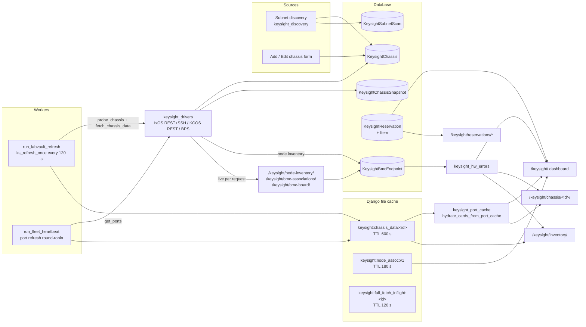
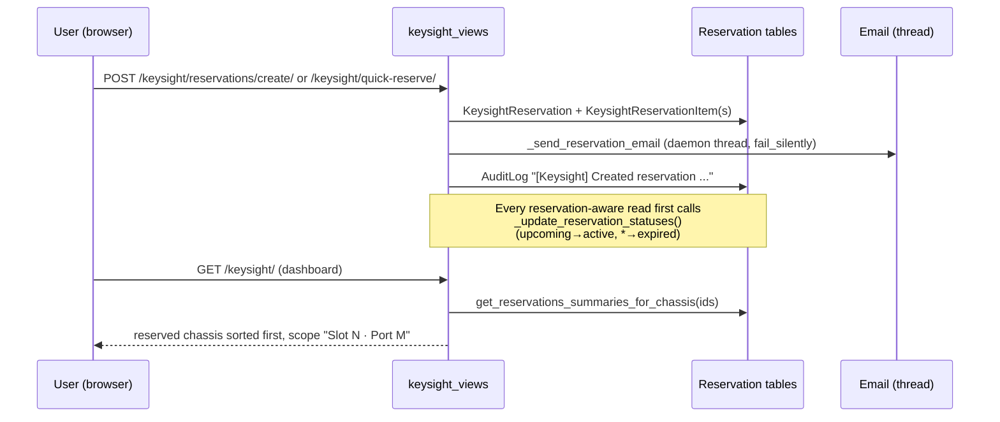

# Keysight chassis inventory

Developer reference for the Keysight / Ixia chassis area of LabVault: discovery, polling, the shared chassis cache, and the dashboard, chassis detail, hardware inventory, node/BMC and reservation pages. The automation surface on top of the same data is described in [fleet-api.md](fleet-api.md).

All code lives in the `connect` app. Device I/O goes through `connect.keysight_drivers.get_driver(chassis)`, which returns an IxOS, KCOS, or other driver. Every driver call returns a result object with `success`, `data`, and `error`.

## Contents

- [Purpose](#purpose)
- [Data flow](#data-flow)
- [Models](#models)
- [Chassis polling and caches](#chassis-polling-and-caches)
- [Card-grid hydration from cached ports](#card-grid-hydration-from-cached-ports)
- [APS generations and standalone nodes](#aps-generations-and-standalone-nodes)
- [Node and BMC associations](#node-and-bmc-associations)
- [Hardware error flags](#hardware-error-flags)
- [Dashboard filters](#dashboard-filters)
- [Reservations](#reservations)
- [Slack notifications](#slack-notifications)
- [Module reference](#module-reference)
- [Views, URLs, and templates](#views-urls-and-templates)
- [Extension points](#extension-points)
- [Gotchas](#gotchas)

## Purpose

LabVault keeps an inventory of Keysight test chassis (IxOS: XGS2, XGS12, XG, XM, AresONE; KCOS: APS M1010, M8400, APS standalone, T-Rex, AresONE HTREX). For each chassis it records identity and status in the database and keeps a recent snapshot of cards, ports, health, sensors, LLDP neighbours and (on KCOS) node, BPS and deployment data in a shared file cache. Pages render from that cache, so a slow or unreachable chassis does not block the UI.

## Data flow

## Models

All in `connect/models.py`.

| Model | Role | Notable fields |
|---|---|---|
| `KeysightChassis` | One chassis | `ip_address` (unique; IPv4, hostname or FQDN), `username`/`password`, `chassis_type`, `status` (online / offline / auth_failed / unknown), `last_seen`, `hostname`, `serial_number`, `ixos_version`, `kcos_version`, `os_platform`, `team_tags` (comma string, `team_tags_list` property), `geo_location`, `lab_name`, `hardware_error_reported`, `notes`, `snmp_community`, `mgmt_ipv6`, `preferred_ip_version`. `connect_address` picks the address drivers use. |
| `KeysightChassisSnapshot` | Health time series | `cpu_utilization`, `memory_used`, `memory_total`; one row per successful `fetch_chassis_data`. |
| `KeysightBmcEndpoint` | One BMC / node | `hostname` (unique), `ip_address`, `source` (`chassis_derived` / `manual_import`), `chassis`, `node_name`, `serial_number`, `aps_gen` (`10`/`15`), `fru_board_product`, `operating_mode`, `relocated_from_chassis`, `relocated_at`, `hardware_error_reported`, `hardware_error_notes`, optional credential override. |
| `KeysightReservation` | Time-boxed virtual hold | `title`, `user`, `start_time`, `end_time`, `status` (upcoming / active / expired / cancelled), `notification_emails`, `email_notified`. `save()` recomputes `status` from the time window unless cancelled. |
| `KeysightReservationItem` | What is held | `chassis`, `slot_number` (null = whole chassis), `port_number` (null = whole slot), `notes`. |
| `KeysightSubnetScan` | Saved discovery subnet | `subnet`, default credentials, `auto_scan`, `scan_interval`, `last_scan`, `discovered_count`. |
| `KeysightDeploymentJob` | KCOS deploy console job | `job_type` (online/offline), `package_type`, `target_version`, `package_url`, `status`, `progress`, `message`, `batch_id`. |

## Chassis polling and caches

### Who refreshes

| Producer | Entry point | Interval | Writes |
|---|---|---|---|
| Refresh worker (normal path) | `manage.py run_labvault_refresh` → `keysight_views.ks_refresh_once()` | `LABVAULT_KS_REFRESH_INTERVAL` (default 120 s, min 30 s) | For every chassis: `probe_chassis`, then `fetch_chassis_data` if the probe returned `ok`. 8 threads. |
| In-process leader thread | `start_ks_refresh_thread()` → `_ks_refresh_all()` | `KS_REFRESH_INTERVAL = 120` (constant) | Same as above, plus `worker_status.record_keysight_refresh`. |
| Heartbeat worker | `manage.py run_fleet_heartbeat` → `fleet_heartbeat.tick_live` → `_refresh_ports_cache` | `LABVAULT_HEARTBEAT_INTERVAL_SECONDS` (default 120 s) | Ports only, for up to `LABVAULT_HEARTBEAT_PORT_REFRESH_PER_TICK` (default 8) API-healthy chassis per tick. See [fleet-api.md](fleet-api.md). |
| On-demand, per chassis | chassis detail / data JSON (cache miss), hardware inventory (cold entries, max 32), add chassis, discovery add, clear-cache, bulk re-detect, `_schedule_full_chassis_fetch` | per request | `fetch_chassis_data` for that chassis. |

`start_ks_refresh_thread()` is called from most pages but returns immediately when `gunicorn` is loaded or `LABVAULT_DISABLE_INPROCESS_REFRESH` is truthy (set in `deploy/systemd/labvault-web.service`, the compose `web` service and `.env.example`). When it does run (for example under `runserver`), only the process that wins a non-blocking `flock` on `LABVAULT_KS_REFRESH_LOCK` (default `var/keysight-refresh.leader`) starts the loop. On a normal install, refresh is the `refresh` compose service or the `labvault-refresh` systemd unit.

### What `fetch_chassis_data` does

1. Submits driver calls to an 8-thread pool: `get_chassis_info`, `get_cards`, `get_ports`, `get_health`, `get_sensors`. KCOS adds `get_logical_ports`, `get_front_panel_ports`, `get_deployed_apps` and a `BPSDriver(...).get_topology()`. IxOS adds `get_topology_ssh` and `get_lldp_ssh`. Each result is awaited with a 30 s timeout.
2. If `get_chassis_info` fails, it returns `None` and writes nothing to the cache.
3. Updates `KeysightChassis` (serials, versions, `status='online'`, `last_seen`) and corrects `chassis_type` from the IxOS API type string, KCOS chart name / hostname (T-Rex, HTREX, `kcos-400` → M8400), 800GE / 400GBASE card types (AresONE), the BPS model string, and single-node standalone detection (`keysight_aps_standalone.infer_chassis_type_from_kcos` over `/introspection/nodes`).
4. Builds resource groups per card, in order of preference: SSH topology, the AresONE 9–24 port mapping, IxOS REST `resource_group_number`, the 2/4/8-port heuristics. It also flattens RG stripes that the native chassis console would not show.
5. LLDP: IxOS tries SSH, then REST `lldpPeerData`. KCOS tries SNMP (`snmp_community`, default `public`). A live result is persisted through `lldp_persistence`; otherwise the persisted copy is used, and finally `ChassisDeviceLink` rows are used as a reverse lookup. Neighbours are merged into the cards.
6. Computes `owners_summary`, including M8400 front-panel `reservedBy` lanes, writes a `KeysightChassisSnapshot`, and calls `_set_cached`.

### Cache keys

All keys live in the `default` Django cache, which is `FileBasedCache` at `LABVAULT_CACHE_DIR` (default `var/django_cache`). All access goes through `connect.cache_utils` (`cache_get` / `cache_set` / `cache_delete`), which swallow permission errors. The web, refresh, and heartbeat processes must share this directory; compose mounts the `djangocache` volume into all three.

| Key | Writer | TTL | Content |
|---|---|---|---|
| `keysight:chassis_data:<id>` | `_set_cached` (full fetch), `fleet_heartbeat._refresh_ports_cache` (ports) | 600 s (`_KS_CACHE_TTL`) | `fetch_chassis_data` payload plus `_cached_at`. The heartbeat path also sets `_cards_from_ports`. |
| `keysight:full_fetch_inflight:<id>` | `_schedule_full_chassis_fetch` | 120 s | Allows only one background full fetch per chassis at a time. |
| `keysight:node_assoc:v1` | `keysight_node_associations.refresh_node_associations` | 180 s | `{'ts', 'by_id': {chassis_id: assoc}}` |
| `fleet_heartbeat:v1`, `fleet_heartbeat:port_refresh_cursor` | heartbeat worker | 24 h | See [fleet-api.md](fleet-api.md). |

### Stale handling

- `_get_cached` returns `None` when the entry is missing, older than 600 s by its `_cached_at` stamp, or has no stamp. Callers treat `None` as "no data" and render empty grids and counts.
- Mutating views (port and card operations, KCOS node power/restart/switch-app, reboot, clear-cache) call `_clear_cached(id)`. The next read triggers a fetch or waits for the worker.
- `probe_chassis` sets `status` to `offline` or `auth_failed`. Pages and the refresh loop skip `fetch_chassis_data` for chassis that are not online.
- The dashboard never fetches inline. Chassis detail on a cold cache fetches synchronously, which can take tens of seconds.

## Card-grid hydration from cached ports

The heartbeat worker refreshes ports far more often than the full fetch, and a pickup import can leave ports cached with no cards. `keysight_port_cache` fills that gap:

- `cards_from_cached_ports(ports)` groups ports by `card_number` (default 1) into synthetic cards. Each card is typed `IxOS ports (fleet cache)`, has `ports_up` / `ports_owned` counts and AresONE-style RGs for ports 9–24, and is tagged `_from_fleet_ports=True`.
- `hydrate_cards_from_port_cache(cached)` applies this only when `cards` is empty and `ports` is present, and marks the payload `_cards_from_ports=True`.
- `cache_has_live_ixos_cards(cached)` is used by the heartbeat writer so it does not overwrite real cards with synthetic ones.

`keysight_chassis_detail` and `keysight_chassis_data_json` hydrate first, then, when `_cards_from_ports` is set and the chassis is online or unknown, call `_schedule_full_chassis_fetch(ch)`. That starts a daemon thread which runs `fetch_chassis_data`, so the next page load shows real cards. The dashboard only hydrates and does not schedule a fetch.

## APS generations and standalone nodes

KCOS APS chassis contain a mgmt node (role `merlin` on M8400, `master` on M1010) and `cn-aps-*` compute nodes. A **standalone** APS is a single box whose only KCOS node is named `mgmt` with role `compute`. It serves as both mgmt and CN.

`keysight_aps_standalone` (no I/O):

- Detection: `is_standalone_kcos_api_nodes` (raw `/introspection/nodes`), `is_standalone_node_inventory` (`get_node_inventory()` rows, `operating_mode == 'standalone_merged'`), `is_standalone_hostname` (`APS-O1/O2/M1/M2-*`).
- `infer_chassis_type_from_kcos` returns `aps_standalone` when standalone. T-Rex and HTREX types never change.
- `standalone_cn_identity("APS-O2-SN123")` returns `cn-aps-o2-sn123`, the name the same hardware would carry as a CN in a multi-node chassis. `standalone_chassis_index` builds that map so CN slots can link to their standalone record.
- `primary_bmc_ip` / `bmc_ips_from_network_addresses` read `bmcNetworkAddresses` (prefers `ipmi-ch1`).

`keysight_aps_generations` classifies nodes as APS 1.0 (`'10'`) or APS 1.5 (`'15'`). The precedence is: an explicit hint from `KeysightBmcEndpoint.aps_gen`, then IPMI FRU strings (`APS-ONE-150`, `O15`, …), then the node name (`cn-aps-o2-` / `cn-aps-o15-` → 1.5, other `cn-` → 1.0), then the standalone hostname. It provides the dashboard `aps_gen` filter (`filter_chassis_list_by_aps_gen`), the chip counts (`aps_generation_chip_stats`), the "models in selection" rows including `CN 1.5` / `CN 1.0` / `Standalone CN 1.x` (`build_models_in_selection_breakdown`), and badges (`chassis_aps_generation`: `'10'`, `'15'`, `'mixed'` or `None`).

## Node and BMC associations

There are three ways to see mgmt/compute node data:

| Page | Data path | Cached? |
|---|---|---|
| Dashboard node slots | `keysight_refresh_node_slots` (or `/keysight/?fetch_nodes=1`) → `refresh_node_associations(kcos_chassis, _fetch_bmc_data_from_chassis)` | Yes: `keysight:node_assoc:v1`, 180 s. The dashboard shows no node data after it expires until someone refreshes again. |
| `/keysight/bmc-associations/` | `_fetch_bmc_data_from_chassis` per online KCOS chassis, per request | No |
| `/keysight/node-inventory/`, `/keysight/bmc-board/` | `KCOSDriver.get_node_inventory()` per online KCOS chassis, per request, followed by `_upsert_bmc_endpoints` | Writes `KeysightBmcEndpoint` rows |

`build_association_for_chassis` shapes one chassis into the association dict: `mgmt_node`, `compute_nodes`, `standalone`, `cn_identity`, and mgmt/compute/up/down counts. Offline chassis that look standalone get a placeholder mgmt node. `enrich_associations_with_standalone_links` adds `paired_standalone_chassis_id` / `_hostname` / `_type` and `standalone_capable` to CN entries, and copies `aps_gen`, `fru_board_product`, and HW flags from matching BMC endpoints.

`_upsert_bmc_endpoints` keys rows on BMC hostname. When a hostname, or a serial number under a different hostname, shows up on a new chassis, it records `relocated_from_chassis` / `relocated_at`, which the BMC board shows as "relocated from".

The BMC board also merges `manual_import` endpoints. These come from `POST /keysight/bmc-board/import/` with `hostname:ip` lines and are DNS-resolved with `BMC_DOMAIN_SUFFIX` when there is no IP. With `?ipmi=1`, the board calls `bmc_ipmi.fetch_all_bmcs` (ipmitool) and writes FRU product and `aps_gen` back to the endpoint. BMC credentials are taken from the endpoint override, then the chassis credentials, then `BMC_DEFAULT_USER` / `BMC_DEFAULT_PASS`.

## Hardware error flags

There are two levels, both set by an operator:

- **Chassis-wide**: `KeysightChassis.hardware_error_reported`, with the explanation in `notes`. Set on the Edit Chassis form.
- **Per node**: `KeysightBmcEndpoint.hardware_error_reported` and `hardware_error_notes`. Set with `POST /keysight/api/chassis/<id>/node-hardware-error/` (`node_name` and/or `bmc_hostname`, `reported`, `notes`). `resolve_bmc_endpoint` finds the row by BMC hostname, then by `(chassis, node_name)`. If neither exists it creates one, using a `"<chassis_id>:<node>"` placeholder hostname when only a node name is known.

The helpers in `keysight_hw_errors` only read from the database. `apply_hw_flags_to_cards` is used on chassis detail and inventory. `enrich_assoc_hw_flags`, `chassis_shows_hw_warning`, `count_hw_error_units`, `build_selection_hw_summary` (the top bar with chassis / CN 1.5 / CN 1.0 totals and bad counts) and `enrich_type_breakdown_hw_bad` are used on the dashboard and inventory. `collect_hw_error_report` feeds Slack. The fleet preflight API treats a chassis-wide flag as a `hardware_error` blocker on every port of that chassis.

## Dashboard filters

`keysight_dashboard_filters` is shared by `/keysight/` and `/keysight/inventory/`.

| Param | Meaning |
|---|---|
| `chassis_type` | exact `KEYSIGHT_CHASSIS_TYPE_CHOICES` value |
| `status` | `online` / `offline` / `auth_failed` |
| `team_tag` | comma list, OR semantics against `team_tags_list` |
| `geo`, `lab` | exact `geo_location`, `lab_name` |
| `q` | substring of hostname, IP, serial |
| `aps_gen` | `10` / `15`; applied in memory against cached node associations |

`keysight_filtered_chassis_list` filters either a queryset or an in-memory `chassis_pool`. The dashboard passes `chassis_pool` to avoid a second query. `build_keysight_filter_chip_context` returns counters and toggle URLs (`build_qparams`) for each chip group. `preserve_query` keeps inventory-only params (`view`, `type`, `chassis`) across chip clicks.

## Reservations

Reservations are virtual holds recorded in LabVault. Nothing is pushed to the chassis, and IxOS port ownership is separate (the fleet APIs report both side by side).

- Scope is chassis (slot and port both null), slot (port null), or port.
- The create and edit forms send indexed `chassis_N` / `slot_N` / `port_N` / `notes_N` fields. Edit deletes and recreates every item. Only the owner or a superuser may edit, cancel, or delete.
- Quick reserve (`POST /keysight/quick-reserve/`) takes `chassis_id`, optional `slot_number` / `port_number`, `duration` (`1h`, `4h`, `8h`, `24h`, `1w`, or `custom` + `custom_end`), `title` and `notes`. It starts immediately and emails the user.
- Delete cancels an active or upcoming reservation and hard-deletes an expired or cancelled one.
- Email recipients come from `notification_emails`, falling back to `settings.KEYSIGHT_RESERVATION_EMAIL_RECIPIENTS`.
- Overlaps are **not** rejected anywhere. `/api/fleet/conflicts.json` reports them after the fact.
- Consumers: dashboard (`get_reservations_summaries_for_chassis`), chassis detail badges (`get_active_reservations_for_chassis`, keyed `chassis_level` / `slot_X` / `slot_X_port_Y`), and the inventory `view=reservations` tab and per-row `reservation_info`.

## Slack notifications

Configuration is through environment variables only. There are no defaults, and no secrets belong in the repository.

| Setting | Effect |
|---|---|
| `SLACK_SIGNING_SECRET` | Enables `POST /api/slack/keysight/`. Requests are verified with Slack's v0 HMAC-SHA256 over `v0:<ts>:<body>` and a 5-minute timestamp window. If the secret is unset, every request gets a 403. |
| `KEYSIGHT_SLACK_WEBHOOK_URL` | Comma-separated incoming-webhook URLs for outbound messages. |
| `WebhookEndpoint` rows (`webhook_type='slack'`, `enabled=True`) | Additional outbound webhook URLs. |
| `LABVAULT_PUBLIC_HOSTNAME` | Makes chassis links absolute (`https://<host>/keysight/chassis/<id>/`). |

Slash-command text: `help`, `hw-errors` (aliases `bad`, `hw`, `hardware`), `count` (alias `hw-count`). Outbound: `notify_hw_error_change` runs when the Edit Chassis form changes the chassis-wide flag and on every node-flag POST. It blocks the request for up to 8 s per webhook.

## Module reference

### `connect/keysight_views.py`

Cache and helpers:

| Function | Purpose | Side effects / external calls |
|---|---|---|
| `_set_cached(chassis_id, data)` | Store payload + `_cached_at` | Cache write, 600 s |
| `_get_cached(chassis_id) -> dict \| None` | Fresh payload or `None` | Cache read |
| `_clear_cached(chassis_id)` | Drop entry | Cache delete |
| `_schedule_full_chassis_fetch(chassis)` | One background `fetch_chassis_data` per chassis | Thread; `keysight:full_fetch_inflight:<id>` |
| `_ensure_chassis_data_cached(chassis_list, *, max_workers=6, max_fetch=32) -> (fetched, missing)` | Warm cold online entries | Probe + fetch per chassis |
| `_delete_keysight_chassis(ch)` | Delete without cross-DB FK errors | Deletes `NPResourceSample` / `PortUsageSample` (np_timeseries DB), chassis row, cache |
| `fetch_chassis_data(chassis) -> dict \| None` | Full snapshot (see above) | Driver calls, chassis save, LLDP persist, snapshot row, cache |
| `probe_chassis(chassis) -> str` | Status probe | Chassis save; `changelog.log_status_transition` |
| `ks_refresh_once() -> int` | Probe + fetch all chassis, 8 threads | As above; returns chassis count |
| `start_ks_refresh_thread()` / `_ks_refresh_all()` / `_try_acquire_ks_refresh_leader()` | Dev-only in-process loop | `flock`, thread, `worker_status` |
| `_api_token_authenticate(request)` / `_api_auth_required(view)` | Session or `Authorization: Bearer <APIToken.token>` | Updates `APIToken.last_used` |
| `_upsert_bmc_endpoints(nodes)` | Persist BMC rows from node inventory | `KeysightBmcEndpoint.update_or_create` |
| `_fetch_bmc_data_from_chassis(ch) -> list \| dict` | `KCOSDriver.get_node_inventory()` + chassis fields | KCOS REST; reverse DNS |
| `_get_bmc_credentials(endpoint, chassis)` | Credential cascade | Reads env |
| `_reverse_dns(ip)` | via `hardware_links.reverse_dns_hostname` | DNS |
| `_update_reservation_statuses()` | Time-based status sync | Bulk `UPDATE` |
| `get_active_reservations_for_chassis(id)` / `get_reservations_summaries_for_chassis(ids)` / `get_reservations_summary_for_chassis(id)` | Reservation lookups | DB |
| `_send_reservation_email(reservation)` | Notification | Thread; `send_mail(fail_silently=True)` |
| `_log_action`, `_audit_log`, `_log_chassis_operation`, `_log_deploy_*_changelog` | `AuditLog` / change-log rows | DB |
| `_ssh_exec`, `_run_deployment_job`, `_run_online_deploy`, `_online_deploy_verify`, `_run_offline_deploy`, `_verify_post_deploy` | KCOS deploy console worker (SSH `kcos deployment online-install`, or REST stage → validate → deploy → poll) | paramiko SSH; KCOS REST; `KeysightDeploymentJob` updates; up to 60 min polling |

The views are listed in [Views, URLs, and templates](#views-urls-and-templates).

### `connect/keysight_discovery.py`

| Function | Purpose |
|---|---|
| `_probe_host(ip, username, password, timeout=5) -> dict \| None` | IxOS session login, then KCOS Keycloak token. Guesses `chassis_type` from `/platform/api/v1/chassis`, Helm releases, hostname, and system info. |
| `scan_subnet(cidr, username, password, max_workers=50) -> list` | Synchronous scan (not used by views) |
| `scan_subnet_async(cidr, username, password) -> scan_id` | Background thread, up to 50 probe threads; progress in `_scan_state` |
| `get_scan_status(scan_id)` | Copy of in-memory state |
| `auto_add_discovered(discovered, username, password)` | Create chassis for new, `auth_ok` hosts (the view `keysight_discover_add_devices` duplicates this logic inline) |

### `connect/keysight_port_cache.py`

`cards_from_cached_ports`, `cache_has_live_ixos_cards`, `hydrate_cards_from_port_cache`. See [Card-grid hydration from cached ports](#card-grid-hydration-from-cached-ports).

### `connect/keysight_aps_generations.py`

`node_aps_generation`, `aps_gen_from_fru`, `is_aps_15_node_name`, `is_kcos_node_name`, `chassis_has_aps_gen`, `filter_chassis_list_by_aps_gen`, `filter_chassis_queryset_by_aps_gen` (narrows to KCOS types only), `count_nodes_for_aps_gen`, `aps_generation_chip_stats`, `build_models_in_selection_breakdown`, `filtered_model_stats`, `chassis_aps_generation`. All are pure functions over association dicts.

### `connect/keysight_aps_standalone.py`

`is_mgmt_kcos_role`, `is_standalone_kcos_api_nodes`, `is_standalone_node_inventory`, `standalone_aps_generation`, `is_standalone_hostname`, `standalone_cn_identity`, `standalone_chassis_index`, `standalone_gen_for_chassis`, `infer_chassis_type_from_kcos`, `bmc_ips_from_network_addresses`, `primary_bmc_ip`, `node_operating_mode`, `chassis_type_eligible_for_standalone`. All are pure functions.

### `connect/keysight_hw_errors.py`

`bmc_hw_flags_for_chassis`, `lookup_node_hw_flag`, `apply_hw_flags_to_cards`, `enrich_assoc_hw_flags`, `chassis_mgmt_hw_bad`, `chassis_shows_hw_warning`, `count_hw_error_units`, `build_selection_hw_summary`, `enrich_type_breakdown_hw_bad`, `resolve_bmc_endpoint` (writes), `collect_hw_error_report`.

### `connect/keysight_node_associations.py`

`refresh_node_associations(chassis_list, fetch_fn, *, max_workers=6)` (writes the cache), `get_cached_node_associations(ids)`, `build_association_for_chassis(ch, raw)`, `fetch_node_inventory_for_chassis(ch, fetch_fn)`, `enrich_associations_with_standalone_links(by_id, chassis_list)`, `node_slot_counts_by_chassis_id`, `aggregate_slot_stats`. `fetch_fn` is injected (normally `keysight_views._fetch_bmc_data_from_chassis`) to avoid an import cycle.

### `connect/keysight_dashboard_filters.py`

`parse_keysight_filter_params`, `keysight_dashboard_query_without(request, *keys)`, `keysight_filtered_chassis_list(request, *, online_only, node_by_id, chassis_pool)`, `build_keysight_filter_chip_context(request, qs, *, path, preserve_query, all_chassis_list)`.

### `connect/keysight_slack.py`, `connect/keysight_slack_views.py`

`slack_signing_secret`, `slack_webhook_urls`, `verify_slack_signature`, `format_hw_errors_text`, `handle_slack_command`, `post_slack_message`, `notify_hw_error_change`. The view is `keysight_slack_command` (CSRF-exempt, POST only).

### `connect/worker_status.py`

`record_device_refresh`, `record_keysight_refresh`, `worker_status_payload`. This is per-process memory read by `connect.diagnostics`. See the gotchas.

## Views, URLs, and templates

Templates live in `connect/templates/connect/keysight/` unless noted. Every view requires login unless stated otherwise.

| URL | Name | View | Method | Renders / returns |
|---|---|---|---|---|
| `/keysight/` | `keysight_dashboard` | `keysight_dashboard` | GET | `dashboard.html` (+ `_dashboard_filters.html`) |
| `/keysight/refresh-node-slots/` | `keysight_refresh_node_slots` | `keysight_refresh_node_slots` | GET | redirect to dashboard |
| `/keysight/add/` | `keysight_add_chassis` | `keysight_add_chassis` | GET/POST | `add_chassis.html` |
| `/keysight/chassis/<id>/` | `keysight_chassis_detail` | `keysight_chassis_detail` | GET | `chassis_detail.html` (+ `_slot_lldp_section.html`, `_node_hw_error_controls.html`) |
| `/keysight/chassis/<id>/edit/` | `keysight_edit_chassis` | `keysight_edit_chassis` | GET/POST | `edit_chassis.html` |
| `/keysight/chassis/<id>/delete/` | `keysight_delete_chassis` | `keysight_delete_chassis` | POST | redirect |
| `/keysight/chassis/<id>/sensors/` | `keysight_chassis_sensors` | `keysight_chassis_sensors` | GET | `chassis_sensors.html` (live) |
| `/keysight/chassis/<id>/licenses/` | `keysight_chassis_licenses` | `keysight_chassis_licenses` | GET | `chassis_licenses.html` (live) |
| `/keysight/api/chassis/<id>/data/` | `keysight_chassis_data_json` | `keysight_chassis_data_json` | GET | JSON |
| `/keysight/api/chassis/<id>/np-timeseries/` | `keysight_np_timeseries_json` | `keysight_np_timeseries_json` | GET | JSON stub (empty series) |
| `/keysight/api/dashboard/` | `keysight_dashboard_data_json` | `keysight_dashboard_data_json` | GET | JSON |
| `/keysight/api/chassis/<id>/team-tags/` | `keysight_update_team_tags` | `keysight_update_team_tags` | POST | JSON |
| `/keysight/api/chassis/<id>/node-hardware-error/` | `keysight_set_node_hardware_error` | `keysight_set_node_hardware_error` | POST | JSON |
| `/keysight/api/chassis/<id>/port-operation/` | `keysight_port_operation` | `keysight_port_operation` | POST | JSON |
| `/keysight/api/chassis/<id>/card-operation/` | `keysight_card_operation` | `keysight_card_operation` | POST | JSON |
| `/keysight/api/chassis/<id>/kcos/switch-app/` · `power-cycle-node/` · `restart-node/` · `power-node/` · `reboot-chassis/` | `keysight_kcos_*` | `keysight_kcos_*` | POST | JSON |
| `/keysight/api/chassis/<id>/clear-cache/` | `keysight_clear_cache` | `keysight_clear_cache` | POST | JSON; refetch in background |
| `/keysight/api/bulk-redetect/` | `keysight_bulk_redetect` | `keysight_bulk_redetect` | POST | JSON; refetches all KCOS chassis in background |
| `/keysight/discover/` | `keysight_discover` | `keysight_discover_page` | GET | `subnet_scan.html` |
| `/keysight/discover/scan/` · `scan/<scan_id>/status/` · `add-devices/` · `configure/` · `<id>/delete/` | `keysight_discover_*` | `keysight_discover_*` | POST / GET | JSON |
| `/keysight/inventory/` | `keysight_hardware_inventory` | `keysight_hardware_inventory` | GET | `hardware_inventory.html` or CSV |
| `/keysight/node-inventory/` | `keysight_node_inventory` | `keysight_node_inventory` | GET | `node_inventory.html` or CSV |
| `/keysight/bmc-associations/` | `keysight_bmc_associations` | `keysight_bmc_associations` | GET | `bmc_associations.html` |
| `/keysight/bmc-board/` · `import/` · `delete/` | `keysight_bmc_board` / `_import` / `_delete` | same | GET / POST | `bmc_board.html` or CSV / redirect |
| `/keysight/api/chassis/<id>/snapshots/` · `snapshot/create/` · `restore/` · `delete/` | `keysight_snapshot*` | same | GET / POST | JSON (KCOS only) |
| `/keysight/api/chassis/<id>/upgrade/` · `upgrade/status/` | `keysight_upgrade*` | same | POST / GET | JSON |
| `/keysight/deploy/` | `keysight_deploy_page` | `keysight_deploy_page` | GET | `deploy.html` |
| `/keysight/api/deploy/start/` · `upload/` · `packages/` · `status/` · `cancel/<job>/` · `retry/<job>/` · `refresh-builds/` | `keysight_deploy_*` | same | POST / GET | JSON |
| `/keysight/api/chassis/<id>/deploy/versions/` · `deploy/installed/` | `keysight_deploy_available_versions` / `_installed` | same | GET | JSON |
| `/keysight/api/changelog/record-operation/` | `keysight_changelog_record_operation` | `keysight_changelog_record_operation` | POST | JSON |
| `/keysight/reservations/` · `create/` · `<id>/` · `<id>/edit/` · `<id>/cancel/` · `<id>/delete/` | `keysight_*reservation*` | same | GET/POST | `reservations.html`, `reservation_form.html`, `reservation_detail.html` |
| `/keysight/quick-reserve/` | `keysight_quick_reserve` | `keysight_quick_reserve` | POST | JSON |
| `/keysight/audit/` | `keysight_audit_log` | `keysight_audit_log` | GET | `audit_log.html` |
| `/api/keysight/resources/` | `api_keysight_resources` | `api_keysight_resources` | GET | JSON; session or Bearer |
| `/api/slack/keysight/` | `keysight_slack_command` | `keysight_slack_views.keysight_slack_command` | POST | Slack JSON; signature only |

## Extension points

- **New chassis type**: add it to `KEYSIGHT_CHASSIS_TYPE_CHOICES` (with a migration), register a driver in `connect/keysight_drivers` (`get_driver`, and `KCOS_TYPES` if it is KCOS), add detection in `keysight_discovery._probe_host` and the type-correction block in `fetch_chassis_data`, and add an icon in `KeysightChassis.chassis_icon`.
- **New cached field**: compute it in `fetch_chassis_data` and add it to `data`. Readers must tolerate its absence, because the heartbeat port refresher writes partial payloads.
- **New dashboard filter**: extend `parse_keysight_filter_params`, both branches of `keysight_filtered_chassis_list`, and `_build_qparams` / the stats in `build_keysight_filter_chip_context`.
- **New node attribute**: add it to `_node_entry_from_raw` (dashboard associations) and `_upsert_bmc_endpoints` / `KeysightBmcEndpoint` if it must persist.
- **New Slack command**: add a branch in `handle_slack_command` and a test in `connect/tests/test_keysight_slack.py`.
- Related tests: `test_keysight_cards_from_ports.py`, `test_keysight_aps_generations.py`, `test_keysight_hw_errors.py`, `test_keysight_slack.py`, `test_kcos_chassis_api.py`, `test_ixos_lldp_peer.py`, `test_aresone_*`.

## Gotchas

- **Shared cache directory.** The web, refresh, and heartbeat processes only see each other's data if `LABVAULT_CACHE_DIR` points at the same writable directory. A per-process or root-owned cache directory silently gives an empty dashboard.
- **In-process refresh never runs under gunicorn.** If the `refresh` service or `labvault-refresh` unit is stopped, the cache ages out after 10 minutes and pages go blank, apart from the heartbeat port refresher's partial data.
- **Synchronous fetches on cold cache.** Chassis detail and `data/` JSON call `fetch_chassis_data` inline on a miss. The hardware inventory warms up to 32 chassis inline. Each fetch can take 30 s or more.
- **`chassis_type` is rewritten by fetches.** A manual type choice can be overwritten on the next refresh by API, chart, card, BPS or standalone detection.
- **Node associations expire after 180 s.** The dashboard only shows node slots shortly after someone clicks refresh. Node inventory, BMC associations and BMC board make live KCOS calls on every load.
- **Discovery state is per worker.** Polling `scan/<id>/status/` may hit a different gunicorn worker and return "Scan not found". `auto_scan` and `scan_interval` are stored but nothing schedules them.
- **Credentials.** Chassis and BMC credentials are stored in plaintext model fields. Discovery defaults to `admin`/`admin`. `api_keysight_resources` returns chassis usernames and passwords to any valid API token.
- **Reservations are advisory.** Overlaps are not rejected, and nothing is enforced on the device.
- **Mutation gate is a no-op.** `demo_mode.mutation_blocked_response` always returns `None` in this SKU, so port, node and reboot actions are never blocked by configuration.
- **`worker_status` looks stale in production** because the web process never runs the Keysight loop, and `run_labvault_refresh` does not report into it. Its staleness check also reads `KS_REFRESH_INTERVAL` while the worker reads `LABVAULT_KS_REFRESH_INTERVAL`.
- **`_ssh_exec` uses `AutoAddPolicy`**, so host keys are not verified for deploy SSH sessions.
