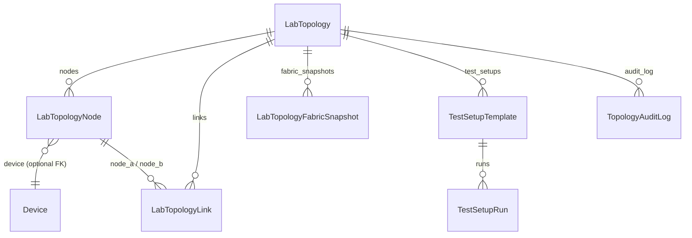
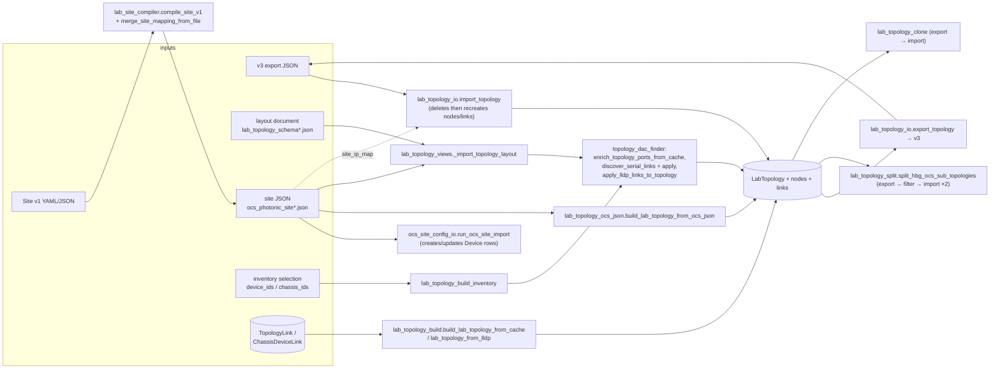
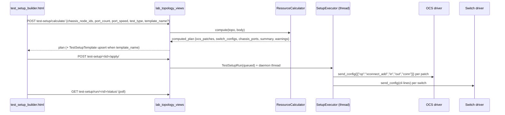

# Subsystem: Lab topology designer

The designer holds an operator-maintained model of one lab: which devices and
chassis belong to it, how they are cabled (planned links), how the canvas is
laid out, and which OCS triplets each port uses. Fabric, Port Fabric, usage and
test-setup views all read this model and overlay live data on it.

Discovery, LLDP, graph building and the fabric caches are described in
[topology.md](topology.md). User docs: [user/TOPOLOGY.md](../../user/TOPOLOGY.md).

## Data model



| Model | Fields that matter |
|---|---|
| `LabTopology` | `name` (not unique), `source` (`manual`, `import`, `lldp`, `dc_preset`, `clone`, `split`), `tags` (comma string), `extra` (JSON), `metrics_collection_enabled`, `updated_at` |
| `LabTopologyNode` | `node_key` (stable external id, ≤64 chars), `node_type` (`switch`, `server`, `ocs`, `chassis`, `firewall`, `generic`), `device` FK (switch/OCS/firewall), `label`, `x`, `y`, `extra` |
| `LabTopologyLink` | `node_a/port_a ↔ node_b/port_b`, `cable_type` (`dac`, `optic`, `direct`, `ocs`), `color`, `label`, `extra` |

Keysight chassis are **not** bound through the `device` FK; they are bound by
`extra.chassis_id` (plus `extra.chassis_type`, `extra.device_ip`).

Common `LabTopologyNode.extra` keys:

| Key | Meaning |
|---|---|
| `chassis_id`, `chassis_type` | Bound `KeysightChassis` |
| `device_ip`, `mgmt_ipv4`, `mgmt_ipv6`, `mgmt_ipv6_source`, `preferred_ip_version`, `hostname` | Management addressing (see [topology.md](topology.md#management-addressing-ipv4--ipv6)) |
| `ports` | Port label list (strings) |
| `port_details` | `[{name, serial, role: dac|ocs, ocs_triplets, link_state, …}]` |
| `slot_layout` | Persisted slot/RG/port grid (same shape as `build_node_slot_layout`) |
| `ocs_triplet_map` / `ocs_site_mapping` | `port_to_ocs_triplets` copied from site JSON |
| `ocs_physical_ports` | OCS physical port inventory |
| `role` | e.g. `dut` for extra devices added by the DC preset |

Common `LabTopology.extra` keys: `view_layouts` (per view), `addressing_profile`
(`ipv4`/`v6`), `site_json`, `layout_schema`, `resource_bundle`,
`sub_topologies`, `parent_topology_id`, `sub_topology_role`,
`ocs_stage_enabled`, `topology_family`.

Common `LabTopologyLink.extra` keys: `discovery` (`serial_match`, `lldp_cache`),
`serial`, `link_kind` (`dac`, `b2b`), `port_range_a/b`, `count`,
`last_validation`.

### View layouts (`extra.view_layouts`, schema_version 2)

One entry per view key (`designer`, `fabric`, `port_fabric`, `usage`), merged by
`_merge_view_layouts` on `POST data/`:

```json
{"port_fabric": {"schema_version": 2, "layout_mode": "dc|tier|free", "bundled": true,
  "pos": {"node_12": {"x": 10, "y": 20}}, "pos_by_node_key": {"arista1": {"x": 10, "y": 20}},
  "theme": "dark", "b2b_labels": true, "lldp_view": false,
  "viewport": {"scale": 1, "tx": 0, "ty": 0}, "saved_at": "…Z"}}
```

`pos` is keyed by DB id; exports add `pos_by_node_key` so positions survive
re-import. The v3 import/export only carries `designer`, `fabric`,
`port_fabric` (not `usage`).

## Files and formats

| Format | Where | Consumed by |
|---|---|---|
| **v3 export** (`format: "labvault.lab_topology"`, `version: 3`) | `GET /lab-topology/<id>/export/` → `<name>.labtopo.v3.json` | `import/`, `import-site/`, clone, split |
| **v2 designer JSON** (`version: 2`, DB ids) | `GET /lab-topology/<id>/data/` | Designer JS |
| **Layout document** (`resources/lab_topology_schema.json`, `lab_topology_schema_v6.json`) | `{version, label, description, site_json, layout: {nodes: [{id, label, node_type, device_ip, x, y, ports, extra}], links: [{from, to, cable_type, count, port_range_a, port_range_b, label}]}}` | `build-dc/`, `import-site/`, `manage.py import_lab_topology` |
| **Site JSON** (`resources/ocs_photonic_site*.json`) | `{version, common_tags, ocs_controller, arista_switches[], ares_switches[], keysight_chassis[]}`; switches/chassis carry `fixed_mapping.port_to_ocs_triplets: {port_9: ["1.1.1", "1.1.2"]}` (chassis may embed it in `notes` after `[ocs_site_mapping]`) | Port Fabric, fabric map, OCS triplet map, onboard, scenario |
| **Site v1** (`resources/labvault_site_v1_example.yaml`) | `{version: 1, site_tags, ocs, switches, chassis, preset}` | Onboard wizard `site_v1` mode (`lab_site_compiler`) |

The `lab_topology_schema*.json` files are example *layout documents*, not JSON
Schema. There is no JSON-Schema validation. Checks that do exist:

- `compile_site_v1` rejects `version != 1`.
- `build_lab_topology_from_ocs_json` requires `version` and `ocs_controller.ip`.
- `import_topology` accepts anything with `nodes`/`links`; links whose ends do not resolve are skipped silently.
- `POST /lab-topology/<id>/graph/validate/` (`validate_topology_payload`) flags duplicate `node|port` pairs and planned-vs-LLDP port conflicts.
- `manage.py validate_ocs_site_config` enriches/validates a site JSON against live LLDP (outside this slice).

v3 export (abridged):

```json
{
  "format": "labvault.lab_topology", "version": 3, "exported_at": "…Z",
  "topology": {"id": 7, "name": "Example lab", "description": "", "source": "manual", "tags": "", "extra": {}},
  "nodes": [{"id": "arista1", "node_key": "arista1", "_db_id": 41, "label": "Spine-1", "node_type": "switch",
             "device_ip": "192.0.2.20", "mgmt_ipv4": "192.0.2.20", "mgmt_ipv6": "2001:db8::20",
             "mgmt_display": "192.0.2.20", "preferred_ip_version": "ipv4", "x": 0, "y": 0, "ports": [], "extra": {}}],
  "links": [{"id": 9, "node_a": "arista1", "port_a": "port_9", "node_b": "ocs", "port_b": "1.1.1",
             "cable_type": "optic", "color": "#22c55e", "label": "", "extra": {}}],
  "view_layouts": {"designer": {"pos": {}, "pos_by_node_key": {}}},
  "resource_bundle": {"addressing_profile": "ipv4", "site_json": "ocs_photonic_site.json", "layout_schema": "lab_topology_schema.json"}
}
```

## Import / export / onboard / compile pipeline



Onboard wizard (`/lab-topology/onboard/`, `lab_topology_onboard.py`) modes:

| Mode | Preview | Build |
|---|---|---|
| `hbg`, `v6` (DC preset) | Checks the layout/site files exist | Forwards to `lab_topology_build_dc` |
| `ocs_only` | Warns without site text | `run_ocs_site_import` + `build_lab_topology_from_ocs_json` |
| `site_v1` | Compiles and reports counts | Compile → merge mapping → `run_ocs_site_import` → OCS JSON build; `preset: v6|hbg` also runs the DC preset |
| `inventory` | Echoes ids | Forwards to `lab_topology_build_inventory` |

Forwarding uses a `RequestFactory` request carrying the caller's `user`.

### Binding rules on import

`import_topology` looks up both `Device` and `KeysightChassis` by
`device_ip` (or `mgmt_ipv4`). A chassis match always wins for `extra.chassis_id`
(stale exported ids are overwritten); a `chassis` node with no match loses its
`chassis_id`. Site JSON (from `extra.site_json` or the `site_data` argument)
adds IPv6 / preferred-version fields and `ocs_triplet_map`. When
`addressing_profile == 'v6'` missing IPv6 is derived with
`derive_dhcpv6_ocs_lab` (needs the `LABVAULT_OCS_*` env vars). Import resets
`metrics_collection_enabled` to `True` unless the payload says otherwise.

### Sub-topologies (`lab_topology_split.py`)

`split_hbg_ocs_sub_topologies(parent, replace_existing=True)` builds two
children from a parent export using fixed `node_key` sets:

- `without_ocs_patch` — `aresone01…04` + `arista1…4`, OCS ports/links stripped, `ocs_stage_enabled=False`.
- `with_ocs_patch` — `aresone05…08`, `ocs`, `server01…02`, `arista1…4`.

Children get `extra.parent_topology_id` / `sub_topology_role`; the parent gets
`extra.sub_topologies` and `topology_family='hbg_ocs_split'`. With
`replace_existing` the previous children are deleted first. The split only
works on topologies whose node keys follow the example preset naming.
`get_sub_topology_nav(topo)` feeds the parent/sibling switcher in templates.

## Discovery helpers used by the designer

- **Serial DAC/B2B finder** (`topology_dac_finder.py`, `GET|POST /lab-topology/<id>/discover-dac/`). Serials come from the Keysight chassis cache (`transceiver_serial`), Arista/SONiC DOM (`get_dom_info`), and `extra.port_details`. Two ports with the same normalized serial form a pair; groups of more than two are chained in sorted order. Same chassis → `direct`/`b2b`, otherwise `dac`. GET previews; POST with `{"apply": true}` creates `LabTopologyLink` rows (existing links are skipped).
- **LLDP links** — `apply_lldp_links_to_topology` adds one portless amber `LLDP` link per node pair found in `get_cached_topology()`.
- **Node port grid** — `GET /lab-topology/<id>/nodes/<node_id>/ports/[?refresh=1]` returns `build_node_slot_layout`; the result is persisted to `extra.slot_layout` when it came from a live or site source. `refresh=1` triggers chassis SSH and a live OCS fetch.
- **Link validation** — `POST /lab-topology/<id>/validate-link/` flaps the switch end of a link (see [topology.md](topology.md#topology_link_validatepy)). This takes the port down on real hardware.

## Test setup builder and scenario analysis



- Test types: `full_mesh`, `p2p`, `one_to_many`. Switch config is a VLAN (`100/200/400/800` by speed) plus access-port stanzas for links from switch nodes to the selected chassis nodes.
- `GET /lab-topology/<id>/scenario/?chassis=<ids>&switch=<ids>` (`_compute_scenario`) builds the full-mesh patch list from site JSON / `extra.ocs_triplet_map`, compares it with the current OCS cross-connects (cached 60 s), and returns `to_add` / `to_remove` / `already_correct`. It does not change anything.
- `GET /lab-topology/<id>/portmap/` returns the site JSON port→triplet map for every node.

## URL → view → template

All views are `@login_required` unless marked *API* (`_api_auth_required`: session or API token).

### `/topology/` (in `connect/views.py`)

| URL | View | Returns |
|---|---|---|
| `topology/` | `topology_map` | `connect/topology.html` |
| `topology/data/[?refresh=1]` | `topology_data` | JSON `{nodes, links, needs_rescan}` |
| `topology/refresh/` | `topology_refresh` | background scan, redirect |
| `topology/rescan/` (POST) | `topology_rescan` | background scan, JSON |
| `topology/export/?format=drawio|json&tags=` | `topology_export` | `.drawio` / JSON download |
| `api/topology/` | `api_topology` | `get_cached_topology()` JSON |
| `device/<id>/lldp/`, `device/<id>/enable-lldp/` | `device_lldp`, `device_enable_lldp` | per-device LLDP (device slice) |

### `/lab-topology/*` and `/test-setup/*` (in `lab_topology_views.py` unless noted)

| URL | Method | View | Template / response |
|---|---|---|---|
| `lab-topology/` | GET | `lab_topology_list` | `lab_topology_list.html` |
| `lab-topology/new/` | GET/POST | `lab_topology_new` | list template / redirect |
| `lab-topology/onboard/` | GET | `lab_topology_onboard.lab_topology_onboard` | `lab_topology_onboard.html` |
| `lab-topology/onboard/preview/`, `…/build/` | POST | `lab_topology_onboard_preview`, `lab_topology_onboard_build` | JSON |
| `lab-topology/build-inventory/` | POST | `lab_topology_build_inventory` | JSON 201 |
| `lab-topology/build-dc/` | POST | `lab_topology_build_dc` | JSON 201 |
| `lab-topology/from-lldp/` | POST | `lab_topology_from_lldp` | redirect |
| `lab-topology/import-site/` | POST | `lab_topology_import_site` | JSON |
| `lab-topology/<id>/` | GET | `lab_topology_detail` | `lab_topology_detail.html` |
| `lab-topology/<id>/data/`, `…/data/v2/` | GET/POST | `lab_topology_data`, `lab_topology_data_v2` | JSON |
| `lab-topology/<id>/metrics-collection/` | GET/POST | `lab_topology_metrics_collection` | JSON |
| `lab-topology/<id>/clone/` | any | `lab_topology_clone` | JSON |
| `lab-topology/<id>/split-subtopologies/` | POST | `lab_topology_split_subtopologies` | JSON |
| `lab-topology/<id>/export/` | GET | `lab_topology_export` | v3 download |
| `lab-topology/<id>/import/` | POST | `lab_topology_import` | JSON |
| `lab-topology/<id>/inventory/` | GET | `lab_topology_inventory` | JSON |
| `lab-topology/<id>/nodes/` | POST | `lab_topology_node_add` | JSON 201 |
| `lab-topology/<id>/nodes/<nid>/` | PATCH/DELETE | `lab_topology_node_detail` | JSON |
| `lab-topology/<id>/nodes/<nid>/ports/` | GET | `lab_topology_node_ports` | JSON slot layout |
| `lab-topology/<id>/links/` | POST | `lab_topology_link_add` | JSON 201 |
| `lab-topology/<id>/links/<lid>/` | PATCH/DELETE | `lab_topology_link_delete` | JSON |
| `lab-topology/<id>/discover-dac/` | GET/POST | `lab_topology_discover_dac` | JSON |
| `lab-topology/<id>/validate-link/` | POST | `lab_topology_validate_link` | JSON |
| `lab-topology/<id>/push-port-config/` | POST | `lab_topology_push_port_config` | JSON |
| `lab-topology/<id>/ports/available/` | GET | `lab_topology_ports_available` | JSON |
| `lab-topology/<id>/scenario/`, `…/portmap/` | GET | `lab_topology_scenario`, `lab_topology_portmap` | JSON |
| `lab-topology/<id>/delete/` | POST/DELETE | `lab_topology_delete` | JSON / redirect |
| `lab-topology/<id>/fabric/` | GET | `lab_fabric_map_page` | `lab_fabric_map.html` |
| `lab-topology/<id>/fabric.json` | GET | `lab_fabric_map_api` | JSON |
| `lab-topology/<id>/port-fabric/` | GET | `lab_port_fabric_page` | `lab_port_fabric.html` |
| `lab-topology/<id>/port-fabric.json` | GET | `lab_port_fabric_api` | JSON + `X-Port-Fabric-Cache` header |
| `lab-topology/<id>/port-fabric/summary.json` | GET | `lab_port_fabric_summary_api` | always 404 |
| `lab-topology/<id>/graph.json`, `graph/compare.json` | GET | `lab_topology_graph_json`, `lab_topology_graph_compare` | JSON |
| `lab-topology/<id>/graph/refresh/`, `graph/validate/` | POST | `lab_topology_graph_refresh`, `lab_topology_graph_validate` | JSON |
| `lab-topology/<id>/usage/` | GET | `lab_topology_usage_page` | `lab_topology_usage.html` |
| `lab-topology/<id>/usage-graph.json` | GET | `lab_topology_usage_graph_json` | JSON (`port_usage_graph`, cached 90 s) |
| `lab-topology/by-name/<name>/` | GET | `lab_topology_by_name` (*API*) | JSON id lookup (409 if ambiguous) |
| `lab-topology/by-name/<name>/usage/` | GET | `lab_topology_usage_by_name` | redirect |
| `lab-topology/list.json` | GET | `lab_topology_list_json` (*API*) | JSON |
| `api/port-usage/episodes/` | POST | `api_port_usage_episodes` (*API*) | JSON |
| `lab-topology/<id>/test-setup/` | GET | `test_setup_list` | `test_setup_builder.html` |
| `lab-topology/<id>/test-setup/calculate/` | POST | `test_setup_calculate` | JSON |
| `test-setup/<tid>/` | GET | `test_setup_detail` | `test_setup_builder.html` |
| `test-setup/<tid>/apply/` | POST | `test_setup_apply` | JSON `{run_id}` |
| `test-setup/run/<rid>/status/` | GET | `test_setup_run_status` | JSON |

Usage insights, timeline and the `usage/*` graph pages
(`lab_usage_insights_views`, `lab_usage_graph_views`, `lab_timeline_views`) are
documented with the insights subsystem.

## Module reference

### `lab_topology_views.py`
View functions are listed in the URL table. Non-view helpers other modules rely on:
- `refresh_port_fabric_snapshot(topo_id, *, want_live=True, want_lldp=True, force_refresh=False) -> payload` — rebuild + store the Port Fabric snapshot (used by `topology_fabric_cache` and management commands).
- `_build_port_fabric_payload(topo, *, want_live, want_lldp, force_refresh, reload_switch_lldp=False, profile=True) -> (payload, timing)`.
- `_chassis_name_to_ip_helper(label) -> ip` — label → chassis IP from site JSON by name prefix + trailing number.
- `_import_topology_layout(topo, layout_data, site_data) -> msg` — layout document importer (appends; does not clear existing nodes).
- `_merge_view_layouts(topo, incoming)`, `_resolve_node_binding(node_type, device_id, chassis_id, device_ip, label) -> (device, extra, node_type, ip)`, `_default_ports_for_node(node_type, port_count)`.
- `_ARISTA_IP_TO_LLDP`, `_LLDP_RAW_DIR`, `_LLDP_HOSTNAME_TO_IP` — empty in this SKU (raw-file LLDP fallback disabled); `refresh_lldp` imports them.

### `lab_topology_io.py`
- `topology_to_api_dict(topo)` — v2 designer JSON with DB ids.
- `export_topology(topo)` — v3 export (plus legacy top-level `id/name/…`).
- `import_topology(topo, payload, *, site_data=None) -> msg` — **deletes all nodes (and their links)** then recreates them; remaps view layouts by `node_key` and legacy DB ids.
- `resource_paths_for_profile(profile) -> (layout_schema, site_json)` — `v6`/`hbg-v6`/`ipv6`/`dc-v6` → v6 layout.
- `FORMAT_ID = 'labvault.lab_topology'`, `EXPORT_VERSION = 3`.

### `lab_topology_split.py`
`split_hbg_ocs_sub_topologies` (atomic), `get_sub_topology_nav`, node-key sets `WITHOUT_OCS_NODE_KEYS` / `WITH_OCS_NODE_KEYS`.

### `lab_topology_build.py`
`build_lab_topology_from_cache(name, user, description='', tags='')` (atomic) plus cable helpers `_infer_cable` (`N.N…` → optic, `eth…`/`port_` → dac, else direct), `_cable_choices`, `_color_for_cable`, `_grid`.

### `lab_topology_ocs_json.py`
`build_lab_topology_from_ocs_json(path, name, user, description='')` (atomic).

### `lab_topology_onboard.py`
`lab_topology_onboard`, `lab_topology_onboard_preview`, `lab_topology_onboard_build`.

### `lab_site_compiler.py`
`compile_site_v1(doc)`, `compile_site_v1_file(path)`, `merge_site_mapping_from_file(site_doc, mapping_path)`.

### `test_setup_engine.py`
`ResourceCalculator.compute(topo, requirements) -> computed_plan`; `SetupExecutor.execute(run)` (applies OCS patches then switch configs, updates `TestSetupRun` and the template status).

## Extension points

- **Add a node type** — add the choice to `LabTopologyNode.NODE_TYPE_CHOICES` (migration), a default port scaffold in `_default_ports_for_node`, a mapping in the three `_NODE_TYPE_MAP` dicts (views, io, dac_finder) if a vendor should map to it, a `build_node_slot_layout` branch in `topology_device_ports.py`, and styling in `lab_topology_detail.html` / `lab_port_fabric.html`. Nodes of unknown type fall back to the generic server-style layout.
- **Add a link discovery source** — write a function that returns pairs shaped like `find_serial_pairs` output (`node_a`, `port_a`, `node_b`, `port_b`, `cable_type`, `link_kind`, `serial`) and reuse `apply_serial_links_to_topology`, or create `LabTopologyLink` rows with `extra.discovery` set.
- **Add an export/import format** — add a function next to `export_topology` that reads the same ORM rows; keep `node_key` as the stable id so layouts can be remapped by `_remap_view_layouts`. Add a view and URL alongside `lab_topology_export`.
- **Add a view layout key** — add it to `_VIEW_LAYOUT_KEYS` in both `lab_topology_views.py` and (if it should survive export) `lab_topology_io.py`.
- **Add a test type** — extend the pair generation in `ResourceCalculator.compute` and `TestSetupTemplate.TEST_TYPE_CHOICES`.

## Gotchas

- There is no per-topology permission check: any logged-in user can edit, import over, delete, split, or clone any topology, push switch config (`push-port-config`), flap ports (`validate-link`) or apply OCS patches (`test-setup/<id>/apply/`).
- `import/` and `import-site/?replace=1` are destructive. `import_topology` deletes every node first; `replace=1` deletes **all** topologies with the same name.
- `lab_topology_clone` accepts GET as well as POST.
- `LabTopology.name` is not unique; `by-name` lookups return 409 on duplicates.
- `ResourceCalculator._build_triplet_map` passes a `Device` object to `ocs_helpers.load_ocs_site_triplets` (which expects an IP string and returns a set), so the calculator always sees an empty triplet map and never plans OCS patches; it only emits warnings and switch configs.
- Generated switch stanzas prefix `Ethernet` to whatever `port_a/port_b` holds, so labels like `port_9` become `Ethernetport_9`.
- `split_hbg_ocs_sub_topologies` only keeps nodes whose `node_key` matches the fixed example names; other topologies produce empty children.
- Site v1 `compile_site_v1` fills missing chassis/switch usernames with `admin` and a missing chassis password with `admin`.
- The onboard `mapping_site` value is joined onto `resources/` without sanitizing path components.
- `_TRIPLET_MAP_CACHE` in `lab_topology_views.py` gains a new key whenever the device count changes and is never pruned.
- Port Fabric filters out LLDP neighbors whose remote name is `sonic` or one hard-coded switch hostname (see `_build_port_fabric_payload`).
