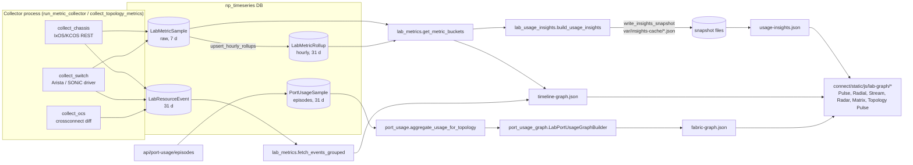

# Metrics, usage insights, and change log

This page covers the lab-topology time-series pipeline: the `np_timeseries` database,
metric collectors, rollups and retention, port-usage episodes, the Lab Pulse insights
payload, the graph and timeline JSON APIs, and the change log.

## Pipeline overview

Web workers never walk the time-series store to build Lab Pulse. The collector writes
snapshot files, and `usage-insights.json` serves those files. `timeline-graph.json` does
read `np_timeseries` on request, but its results are cached for 60 s.

## `np_timeseries` database

- Configured in `connect/settings.py` as `DATABASES['np_timeseries']`, from
  `NP_TIMESERIES_DATABASE_URL` (default `BASE_DIR/np_timeseries.sqlite3`).
- `connect/db_routers.NPTimeseriesRouter` routes `NPResourceSample`, `PortUsageSample`,
  `LabMetricSample`, `LabMetricRollup`, and `LabResourceEvent` there, and blocks their
  migration on `default`. Code also uses `.using('np_timeseries')` explicitly
  (`lab_metrics.TS_DB`, `port_usage.USAGE_DB`).
- `connect/np_timeseries_db.py` applies SQLite pragmas on connect (WAL,
  `busy_timeout=5000`, `synchronous=NORMAL`, in-memory temp store, ~256 MB page cache).
- `manage.py ensure_topology_insights` migrates / checks this DB. Diagnostics runs it with
  `--check-only`.

### Tables

| Model | Key fields | Written by |
|---|---|---|
| `LabMetricSample` | `topology_id`, `resource_key`, `metric`, `value`, `sampled_at` | Collectors (`bulk_write_metrics`) |
| `LabMetricRollup` | `topology_id`, `resource_key`, `metric`, `bucket_start` (hour), `avg/max/min_value`, `sample_count`; unique per bucket | `upsert_hourly_rollups`, `rebuild_rollups_for_topology` |
| `LabResourceEvent` | `topology_id`, `resource_key`, `event_type`, `started_at`, `ended_at` (null = open), `payload` | Collector event buffer |
| `PortUsageSample` | `topology_id`, `resource_key`, `episode_id`, `event` (`reservation`/`enqueue`/`active`/`complete`), `started_at`, `ended_at`, `team`, `user_name`, `source`, `meta` | `port_usage.record_port_usage_episode` |
| `NPResourceSample` | per-slot/NP CPU and memory for a chassis | Chassis NP sampling (outside this slice) |

### Resource keys

- Node: `node_<LabTopologyNode.pk>` (`topology_resource_catalog.node_resource_key`).
- Port: `node_<pk>__<label>` (`port_resource_key`). Chassis port labels come from
  `chassis_port_metric_label` (typically `card.port`). Switch ports use the interface name.
  `build_switch_counter_aliases` also writes the same series under designer fabric labels.
  OCS events use the crossconnect's `port_a` triplet.

### Metrics collected

| Metric | Resource | Source |
|---|---|---|
| `cpu_pct`, `mem_pct` | chassis node | `driver.get_health()` (`cpu_utilization`, memory %) |
| `cpu_pct`, `mem_pct` | chassis port | PCPU health by management IP (`get_pcpu_health_by_mgmt_ip`), then portstats fields, then chassis values as fallback |
| `port_ownership` | chassis port | `1.0` if IxOS `owner` is not `Free` |
| `link_speed_gbps` | chassis port | Parsed `speed` (`0` when link is down) |
| `bps_in`, `bps_out` | chassis port | Instant bit-rate fields, or deltas of cumulative byte counters (`bytesReceived`/`bytesSent`) |
| `cpu_pct`, `mem_pct` | switch node | `driver.get_health()` |
| `bps_in`, `bps_out` | switch port (+ aliases) | Deltas of `get_interface_counters()` `bytes_in/out` |
| `input_discards` | Arista switch port | Per-interval delta of `input_discards` (only written when > 0) |

Insights also reads `crc_errors`, `alignment_errors`, and `fragments` when present. The
collectors in this module do not write them.

Events (`LabResourceEvent.event_type`): `port_owned` / `port_released` (owner changes),
`link_up` / `link_down` (chassis link state, OCS patch add/remove), `patch_add` /
`patch_remove` / `patch_move` (OCS crossconnect diff keyed by crossconnect name), and
`input_discard` (Arista). Interval events are closed explicitly on the opposite transition:
release closes `port_owned`, link down closes `link_up`, and patch remove or move closes
`patch_add`. The `EventWriteBuffer` applies the closes before inserting new rows at flush.

## Collectors (`connect/metric_collectors.py`)

### Which worker, how often

| Entry point | Deployment | Cadence | Mode handling |
|---|---|---|---|
| `manage.py run_metric_collector` | `labvault-collector.service` (systemd), compose `collector` service, install `--once` smoke | `--interval` default **60 s** | Checks `collector_mode()` each tick. `idle` skips polling. `live` runs `collect_all_topologies()`. Both refresh Pulse snapshots. |
| `manage.py collect_topology_metrics [--daemon] [--interval 300] [--topology-id N] [--workers 8]` | Manual / cron | default **300 s** | Keeps one `CollectorState` across ticks. Does **not** check `collector_mode()`. |

`collect_all_topologies()` iterates `LabTopology.objects.filter(metrics_collection_enabled=True)`,
optionally narrowed by `--topology-id` and `LABVAULT_COLLECTOR_TOPOLOGY_IDS`. For each
topology it fans out nodes over a `ThreadPoolExecutor` (`MAX_COLLECT_WORKERS=8`, 120 s
per-node result timeout) and flushes the event buffer once per topology.

### Configuration

| Setting | Effect |
|---|---|
| `collector_mode` runtime setting, fallback `LABVAULT_COLLECTOR_MODE` | `idle` (default) or `live`. `seeded` is coerced to `idle` on the customer SKU. |
| `LABVAULT_COLLECTOR_TOPOLOGY_IDS` | Topology allowlist |
| `LABVAULT_COLLECTOR_NODE_TYPES` | Only poll these node types (for example `chassis`, which is REST-only) |
| `LABVAULT_COLLECTOR_SWITCH_DISCARDS_SEEDED` | Synthesises Arista `input_discards` samples and events (no device access). For demos only. It writes synthetic rows, so leave it unset in production. |

### Dispatch (`collect_topology_node`)

- `chassis` node, or any node with `extra.chassis_id`: `resolve_topology_chassis` (by
  `chassis_id`, then by management IP), then `bind_topology_chassis` persists the live PK,
  then `collect_chassis`.
- `ocs` node with a device: `collect_ocs`. It writes events only and returns 0 samples.
- `switch` node with an `arista`/`sonic` device: `collect_switch`. Other vendors may provide
  a plugin `collector_hook` through `driver_registry.discover_plugin_manifests()`.

`node_is_collectable()` / `topology_has_collectable_nodes()` answer "can this node be
polled" without contacting the device. Insights uses them to explain empty charts.

### Counter state and restarts

`CollectorState` holds previous owners, link state, byte counters and their timestamps,
the previous OCS crossconnect set, and cached chassis drivers. Byte-counter baselines are
persisted by `persist_if_counters()` to the Django cache (`collector:if_counters:v1`, 24 h)
and to `var/collector_if_counters.json`, so a restart does not write a 0 bps sample. For
chassis byte-counter deltas, a counter decrease re-seeds the baseline. A computed rate above
`_MAX_SANE_PORT_BPS` (800 Gbps) or `_MAX_PULSE_WRITE_BPS` (1 Gbps) is discarded
(`measured=False`), and no bps sample is written for that tick.

Only byte counters are persisted. Owner, link state, and the OCS crossconnect set live in
memory only.

### Side caches written by the chassis collector

- `pcpu_mgmt_ip:<topo>:<node>` and `port_mgmt_ip:<topo>` map a port to its PCPU management IP.
- `pcpu_apps:<topo>:<node>` and `pcpu_apps:<topo>` hold PCPU application versions.
- `port_owner_names:<topo>:<node>` and `port_owner_names:<topo>` hold port owners (600 s).

Insights reads these to group ports by packet CPU and to show owners.

## Aggregation (`connect/lab_metrics.py`)

| Function | Behaviour |
|---|---|
| `get_metric_buckets(topo, from, to, bucket)` | Main entry point. For windows ≤ `RAW_WINDOW_HOURS` (4 h) it uses `aggregate_metric_buckets_sql` on raw samples. For longer windows it reads hourly rollups (5m/15m requests are promoted to 1h), falls back to raw SQL if rollups are empty, then `overlay_latest_raw_samples` appends the newest raw point (last 20 min) for live metrics. |
| `aggregate_metric_buckets_sql` | SQLite: `strftime('%s')` integer bucketing in SQL. Other vendors: rollups for 1h, else the Python 5m path. |
| `aggregate_metric_buckets` | Python bucketing (`avg` per bucket) |
| `aggregate_from_rollups` | Reads `LabMetricRollup` |
| `upsert_hourly_rollups` | Merges a batch of samples into the hour bucket (weighted avg, min, max, count). One query per `(resource, metric, hour)` group. |
| `rebuild_rollups_for_topology` | Deletes and rebuilds rollups for a window (default 31 d). Used by `manage.py rebuild_metric_rollups`. |
| `fetch_events`, `fetch_events_grouped` | Events overlapping the window. The grouped form looks back 31 d for open intervals, caps at 20 000 rows and 200 per resource. |
| `EventWriteBuffer`, `open_resource_event`, `close_open_events`, `bulk_write_*` | Writers |

Bucket output shape: `{resource_key: {metric: [[iso_ts, avg], ...]}}`.
`BUCKET_SECONDS = {'5m': 300, '15m': 900, '1h': 3600}`.

## Retention and cleanup

`manage.py cleanup_np_timeseries` (schedule it daily, for example from cron at 03:00):

| Table | Kept |
|---|---|
| `LabMetricSample` | 7 days |
| `LabMetricRollup` | 31 days |
| `LabResourceEvent` | 31 days (by `started_at`) |
| `PortUsageSample` | 31 days (by `started_at`) |
| `NPResourceSample` | 31 days |

Pulse snapshot files in `var/insights-cache/` (or `$LABVAULT_CACHE_DIR/insights-cache/`)
are overwritten in place and never pruned. The directory holds two files per enabled
topology.

## Port usage (`connect/port_usage.py`, `connect/port_usage_graph.py`)

Port usage is episode-based ("who held this port, and when") and separate from metric
samples.

- `record_port_usage_episode(payload)` requires `topology_id` and `episode_id`. It builds
  `resource_key` from `device_id`/`node_id` + `port_label` when the key is not given. It
  refuses topologies with `metrics_collection_enabled=False`. The batch ingester reports
  those items as `skipped`.
- `close_episode(episode_id)` sets `ended_at`/`event` on all open rows of that episode.
- `ingest_episode_batch(items)` returns a per-item status. Items with `action: "close"`
  close an episode.
- `aggregate_usage_for_topology(topo)` computes, per resource key over 31 days:
  `duty_cycle` (0–1), `heatmap_31d` (31 daily ratios), `episodes_31d`, `in_use` (open
  `enqueue`/`active`/`reservation` row), `last_team`, and `last_user`.

`LabPortUsageGraphBuilder(topo_id).build(...)` (`graph_kind='lab_port_usage_v1'`) merges:

- the normalized topology graph (`topology_graph.TopologyGraphBuilder`, cached),
- the port-fabric payload (`lab_topology_views._build_port_fabric_payload`), and
- the usage aggregate above.

It returns `nodes`, `links`, `devices[]` (with `ports[]`, `port_groups`, `ocs_shelves`,
`utilization`), `port_nodes[]` (`id='port:<resource_key>'`, `duty_cycle_31d`, `color`),
`port_links[]`, `usage_summary.by_resource_key`, `meta.stats`, and `ocs_summary`.
`_duty_color` maps duty cycle to grey (≤ 0.05), green, blue (≥ 0.25), amber (≥ 0.5), or red
(≥ 0.75). Ports with an open episode are painted at 0.85 or higher.

The episode ingest endpoint (`/api/port-usage/episodes/`) and `usage-graph.json` live in
`lab_topology_views.py`.

## Lab Pulse insights (`connect/lab_usage_insights.py`)

### Snapshot flow

1. The collector tick calls `refresh_stale_insights_snapshots()`. For each enabled
   topology whose `<id>-24h.json` is older than 60 s, `refresh_insights_snapshots()` writes
   the `4h` and `24h` presets. This happens in both `idle` and `live` modes.
2. `write_insights_snapshot()` runs `build_usage_insights()` and writes the file atomically
   (`.json.tmp`, then replace).
3. `GET /lab-topology/<id>/usage-insights.json?window=4h|24h|7d` (session or Bearer token)
   checks the Django cache (`usage_insights:v11:<id>:preset:
`, 180 s), then the snapshot
   file. If neither exists it returns `empty_insights_payload()` with
   `health.reason='snapshot_warming'`. Explicit `from=`/`to=` windows only hit the cache.
   The endpoint never computes a fresh payload on the web worker. The `7d` preset has no
   snapshot writer, so it always returns the warming payload.

### Payload (`schema_version: 2`)

| Key | Content |
|---|---|
| `window` | `from`, `to`, `bucket` (`5m` ≤ 48 h, else `1h`), `hours` |
| `health` | `has_any`, `signals` (chassis_cpu/mem, port_traffic, port_ownership, link_errors, switch_discards, pcpu, events), `missing`, `notes`, `reason` (`no_collectable_nodes`, `collector_not_writing`, `snapshot_warming`) |
| `summary` | Port totals and owned/traffic/link-up counts and %, average chassis CPU/mem, `pcpu_hosts_hot`, `waste_owned_idle`, `hot_ports_cpu/mem` |
| `devices[]` | Per node: `metrics.{cpu_pct,mem_pct,...}.{latest,avg,max}`, port counters, versions, `discard_summary` (Arista) |
| `heat_matrix[]` | One row per device: CPU/mem max, owned %, link-up % (`traffic_pct`), idle-owned count |
| `rankings` | Top 20 ports by `cpu_pct`, `mem_pct`, `bps_total` |
| `pcpu_fleet[]` | Ports grouped by `(chassis, PCPU mgmt IP)`, with CPU/mem, bps peak/instant/avg totals, `poll_mode`, owners, compact `ports[]` (`fresh` marks ports from the latest poll generation) |
| `waste_signals[]`, `link_errors[]`, `switch_input_discards[]`, `dut_drops[]` | Findings lists |
| `time_series.fleet` | `cpu_pct`, `mem_pct`, `bps_total`, `ports_owned_pct` (downsampled to ≤ 96 points); `time_series.devices` (≤ 48 points) |
| `stress_graph` | `nodes` (devices and up to 18 hot ports), `edges` (`hosts`, `fabric`), `meta` (`bridge_devices`) |
| `bottlenecks[]` | Up to 30 scored findings: `type`, `severity`, `resource_key`, `label`, `score`, `detail`, `laas_hint` (remediation text) |
| `activity` | `total_events`, `by_type` |
| `research_notes[]` | Static UI blurbs |

Heuristics: `HOT_CPU=75`, `HOT_MEM=80`, `IDLE_BPS=1 kbps`. A PCPU at ≥ 90 % CPU carrying
< 1 Mbps counts as `poll_mode` (busy-poll, not saturation). Pulse bps statistics prefer
values ≤ 1 Mbps (`_PULSE_PLAUSIBLE_BPS`) and discard values above 400 Gbps.
`compact_pulse_payload()` removes duplicated fields to keep the JSON small.

`build_usage_insights()` does not query `LabResourceEvent`, because events are skipped on
this path. `activity` is therefore always empty, and link state falls back to the latest
`link_speed_gbps` sample.

## Graph and timeline views

HTML pages (all `login_required`):

| URL | View | JS module |
|---|---|---|
| `/lab-topology/<id>/usage/insights/` | `lab_usage_insights_views.lab_topology_usage_insights_page` | `usage-insights.js` (polls `usage-insights.json` every 30 s while the tab is visible) |
| `/lab-topology/<id>/usage/pulse-radial/` | `lab_usage_graph_views.lab_topology_graph_pulse_radial` | `view-pulse-radial.js` |
| `/lab-topology/<id>/usage/stream-wave/` | `…graph_stream_wave` | `view-stream-wave.js` |
| `/lab-topology/<id>/usage/radar-health/` | `…graph_radar_health` | `view-radar-health.js` |
| `/lab-topology/<id>/usage/matrix-heat/` | `…graph_matrix_heat` | `view-matrix-heat.js` |
| `/lab-topology/<id>/usage/topology-pulse/` | `…graph_topology_pulse` | `view-topology-pulse.js` |

The five graph pages share `lab_topology_usage_graph.html` and `usage-graph-shell.js`.
`usage-graph-data.js:fetchGraphData()` loads three endpoints in parallel (20 s timeout
each): `usage-insights.json?window=`, `timeline-graph.json?from=&to=&bucket=` (`5m` for
4h, `15m` for 24h, `1h` for 7d), and `fabric-graph.json?live=1&lldp=1&ocs=1&reservations=1`.

JSON APIs (`connect/lab_timeline_views.py`):

- `GET /lab-topology/<id>/timeline-graph.json?from=&to=&bucket=` returns
  `{schema_version: 2, topology_id, window, catalog, metric_buckets, events, ok}`. It uses
  the designer catalog (`observe_db=False`) plus keys seen in the returned buckets and
  events, applies `alias_switch_metric_buckets`, and restricts buckets and events to catalog
  keys. Cached 60 s per window and bucket. On error it returns an empty payload with
  `ok: false` instead of HTTP 500. The default window is 4 h.
- `GET /lab-topology/<id>/fabric-graph.json?live=&lldp=&ocs=&planned=&reservations=`
  returns `{schema_version: 1, ok, devices, port_nodes, port_links, nodes, meta}` from
  `LabPortUsageGraphBuilder`. Cached 90 s per flag set. On error it returns an empty fabric.
- `_parse_window(request, default_hours)` handles ISO `from`/`to` and makes naive values
  timezone-aware. `lab_usage_insights_views` reuses it.

## Change log (`connect/changelog.py`, `connect/changelog_display.py`)

`ChangeLogEvent` rows (default DB) form the unified timeline on `/reports/changes/`
(`views.change_log_report`, which also merges up to 50 `ConfigBackup` rows as
`config_change`).

Writers:

| Function | Emits | Called from |
|---|---|---|
| `log_change_event` | Any type. Best-effort, never raises. | All below |
| `log_status_transition` | `status_up` / `status_down` (`online` vs `offline`/`auth_failed`) | Device refresh (`views._refresh_single_device`), Keysight chassis refresh |
| `log_bmc_status_transition` | `bmc_up` / `bmc_down` | `scan_bmc_endpoint` |
| `log_deploy_lifecycle` | `deploy_start/done/failed`, `upgrade`, `downgrade` (source `user`, with actor browser/OS/device) | `keysight_views` deploy and record-operation flows |
| `compare_snap_to_baseline` | `moved_ip`, `moved_location` (lab), `moved_topology` (geo/site/peer), `temporarily_down` (≥ 4 h offline), `extended_down` (≥ 24 h) | `scan_device`, `scan_chassis`, `scan_bmc_endpoint` |

`DeviceStateBaseline` stores the last snapshot per `(target_kind, target_id)`, plus
`last_offline_at` and `last_emitted_state`, so threshold events fire once per outage. The
first scan of a target only creates the baseline and emits nothing.

`manage.py changelog_scan [--bmc-only] [--bmc-timeout 6]` runs `scan_all_targets()`
(devices, chassis, then BMCs probed over IPMI in parallel with 10 workers). No bundled
service schedules it, so run it from cron or a timer if you want move and threshold
events.

`changelog_display.chassis_reachability_badge()` maps a chassis baseline to a
`Down (Nd)` or `Temp Down` badge. Nothing in the tree calls it at the moment.

## Per-module reference

- `connect/lab_metrics.py`: `TS_DB`, `BUCKET_SECONDS`, `RAW_WINDOW_HOURS`, writers,
  `EventWriteBuffer`, `fetch_events[_grouped]`, `aggregate_*`, `get_metric_buckets`,
  `overlay_latest_raw_samples`, `upsert_hourly_rollups`, `rebuild_rollups_for_topology`.
- `connect/metric_collectors.py`: config (`collector_mode`, allowlist, node types),
  collectability, `CollectorState`, parsers (`_parse_port_bitrate`,
  `_parse_port_byte_counters`, `_parse_speed_gbps`, `_port_is_link_up`), `collect_chassis`,
  `collect_switch`, `collect_ocs`, `collect_topology_node`, `collect_all_topologies`,
  demo-only `seed_topology_metrics` / `seed_switch_discards`.
- `connect/port_usage.py`: `resource_key_for_port`, `aggregate_usage_for_topology`,
  `record_port_usage_episode`, `close_episode`, `ingest_episode_batch`.
- `connect/port_usage_graph.py`: `LabPortUsageGraphBuilder`, key-resolution helpers
  (`_metric_label_from_port`, `_port_resource_key`, `_resolve_connection_port_key`).
- `connect/lab_usage_insights.py`: snapshot I/O, `build_usage_insights`,
  `_insight_from_buckets`, `_detect_bottlenecks`, `_build_stress_graph`,
  `_fleet_time_series`, `_data_health`, `compact_pulse_payload`, `empty_insights_payload`.
- `connect/lab_usage_insights_views.py`: Pulse page and JSON.
- `connect/lab_usage_graph_views.py`: `GRAPH_VIEWS` registry and five page views.
- `connect/lab_timeline_views.py`: timeline and fabric JSON, `_parse_window`.
- `connect/changelog.py`, `connect/changelog_display.py`: see above.

## Known risks (as of this writing)

- `run_metric_collector` calls `collect_all_topologies()` with no `state`, so every tick
  starts from an empty `CollectorState`. OCS crossconnect diffs, port-owner changes, and
  link changes then see "previous = nothing". This re-emits `patch_add`/`link_up`/`port_owned`
  events every tick. `collect_topology_metrics --daemon` does not have this problem.
- `collect_topology_metrics` ignores `collector_mode`, so it polls devices even when the
  mode is `idle`.
- `_MAX_PULSE_WRITE_BPS = 1e9` makes chassis byte-counter deltas above 1 Gbps count as
  unmeasured, so real high-rate traffic on 100G/400G ports is dropped rather than recorded.
- `_parse_speed_gbps`: the `val > 1_000_000` branch can never run, because `val >= 1000`
  is checked first.
- `lab_topology_timeline_graph_json` and `lab_topology_fabric_graph_json` have no auth
  decorator, and no global login middleware is configured. The fabric endpoint's default
  `live=1` can trigger live device probes (cached 90 s).
- On non-SQLite `np_timeseries`, `aggregate_metric_buckets_sql` with `bucket='15m'` returns
  5-minute buckets.
- Bottleneck `laas_hint` text and `research_notes` still contain wording about an external
  scheduler ("LaaS").
- `change_log_report` does `int(request.GET['days'])` without validation, so a non-numeric
  value returns HTTP 500.
