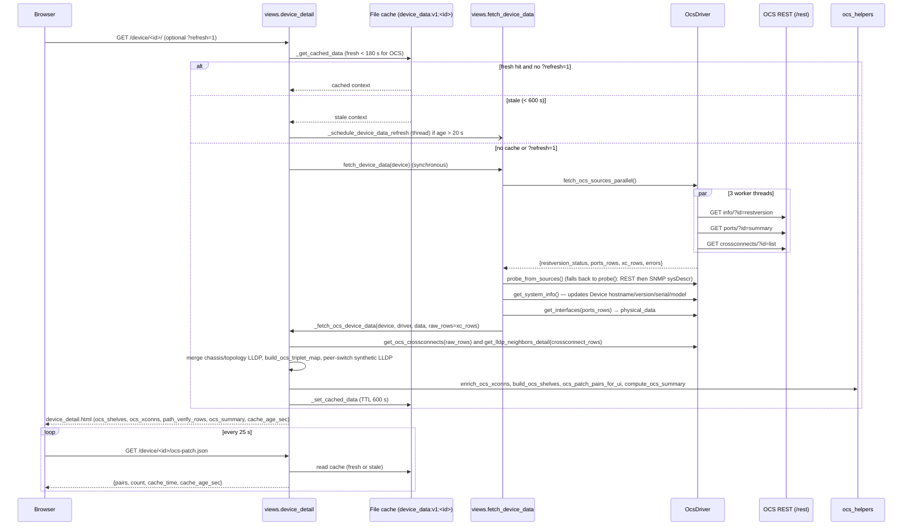

# OCS (optical circuit switch) subsystem

LabVault manages photonic optical circuit switches (Calient / Photonic S-series REST
controllers) as `Device` rows with `vendor_type='ocs'`. This page covers the data model,
the device-page load path, site mapping JSON, the crossconnect and snapshot APIs, and the
safety rules that keep LabVault from disrupting live patches.

Related code:

| Module | Role |
|---|---|
| `connect/drivers/ocs.py` | `OcsDriver` — REST client, crossconnect parse, `send_config` ops, snapshot restore |
| `connect/views.py` | `fetch_device_data`, `_fetch_ocs_device_data`, `device_detail`, `api_device_ocs_patch`, `api_device_ocs_mapping`, snapshot APIs |
| `connect/ocs_helpers.py` | Triplet keys, shelf/bank grid, tooltips, XConn table enrichment, summary cards, site triplet map |
| `connect/views_ocs_xconnect.py` | Fleet crossconnect list / add / delete API keyed by device IP |
| `connect/ocs_site_config_io.py` | Import site JSON into `Device` / `KeysightChassis` rows |
| `connect/ocs_site_validate.py` | Enrich site JSON with LabVault DB status and live LLDP for validation |
| `connect/metric_collectors.py` (`collect_ocs`) | Crossconnect diffs → `patch_add` / `patch_remove` / `patch_move` timeline events (see [metrics-insights.md](metrics-insights.md)) |
| `connect/diagnostics.py` (`_ocs_status`) | Read-only OCS probe in the Diagnostics Center (see [diagnostics.md](diagnostics.md)) |

## Data model

### Triplets

Every OCS port is addressed by a **triplet** `shelf.module.port`, optionally with a
`/n` suffix (`1.2.7`, `3.1.4/1`). `ocs_helpers._OCS_KEY_RE` parses
`^(\d+)\.(\d+)\.(\d+)(?:/(\d+))?$`.

- `norm_ocs_triplet_key()` strips spaces and turns `\` into `/`. Use it on both sides of
  every comparison (API rows, grid cells, `data-ocs-triplet` attributes, LLDP `local_port`).
- `parse_triplet_parts()` returns `(shelf, module, port, suffix)` or `None`.
- `ocs_triplet_sort_key()` gives a numeric sort order. Unparseable keys sort last.

### Shelves and banks (front-panel grid)

- `OCS_PANEL_COUNT = 6` front panels (shelves 1–6) are always rendered, even when empty.
- Each `(shelf, module)` pair is a **bank** of exactly `OCS_BANK_SIZE = 8` port slots.
- `build_ocs_shelves()` returns `(shelves, flat_ports)`:

```text
shelves = [
  {"shelf_id": 1, "label": "Shelf 1", "bank_count": 2,
   "modules": [
     {"module_id": 1, "label": "1.1",
      "ports": [ {port cell} x 8 ]}, ...]}, ...]
```

A port cell is the driver's `physical_data` row plus `ocs_triplet_key`, `short_name`,
`status_color` (`green` only when status is connected/up **and** `ocs_conn` is set; otherwise
`off`), `ocs_bank_label`, `port_digit`, `ocs_in_site_map`, and a pre-rendered
`ocs_tooltip_html`. Empty slots get `is_ocs_placeholder: True`. Ports whose port number is
outside 1–8, or that collide with an occupied slot, go into the first free slot of their
bank. If no slot is free they are dropped from the grid (they still exist in `flat_ports`).

`ensure_ocs_shelf_panels()` pads missing shelves. It uses the site triplet set to decide
which module IDs to draw, falling back to module `0`.

### Crossconnects and halves

The controller's `GET /rest/crossconnects/?id=list` returns rows with `half1` / `half2`.
`half1.conn` is `"<in>><out>"`. `OcsDriver.get_ocs_crossconnects()` normalises each row to:

```text
{"name", "n", "group", "dir", "band", "port_a", "port_b",
 "h1": {inp, outp, loss, alarm, as, os, oc, conn, state, ...},   # stringified
 "h2": {...}}
```

Rows without a parseable `half1.conn` are skipped. `h1`/`h2` hold per-direction power
(`inp`/`outp`, dBm), `loss` (dB), `alarm`, and states (`as` admin state, e.g. `IS`/`OOS`;
`os` operational; `oc` connection state).

`ocs_helpers.enrich_ocs_xconns()` adds XConn-table columns: `peer_a/b` (from LLDP),
`peer_a/b_hostname|ip|device_id|sw_port` (from the site triplet map), `path_a/b` badges,
`pwr_*_str`, `loss_a/b`, `alarm_a`, `state_text`/`state_css`, and `row_class`
(`table-success` for IS with no alarm, `table-danger` for OOS, `table-warning` for any alarm).

### Patch pairs

`ocs_patch_pairs_for_ui()` reduces crossconnects to `{"a", "b", "n", "state"}` with
normalised triplets. These drive the orange SVG overlay on the device page. They come
**only** from live controller crossconnects, never from the site map or switch LLDP.

### Site triplet map and path verify

`build_ocs_triplet_map(ocs_ip, devices)` returns
`{triplet: {hostname, ip, device_id, sw_port}}` from two sources:

1. `resources/ocs_photonic_site*.json` files whose `ocs_controller.ip` equals the OCS IP:
   `ares_switches[]` / `arista_switches[]` with an active `fixed_mapping.port_to_ocs_triplets`,
   plus `keysight_chassis[]` entries (explicit `fixed_mapping` or an
   `[ocs_site_mapping] {...}` block in `notes` whose `to_ocs` matches).
2. `Device.notes` rows that contain `[ocs_site_mapping] {"to_ocs": "<ocs ip>", "port_to_ocs_triplets": {...}}`.

The first mapping for a triplet wins. The result is cached for 300 s under
`ocs:triplet_map:<ip>:<max Device.updated_at>`, so editing a device's notes invalidates it.
Whether a `fixed_mapping` counts as active is decided by
`hbg_fabric_connectivity.ocs_fixed_mapping_is_active`.

`load_ocs_site_triplets(ocs_ip)` returns only the set of triplets from the JSON files (no DB
notes). It drives the "Not in site map" tooltip line and placeholder rendering.

Path verification (per triplet):

- `views._build_peer_switch_lldp_for_triplets()` looks up each mapped switch's **cached**
  LLDP. It matches `sw_port` to LLDP `local_port` by trailing integer (`port_17` ↔
  `Ethernet17`) and synthesises neighbour rows with `source='peer_switch_lldp'`.
- `ocs_helpers._path_badge()` returns grey `—` (not in map), green `OK` (LLDP row on that
  triplet that is not a crossconnect pseudo-neighbour), or amber `No switch cache`.
- `views._build_path_verify_rows()` builds the detailed table with states `ocs_ok`,
  `chassis_ok`, `mismatch`, `no_lldp`, `no_cache`.

`compute_ocs_summary()` produces the overview cards: `active_xconns`, `ocs_ports`,
`paths_up`, `lldp_path_ok`, `lldp_path_total`, `chassis_in_lldp`.

## Device page load



Notes:

- One crossconnect GET is shared by the XConn table and LLDP. The OCS driver builds
  pseudo-LLDP rows (`source='ocs_crossconnect'`, `system_name='xconnect:<name>'`) from each
  crossconnect and merges them with SNMP LLDP (SNMP wins on the same `local_port`).
  Path-verify logic deliberately ignores these pseudo-rows.
- The REST client tries each management target (`iter_connect_targets`) over HTTPS, then
  HTTP. A timeout skips the HTTP fallback for that target.
- `auth_failed` / `unreachable` probes set `Device.status` and return `None` without caching.
- The 25 s poll in `device_detail.html` only **reads** the cache. `?refresh=1` on
  `ocs-patch.json` clears the cache and runs `fetch_device_data` synchronously. The
  template's "Refresh" link reloads the page with `?refresh=1`.
- Cache timing constants live at the top of `connect/views.py`: `_OCS_CACHE_FRESH_SECONDS = 180`,
  `_DEVICE_CACHE_TTL = 600`, `REFRESH_INTERVAL = 20`.

## Site mapping JSON

A site file (`resources/ocs_photonic_site*.json`, customer-provided) has this shape:

```json
{
  "version": 1,
  "site": "lab-a",
  "common_tags": ["ocs-lab"],
  "addressing": {"ipv6_mode": "dhcpv6", "preferred_ip_version": "dual"},
  "ocs_controller": {"ip": "192.0.2.10", "name": "ocs-1", "username": "...", "password": "..."},
  "arista_switches": [
    {"ip": "192.0.2.21", "name": "leaf-1",
     "fixed_mapping": {"to_ocs": "192.0.2.10",
                       "port_to_ocs_triplets": {"port_17": ["1.1.1"], "port_18": "1.1.2"}}}
  ],
  "ares_switches": [],
  "keysight_chassis": [{"ip": "192.0.2.31", "name": "chassis-1", "chassis_type": "xgs12"}]
}
```

Import (`connect/ocs_site_config_io.py`):

- `python manage.py import_ocs_site_config --config <file> [--dry-run]` requires `version`
  and runs `run_ocs_site_import()` inside `transaction.atomic()`.
- `import_ocs_site_devices()` upserts `Device` by `ip_address`. OCS blocks default to
  `vendor_type='ocs'`, switches to `arista`. `vendor_type_secondary` can come from
  `api_key` JSON. Tags are merged (`merge_tags_ocs`). A `fixed_mapping` is appended to
  `notes` as one `[ocs_site_mapping] {...}` line. Adding this line bumps `updated_at`, which
  invalidates the triplet-map cache.
- `import_keysight_chassis_from_json()` upserts `KeysightChassis` rows. `name` sets the
  hostname only on create or when `sync_name_to_hostname` is true.
- IPv6: `mgmt_ipv6` comes from the row, or is derived by `derive_dhcpv6_ocs_lab()` when the
  site `addressing.ipv6_mode` is `dhcpv6`. `preferred_ip_version` becomes `dual` when a v6
  address exists or the site asks for it.
- Other callers: `lab_topology_onboard` and `labvault_bundle` import (bundle restore).

Validation (`connect/ocs_site_validate.py`):

- `python manage.py validate_ocs_site_config --config <file> [--output f] [--in-place] [--fix-hostnames] [--db-only]`.
- `enrich_ocs_site_json()` deep-copies the input and adds a `validation` header plus a
  `connectivity` block per entity. For devices this is DB status/hostname, driver LLDP (up to
  400 rows), and rows that mention the expected `to_ocs` IP. For chassis it is SNMP LLDP via
  `topology_lldp.fetch_chassis_lldp`. Nothing is written to the DB.
- `apply_hostname_fixes()` copies `connectivity.hostname_db` into each block's `name`.

## Crossconnect list / mutate API

`connect/views_ocs_xconnect.py`. Both endpoints use `_api_auth_required` (session or
Bearer API token). The device is looked up by IP and must have `ocs` or `calient` in its
`vendor_type`.

| Method | Path | Body / result |
|---|---|---|
| GET | `/api/ocs/<device_ip>/crossconnects/` | `{ok, crossconnects: [{port_a, port_b, name, state, raw}], count, device_ip, device_hostname}`. Returns 502 `ocs_auth_failed` if the probe rejects credentials. |
| POST | `/api/ocs/<device_ip>/crossconnect/` | `{"action": "xconnect_add"\|"xconnect_delete", "port_a", "port_b", "name"}`. CSRF-exempt, blocked in demo mode (`demo_mode.mutation_blocked_response`). |

`state` is `half.oc`/`state`. It is reported as `FAIL` if either half reports `FAIL`.

After a successful mutation, the view calls `views._clear_cached_data(dev.id)` and
`views._schedule_device_data_refresh(dev)`, so the next device-page or `ocs-patch.json` read
sees the new patch state. Only `xconnect_add` and `xconnect_delete` are accepted here;
`deleteall`, `badd`, `activate`, and `port_config` are not reachable through this endpoint.

`GET /api/device-ocs-mapping/<device_id>/` (login required) returns a switch/chassis
device's `[ocs_site_mapping]` from its notes, plus active crossconnect state from the OCS
device cache. The Lab Topology designer uses it.

## Patch snapshots (backup and restore)

Model: `OcsPatchSnapshot` (`device`, `name`, `description`, `raw_xconns`, `patch_pairs`,
`patch_count`, `created_by`, `created_at`). Views in `connect/views.py` all use
`_api_auth_required` and are CSRF-exempt.

| Method | Path | Behaviour |
|---|---|---|
| GET | `/api/ocs/<device_id>/snapshots/` | List the 50 newest snapshots |
| POST | `/api/ocs/<device_id>/snapshots/` | Live `fetch_crossconnect_list()` → restore pairs `{in, out, conn, group, dir, band}`; saves raw rows + pairs; audit `ocs_snapshot_create` |
| GET / DELETE | `/api/ocs/snapshots/<id>/` | Details / delete (audit `ocs_snapshot_delete`) |
| GET | `/api/ocs/snapshots/<id>/download/` | JSON attachment with raw crossconnects and pairs |
| POST | `/api/ocs/snapshots/<id>/restore/` | `{"clear_first": true\|false}` (defaults to **true**) |

Restore path (`OcsDriver.restore_patch_snapshot`):

1. `_normalize_ocs_restore_connections()` drops empty fields and pairs without `in`/`out`,
   and normalises `dir` (`bi`/`uni`).
2. If `clear_first`, send `{"op": "xconnect_deleteall"}`. Then send
   `{"op": "xconnect_badd", "connections": [...]}` via `send_config`.
3. If REST returns a permission error, fall back to TL1 (`connect/drivers/ocs_tl1.py`)
   using `ssh_user` / `ssh_password` / `tl1_user` / `tl1_password` from the device's API-key
   JSON.
4. Bust the device cache and write audit `ocs_snapshot_restore` (includes `clear_first`
   and the method used). Partial failure returns HTTP 207 with `errors`.

## Safety rules

- **No reboot or power operations.** The OCS driver has none. Diagnostics and collectors
  only call read-only REST (`info`, `ports`, `crossconnects` list).
- **`xconnect_deleteall` is only issued by an explicit snapshot restore with
  `clear_first`.** Nothing else in the app sends it. The fleet crossconnect POST endpoint
  only allows single add/delete. Callers of restore should pass `clear_first` explicitly,
  because it defaults to `true`.
- Mutations (`crossconnect/` POST, snapshot restore) change live optical paths. Only run
  them when the operator asked for them. The fleet endpoint honours demo mode; see
  "Risks" below for the snapshot endpoints.
- Credentials: `Device.username`/`password` (HTTP Basic). Optional API-key JSON:
  `verify_ssl`, `rest_base` (default `/rest`), `headers`, `bearer_token`/`token`, TL1/SSH
  fallback keys. Never commit these values.

## Per-module reference

### `connect/ocs_helpers.py`

| Function | Purpose |
|---|---|
| `norm_ocs_triplet_key`, `parse_triplet_parts`, `ocs_triplet_sort_key` | Triplet normalise / parse / sort |
| `annotate_ocs_port` | Add triplet key, short name, LED colour to a port row |
| `load_ocs_site_triplets` | Triplet set from site JSON files for one OCS IP |
| `enrich_ocs_ports_tooltips` | Build per-port tooltip HTML (state, XC partner, power/loss, alarm, site device, LLDP). All dynamic values are `html.escape`d. |
| `_group_ocs_shelves_eight`, `_placeholder_bank_cells`, `ensure_ocs_shelf_panels` | Shelf → bank → 8-slot grid |
| `build_ocs_triplet_map`, `_add_triplets_from_mapping` | Site-map triplet → switch/chassis resolution (cached 300 s) |
| `_path_badge`, `_lookup_lldp_name`, `_fmt_power` | XConn table helpers |
| `enrich_ocs_xconns` | XConn table rows |
| `ocs_patch_pairs_for_ui` | Overlay pairs `{a, b, n, state}` |
| `build_ocs_shelves` | Entry point for the grid (returns shelves + flat ports) |
| `compute_ocs_summary` | Overview card counts |

### `connect/ocs_site_config_io.py`

`merge_tags_ocs`, `import_ocs_site_devices`, `import_keysight_chassis_from_json`,
`run_ocs_site_import` (returns `{ok, device_log, keysight_created, keysight_updated, keysight_errors}`).
Private helpers handle IPv6 derivation, preferred IP version, team tags, stack credentials
(`arista_*`, `sonic_*`), and the `[ocs_site_mapping]` notes line.

### `connect/ocs_site_validate.py`

`enrich_ocs_site_json(data, live_lldp=True)`, `apply_hostname_fixes(data)`.

### `connect/views_ocs_xconnect.py`

`api_ocs_crossconnects_list`, `api_ocs_crossconnect_mutate`, `_xconnect_endpoints`
(endpoint/state extraction from raw rows).

### `connect/drivers/ocs.py` (read-only reference)

`fetch_ocs_sources_parallel`, `probe`, `probe_from_sources`, `get_system_info`,
`get_interfaces`, `fetch_crossconnect_list`, `get_ocs_crossconnects`,
`get_lldp_neighbors_detail`, `send_config` (ops: `xconnect_add`, `xconnect_badd`,
`xconnect_delete`, `xconnect_activate`, `xconnect_deactivate`, `xconnect_deleteall`,
`port_config`), `restore_patch_snapshot`, `identity` (diagnostic identity, not used on page
load).

## Known risks (as of this writing)

- `api_device_ocs_mapping` reads `cached['ocs_crossconnects']`, but the device cache stores
  `ocs_xconns`, so `active_xconns` is always empty. It also reads `h.get('op')` for power,
  but halves use `outp`.
- The snapshot restore/create/delete endpoints do not call `mutation_blocked_response`, so
  demo mode does not block them. Restore defaults to `clear_first=true` (deleteall).
- Under gunicorn the in-process device poller is disabled. The OCS device cache is then
  refreshed only by page loads (stale path or `?refresh=1`) or mutations, so the 25 s poll
  can keep showing a cache that is several minutes old.
- `ocs_site_validate._enrich_db_only_all` unpacks 3-element tuples into four names, so
  `validate_ocs_site_config --db-only` raises `ValueError`.
- `test_setup_engine._build_triplet_map` passes a `Device` object to
  `load_ocs_site_triplets(ocs_ip: str)` and expects a different return shape.
