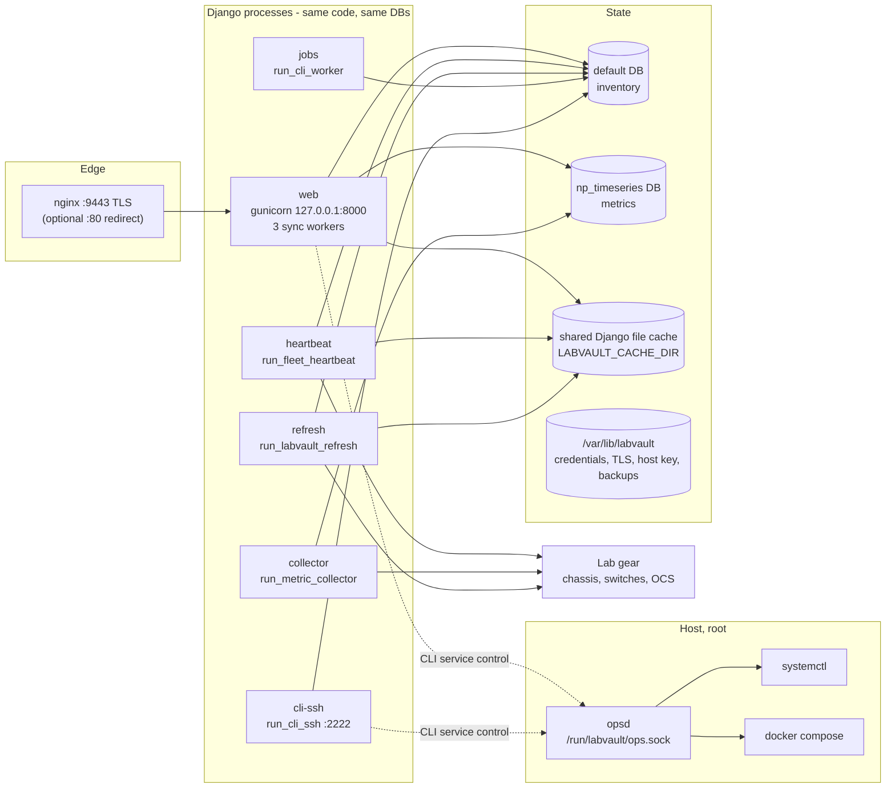

# Operations subsystem

How a LabVault appliance runs: the process model (web, workers, SSH CLI, ops broker), the
management commands behind each process, the `labvaultctl` lifecycle tool, first-boot
bootstrap, dataset and bundle import/export, runtime settings, deploy layouts, the release
gates, and the test layout.

The staff CLI itself (registry, invoke API, confirmation nonces, audit) is covered in
[cli.md](cli.md).

Related code:

| Path | Role |
|---|---|
| `connect/management/commands/` | 45 Django management commands: long-running workers, bootstrap, import/export, maintenance, lab tooling ([README](../../../connect/management/commands/README.md)) |
| `opsd/opsd.py`, `opsd/service_catalog.py` | Root-owned Unix-socket broker for service start/stop/restart ([README](../../../opsd/README.md)) |
| `labvaultctl` | Lifecycle controller: install, check, status, backup, restore, update, rollback |
| `connect/labvault_bootstrap_defaults.py` | First-login username/password and fleet-token selection |
| `connect/labvault_dataset.py` | `labvault-full-export` v1 JSON dataset (export/import) |
| `connect/labvault_bundle.py` | `labvault-multibundle` v1 `.tar.gz` (inventory + topologies + resources + optional DBs) |
| `connect/runtime_settings.py` | DB-backed `RuntimeSetting` rows (`collector_mode`, `heartbeat_mode`) |
| `connect/labvault_flags.py`, `connect/demo_mode.py` | Baked customer-SKU flags; demo mutate path is always off |
| `connect/cache_utils.py` | Permission-tolerant wrappers around the shared Django file cache |
| `connect/about_info.py` | About page: product identity and installed library versions |
| `deploy/` | Compose stack, systemd units, oneshot installers, nginx configs, deploy scripts ([README](../../../deploy/README.md)) |
| `tools/` | Public-source and docs gates, release gates, security scans, SBOM ([README](../../../tools/README.md)) |

## Process model

Every deployment mode runs the same set of **logical services**. The names come from
`opsd/service_catalog.py` (`SERVICES`) and are what `show services` / opsd report. Adapter
columns map them to a Compose service or a systemd unit.



### Service table

| Logical name | systemd unit | Compose service | Command | Cadence | Reads / writes |
|---|---|---|---|---|---|
| `web` | `labvault-web.service` | `web` | `gunicorn labvault.wsgi:application --bind 127.0.0.1:8000 --workers 3 --timeout 300` (systemd runs `validate_external_config` as `ExecStartPre`) | Request-driven | Both DBs, shared cache, media. `LABVAULT_DISABLE_INPROCESS_REFRESH=1` stops gunicorn from polling chassis itself |
| `heartbeat` | `labvault-heartbeat.service` | `heartbeat` | `manage.py run_fleet_heartbeat` | Every `LABVAULT_HEARTBEAT_INTERVAL_SECONDS` (default 120 s; `--interval` overrides) | In `live` mode probes Keysight chassis and writes the `fleet_heartbeat:v1` cache key. Ticks are serialised by an `fcntl` lock at `LABVAULT_HEARTBEAT_LOCK` |
| `collector` | `labvault-collector.service` | `collector` | `manage.py run_metric_collector` | Every 60 s (`--interval`) | In `live` mode polls topology nodes and writes `LabMetricSample` rows to `np_timeseries`; always refreshes stale Insights snapshots. In `idle` mode it does no network I/O |
| `refresh` | `labvault-refresh.service` | `refresh` | `manage.py run_labvault_refresh` | `LABVAULT_KS_REFRESH_INTERVAL` (default 120 s, minimum 30 s) | Probes every `KeysightChassis` and refreshes the card/port cache. Not gated by `collector_mode` |
| `jobs` | `labvault-cli-worker.service` | `jobs` | `manage.py run_cli_worker` | Polls every 2 s | Drains `CliJob` rows with `status=queued`. See [cli.md](cli.md#clijob-and-the-cli-worker) — currently a placeholder that marks jobs succeeded |
| `cli-ssh` | `labvault-cli-ssh.service` | `cli-ssh` | `manage.py run_cli_ssh` | Long-lived AsyncSSH server on `LABVAULT_CLI_SSH_PORT` (2222) | Staff-only REPL on the shared CLI runner. Host key in `/var/lib/labvault/cli-ssh/` |
| `opsd` | `labvault-opsd.service` (alias `labvault-opsd-compose.service`) | none (host unit on every mode) | `opsd/opsd.py --sock /run/labvault/ops.sock` | Long-lived | Runs `systemctl` or `docker compose` for allowlisted lifecycle actions |
| `nginx` | `nginx.service` | `nginx` | nginx | Long-lived | TLS on `:9443` proxying to `127.0.0.1:8000` (host) or `web:8000` (Compose) |
| `db` | host PostgreSQL | `db` | postgres:15 | — | Inventory database `labvault`. Status-only in opsd |
| `metrics-db` | host PostgreSQL (DB `labvault_metrics`) | `metrics-db` | postgres:15 | — | Time-series database. Status-only in opsd |

Worker loops catch per-tick exceptions, call `close_old_connections()` so a Postgres restart
does not wedge them, and sleep until the next tick. Both `run_fleet_heartbeat` and
`run_metric_collector` accept `--once` for a single tick; the oneshots use that to prime the
first live tick.

### Idle vs live

`collector_mode` and `heartbeat_mode` are the only two runtime settings
(`connect/runtime_settings.py`). Each is `idle` or `live`:

1. A stored `RuntimeSetting` row wins.
2. Otherwise `LABVAULT_WORKER_MODE` (read into `settings.WORKER_MODE_ENV`).
3. Otherwise `settings.LABVAULT_WORKER_DEFAULT_MODE` (`idle`).

`bootstrap_labvault --live`, `LABVAULT_WORKER_MODE=live`, `LABVAULT_RESTORE_DATASET`, or a
dataset/bundle import that creates chassis or topologies all write `live` rows. A legacy
`seeded` collector mode is mapped to `idle` on this SKU (`metric_collectors.collector_mode`).

## opsd — operations broker

opsd lets unprivileged Django processes start, stop, or restart LabVault services without
mounting a Docker socket or granting sudo. It is the only root process in the app stack.

### Socket and authorisation

| Item | Value |
|---|---|
| Socket | `/run/labvault/ops.sock` (`LABVAULT_OPS_SOCK`, `--sock`) |
| Ownership | `root:labvault-ops` (falls back to group `labvault`), mode `0660` |
| Who can connect | Members of `labvault-ops`. systemd oneshots add user `labvault` to that group; Compose `cli-ssh` joins via `group_add: ${LABVAULT_OPS_GID}` |
| Peer identity | `SO_PEERCRED` (pid/uid/gid) is logged for every request but not checked |
| Concurrency | Single accept loop; requests are handled one at a time under a global lock |

Authorisation of the *human* happens in Django before the socket is used (staff user,
`connect.control_labvault_services` permission, `reason`, one-time nonce — see
[cli.md](cli.md#tiers-and-confirmation)). opsd itself enforces only the allowlist and the
per-source capability flags below.

### Wire protocol

One JSON object per connection, newline-terminated; one JSON response line back.

Request keys (any other key → `{"ok": false, "error": "extra_fields", "state": "denied"}`):

| Key | Required | Meaning |
|---|---|---|
| `action` | yes | `list`, `status`, `start`, `stop`, `restart` |
| `name` | for `status`/lifecycle | Logical name, an alias from `NAME_ALIASES` (for example `worker` → `jobs`, `labvault-web` → `web`), or `all` (`status`, and `restart` only) |
| `source` | no | `web`, `browser`, or `ssh`; drives the capability flags |
| `reason` | for lifecycle | Free text; empty → `reason_required` |
| `request_id` | no | Correlation id; logged |

Example:

```json
{"action": "restart", "name": "collector", "source": "ssh", "reason": "apply new env", "request_id": "3f2a..."}
```

Responses always carry `ok` and `state`. States are listed in `RESULT_STATES`: `ok`,
`accepted`, `already_running`, `already_stopped`, `unsupported`, `denied`, `timeout`,
`partial_failure`, `failed`, `skipped_source_guard`. `list` returns
`{"ok": true, "adapter": ..., "services": [...]}` with one status row per logical name.

### Capability matrix

From `opsd/service_catalog.py`. `True` = always, `ssh_only`/`web_only` = only when `source`
matches, `privileged` = currently always denied, `False` = never.

| Service | status | start | stop | restart | In `restart all` |
|---|---|---|---|---|---|
| `heartbeat` | yes | yes | yes | yes | order 10 |
| `collector` | yes | yes | yes | yes | order 20 |
| `refresh` | yes | yes | yes | yes | order 30 |
| `jobs` | yes | yes | yes | yes | order 40 |
| `web` | yes | `ssh_only` | no | `ssh_only` | order 50 (skipped when `source` is web) |
| `cli-ssh` | yes | no | no | `web_only` | no |
| `opsd` | yes (always reports running) | no | no | no | no |
| `nginx` | yes | no | no | `privileged` (denied) | no |
| `db`, `metrics-db` | yes | no | no | no | no |

The source guards stop a transport from killing itself: the web UI cannot restart `web`, and
an SSH session cannot restart `cli-ssh`.

### Adapters

`LABVAULT_OPS_ADAPTER` is `systemd`, `compose`, or `auto` (default). `auto` picks `compose`
when `$LABVAULT_COMPOSE_PROJECT_DIR/$LABVAULT_COMPOSE_FILE` exists and `docker compose version`
succeeds, else `systemd`.

- **systemd** — `systemctl is-active|start|stop|restart <unit>` with a fixed `PATH` and
  `LABVAULT_OPS_TIMEOUT` (default 90 s). Units come from `systemd_unit` / `systemd_units`.
- **compose** — `docker compose -f <file> --project-directory <root> [-p <name>] up -d --no-deps | stop | restart <service>`.
  Before every call `_validate_compose_tree()` requires the project root, the compose file,
  and any `.env` to be root-owned, not group/world-writable, and not symlinks, and pins the
  compose file's `(st_dev, st_ino)` on first use so a swapped file is refused
  (`compose_identity_changed`). Host-only services (`opsd`) and services with no Compose
  mapping fall back to `systemctl is-active` for status.

Start/stop are idempotent (`already_running` / `already_stopped`), and every successful
lifecycle call re-reads status into `final`.

### Django client

`connect/labvault_cli/ops_client.py` is the only caller. It returns
`{"ok": false, "error": "opsd_unavailable"}` when the socket file is missing and
`opsd_connect_failed` on `OSError` (for example permission denied), so the CLI degrades to
"unknown" service rows instead of raising. Timeouts: 60 s for list/status, 120 s for lifecycle.

## labvaultctl

`./labvaultctl [--adapter systemd|compose] [--state-dir DIR] <command>` (Python, stdlib only).
Before parsing it loads the tree `.env` (does not override process env) and then
`/etc/labvault/labvault.env` (overrides). It runs `manage.py` with `.venv/bin/python` when
present.

| Subcommand | What it does |
|---|---|
| `host-deps [--install]` | Prints the OS packages needed to build `python-ldap`/`psycopg` and the oneshot commands. `--install` runs `dnf` or `apt-get` directly |
| `check [--allow-down]` | `manage.py check --deploy`, `validate_external_config`, then probes `/health/live` and `/health/ready` on `127.0.0.1:8000` and the public base URL |
| `install [--skip-health]` | `migrate` (default and `np_timeseries`), `ensure_topology_insights`, `validate_external_config`, `collectstatic`, `bootstrap_labvault` (adds `--live` / `--restore` from env), copies the credential and token files into the state dir (0600), then either `docker compose up -d --build` or writes the systemd units (rewriting `/opt/labvault/current` to the tree path) and `systemctl enable --now` for all seven units. `--skip-health` is accepted but unused |
| `backup` | Creates `<state>/backups/labvault-<UTC stamp>/` with `default.sql` / `metrics.sql` (`pg_dump`, or `docker compose exec db pg_dump` for Compose) or the SQLite files, plus `MANIFEST.txt` |
| `restore BACKUP [--drill]` | Requires `MANIFEST.txt`. `--drill` only validates the layout. Otherwise feeds `*.sql` to `psql` (host or Compose container) and copies SQLite files back into the tree |
| `status` | Health probes, then `docker compose ps` or `systemctl is-active` for each component |
| `update RELEASE` | `backup`, copy `RELEASE` into `LABVAULT_RELEASES_DIR` (default `/opt/labvault/releases`), atomically retarget the `LABVAULT_CURRENT` symlink (default `/opt/labvault/current`), then `install` |
| `rollback TARGET` | If `TARGET` is a backup directory (has `MANIFEST.txt`) → `restore`; otherwise treat it as a release and switch + `install` |
| `cli` | Prints how to reach the SSH CLI, the browser CLI, and the CLI API |

## Bootstrap flow

First boot is driven by the oneshots. The systemd and air-gapped oneshots call
`labvaultctl install`, which calls `manage.py bootstrap_labvault`. The Compose oneshot runs
`migrate` and `bootstrap_labvault` inside the `web` container with `docker compose exec` and
copies the two files out with `docker compose cp`; the container entrypoint already migrated
and ran `collectstatic`.

```mermaid
sequenceDiagram
  participant OS as oneshot-*.sh
  participant CTL as labvaultctl install
  participant BL as bootstrap_labvault
  participant DB as default DB
  participant FS as filesystem
  OS->>OS: write .env or /etc/labvault/labvault.env (secret key, hosts, DB URLs, TLS paths)
  OS->>OS: set LABVAULT_WORKER_MODE and LABVAULT_DEMO_DEFAULTS in the env file
  OS->>CTL: labvaultctl --adapter systemd install
  CTL->>DB: migrate default + np_timeseries, ensure_topology_insights, collectstatic
  CTL->>BL: bootstrap_labvault [--live] [--restore FILE]
  BL->>DB: set collector_mode/heartbeat_mode (live or leave idle)
  BL->>DB: find or create superuser; grant control_labvault_services
  BL->>DB: find or create fleet APIToken
  BL->>FS: /tmp/labvault-fleet-token and /tmp/bootstrap-credentials (0600)
  BL->>DB: optional import_from_file(restore)
  CTL->>FS: copy both files to /var/lib/labvault/{fleet-token,bootstrap-credentials} (0600)
  OS->>OS: enable units / compose up, prime --once ticks if live, post_deploy_verify.sh
```

Credential selection (`connect/labvault_bootstrap_defaults.py`):

| Value | Order of precedence |
|---|---|
| Username | `LABVAULT_BOOTSTRAP_USERNAME`, else `admin` |
| Password | `LABVAULT_BOOTSTRAP_PASSWORD` or `LABVAULT_DEMO_ADMIN_PASSWORD`; else the published demo password when `LABVAULT_DEMO_DEFAULTS=1` and `LABVAULT_BOOTSTRAP_RANDOM` is not set; else `secrets.token_urlsafe(20)` |
| Fleet token name | `LABVAULT_FLEET_TOKEN_NAME`, else `demo-api` |
| Fleet token | `--fleet-token`, `LABVAULT_FLEET_TOKEN` or `LABVAULT_DEMO_API_TOKEN`; else the published demo token under the same demo condition; else `secrets.token_urlsafe(32)` |

- The library default is random. **The oneshot installers export `LABVAULT_DEMO_DEFAULTS=1`
  unless `LABVAULT_BOOTSTRAP_RANDOM=1`** and persist that choice in the env file, so a stock
  oneshot uses the published demo values described in
  [FIRST_LOGIN.md](../../getting-started/FIRST_LOGIN.md). Rotate after first login.
- Re-runs are idempotent: an existing admin (by username, else first superuser, else first
  staff user) keeps its password and the credential file says `password_unchanged=1`.
- A token that collides with the chosen value on another row is deleted first so the
  `APIToken.token` stays unique.
- `validate_external_config` refuses demo passwords/tokens in env only when demo defaults are
  off.

## Dataset and bundle import/export

Two formats, both staff-only in the UI (DATA → Export / Import) and available as commands.
Neither is a `labvaultctl backup` (that is a database dump).

### `labvault-full-export` v1 (JSON)

`connect/labvault_dataset.py`. Commands: `export_labvault_dataset -o FILE`,
`import_labvault_dataset FILE`, and `bootstrap_labvault --restore FILE`.

Top-level keys: `format`, `version`, `exported_at`, `media_root_note`, `counts`, `devices`,
`keysight_chassis`, `keysight_reservations`, `keysight_reservation_items`,
`keysight_bmc_endpoints`, `keysight_subnet_scans`, `keysight_deployment_jobs`, `audit_logs`
(newest 50 000), `request_logs` (20 000), `config_backups` (5 000), `changelog_events`
(50 000), `device_state_baselines`, `lab_topologies` (v3 `export_topology` blocks),
`topology_links`, and an always-empty `capex` section kept for format compatibility.

Rows are model field dumps with primary keys removed; foreign keys are replaced by natural
keys (`chassis_ip`, `device_ip`, `user_username`, `reservation_source_id`).

Import (`import_from_payload`, one transaction):

1. Reject any `format` other than `labvault-full-export`.
2. Upsert `Device` and `KeysightChassis` by `ip_address`, dropping unknown fields so older
   exports still load.
3. Upsert reservations by `title` (user by username, else first superuser/staff), then
   reservation items by `(reservation, chassis, slot, port)`.
4. Unless `skip_logs` (the `bootstrap_labvault` default), append audit and change-log rows.
5. Upsert BMC endpoints by `hostname`.
6. Import `lab_topologies` by name via `lab_topology_io.import_topology` and enable metrics
   collection on each.
7. If any chassis or topology was imported, set both runtime modes to `live`.

`request_logs`, `config_backups`, `device_state_baselines`, `keysight_subnet_scans`,
`keysight_deployment_jobs`, and `topology_links` are exported but not imported.

Appliance identity (SSH host keys, credential files, CLI throttle rows, TLS keys) is never
part of a dataset.

### `labvault-multibundle` v1 (`.tar.gz`)

`connect/labvault_bundle.py`. Commands: `export_labvault_bundle -o FILE [...]`,
`import_labvault_bundle FILE [...]`.

```text
manifest.json                      format, version, scope, files[], counts
inventory.json                     labvault-full-export (optionally scoped)
topologies/<slug>-<pk>.json        labvault.lab_topology v3
resources/<file>.json              site + layout schemas (default: ocs_photonic_site.json, lab_topology_schema.json)
data/lldp_persistent_cache.json    optional (default on)
databases/db.sqlite3               optional (--include-databases)
databases/np_timeseries.sqlite3    optional
secrets/<name>                     optional (--include-secrets, off by default)
```

Export scoping: `--lab NAME` keeps chassis with that `lab_name` plus devices tagged `ocs-lab`
or the slugged lab name; `--ip-prefix` keeps rows whose IP starts with the prefix;
`--topology-id` / `--topology-name` pick topologies.

Import order: inventory (`import_from_payload`), `resources/ocs_photonic_site.json` through
`run_ocs_site_import`, each topology file (by name; nodes/links are replaced unless
`--no-replace-topologies`), then LLDP cache, SQLite files, and secrets when requested. Any
imported topology turns Pulse live.

## Runtime settings and baked flags

`connect/settings.py` bakes the customer SKU surface; there is no per-feature
`DISABLE_*` list.

| Setting | Value | Effect |
|---|---|---|
| `LABVAULT_CUSTOMER_SKU` | `True` | Marks the customer build |
| `LABVAULT_DEMO_MODE` | `False` | `demo_mode.demo_mode_enabled()` always returns `False`; `mutation_blocked_response()` always `None` |
| `LABVAULT_EXTERNAL_PLUGINS_ENABLED`, `LABVAULT_TOPOLOGY_WIZARD_V1_ENABLED`, `LABVAULT_DEEP_DIAGNOSTICS_ENABLED`, `LABVAULT_AUTO_SEED` | `False` | Off in this SKU |
| `LABVAULT_WORKER_DEFAULT_MODE` | `idle` | Final fallback for the two runtime modes |
| `LABVAULT_CLI_ENABLED` | `True` | Exposed to templates as `labvault_cli_enabled` |
| `WORKER_MODE_ENV` | from `LABVAULT_WORKER_MODE` | Env fallback for runtime modes |

`connect/labvault_flags.py` keeps `AI_NEXUS_ENABLED = False` only so leftover guards fail
closed. Runtime settings are editable with the staff CLI `settings set` (privileged tier)
and listed by `show settings`.

Common environment variables for operations (full list:
[CONFIGURATION.md](../../install/CONFIGURATION.md)):

| Variable | Used by | Default |
|---|---|---|
| `LABVAULT_WORKER_MODE` | oneshots, runtime settings fallback | `idle` |
| `LABVAULT_RESTORE_DATASET` | oneshots, `labvaultctl install`, `bootstrap_labvault` | unset |
| `LABVAULT_DEMO_DEFAULTS` / `LABVAULT_BOOTSTRAP_RANDOM` | bootstrap | oneshot sets demo defaults on |
| `LABVAULT_HEARTBEAT_INTERVAL_SECONDS`, `LABVAULT_HEARTBEAT_LOCK` | heartbeat | 120 s |
| `LABVAULT_KS_REFRESH_INTERVAL` | refresh | 120 s |
| `LABVAULT_CACHE_DIR` | all Django processes | must be shared by web and workers |
| `LABVAULT_OPS_SOCK`, `LABVAULT_OPS_ADAPTER`, `LABVAULT_COMPOSE_*`, `LABVAULT_OPS_TIMEOUT` | opsd / ops client | `/run/labvault/ops.sock`, `auto`, 90 s |
| `LABVAULT_CLI_SSH_*` | cli-ssh | port 2222, private CIDRs |
| `LABVAULT_TLS_PORT`, `LABVAULT_TLS_CERT`, `LABVAULT_TLS_KEY`, `LABVAULT_USE_TLS` | nginx edge, `labvaultctl` | 9443, generated self-signed pair |

## Deploy layouts

| Mode | Entry point | Processes | Databases | Notes |
|---|---|---|---|---|
| Compose | `sudo ./deploy/install/oneshot-compose.sh` | `deploy/compose/docker-compose.yml`: `db`, `metrics-db`, `web`, `heartbeat`, `refresh`, `jobs`, `collector`, `cli-ssh`, `nginx`; plus host unit `labvault-opsd` | Two postgres:15 containers | Image: `deploy/compose/Dockerfile` (python:3.11-slim). `entrypoint.sh` migrates both DBs on every container start, runs `collectstatic` only for gunicorn, then drops to uid 10001 keeping supplementary groups |
| systemd (bare metal / VM) | `sudo ./deploy/install/oneshot-systemd.sh [INSTALL_ROOT]` | 7 units from `deploy/systemd/` | Host PostgreSQL 14+ with DBs `labvault` and `labvault_metrics` | Installs OS packages, creates user `labvault` and group `labvault-ops`, rsyncs to `/opt/labvault/current`, builds `.venv`, writes `/etc/labvault/labvault.env` (0600) |
| Air-gapped | `build-wheelhouse.sh` on a networked builder, then `oneshot-airgap.sh WHEELHOUSE [INSTALL_ROOT]` | Same as systemd | Host PostgreSQL if installed | `pip install --no-index` from the wheelhouse; removes any tree `.env` so Compose DB hostnames never leak into a systemd install |
| Proxmox | [PROXMOX.md](../../install/PROXMOX.md) | Either of the above inside a generic guest | — | No VM-specific code in this tree |

The Python floor for the oneshots is 3.10 (they prefer `python3.11`); the application code
itself stays importable on 3.9.

### Ports

| Port | Bind | Purpose |
|---|---|---|
| 9443 | all interfaces | Customer HTTPS (nginx); `LABVAULT_TLS_PORT` |
| 8000 | `127.0.0.1` | gunicorn (Compose publishes `127.0.0.1:${LABVAULT_HTTP_PORT:-8000}`) |
| 2222 | all interfaces | Staff SSH CLI; source CIDRs limited by `LABVAULT_CLI_SSH_ALLOW_CIDRS` |
| 80 | optional | Host nginx redirect to HTTPS (`install-labvault-http80.sh`, skip with `LABVAULT_SKIP_HTTP80=1`) |
| 5432 | loopback / Compose network | PostgreSQL |

### Filesystem layout

| Path | Contents |
|---|---|
| `/opt/labvault/current` | Install root (systemd/airgap); may be a symlink into `/opt/labvault/releases/` after `labvaultctl update` |
| `/etc/labvault/labvault.env` | systemd/airgap environment (0600, `root:labvault`) |
| `.env` (tree root) | Compose environment |
| `/var/lib/labvault/bootstrap-credentials`, `fleet-token` | First-login and fleet API token files (0600) |
| `/var/lib/labvault/tls/` | `fullchain.pem`, `privkey.pem` (generated by `ensure-labvault-tls.sh` if absent) |
| `/var/lib/labvault/cli-ssh/` | SSH CLI host key (0700 dir, 0600 key) |
| `/var/lib/labvault/django_cache/` (systemd) or volume `djangocache` at `/app/var/django_cache` (Compose) | Shared file cache and heartbeat lock |
| `/var/lib/labvault/backups/` | `labvaultctl backup` output |
| `/run/labvault/ops.sock` | opsd socket |

After install, `deploy/scripts/post_deploy_verify.sh` checks every unit or Compose service,
the opsd socket, the SSH port, heartbeat plumbing (waits up to
`LABVAULT_VERIFY_HEARTBEAT_WAIT` seconds in live mode), and runs `fleet_api_smoke.sh`.

## Release gates and CI

| Gate | What it enforces |
|---|---|
| `tools/check_public_source.py [--target DIR]` | Fails on forbidden paths (excluded surfaces, internal docs), forbidden imports, internal lab address prefixes in runtime Python and customer-facing files, internal hostnames and credentials, and the published demo login in Markdown/shell unless the text also explains it is opt-in |
| `tools/check_docs.py` | Every file in `REQUIRED` exists (customer doc map) and nothing in `FORBIDDEN` exists |
| `tools/run_release_gates.sh` | Both checks, `manage.py check`, `makemigrations --check --dry-run`, 12 fast test modules, and `docker compose config` |
| `tools/run_security_scans.sh` | `gitleaks`, `pip-audit`, `trivy` when installed; missing scanners are reported as `SKIP` |
| `tools/generate_sbom.sh` | CycloneDX SBOM in `dist/` when `cyclonedx-bom` is installed, else a fallback list |
| `tools/build_public_source.py` | Rebuilds a public tree from a private source by allowlist copy + hard-dump; **deletes `--target` first** |

GitHub workflows (`.github/workflows/`): `ci.yml` (push/PR: the same checks and test list as
the release gates on Python 3.11), `security.yml` (push/PR/weekly: public-source and docs
gates, `pip-audit`, gitleaks), `release.yml` (tag `v*.*.*`: release gates, SBOM, SHA256SUMS,
GitHub release).

## Tests

| Location | Contents |
|---|---|
| `connect/tests/` | 63 Django test modules plus `timeline_test_helpers.py` and `fixtures/` ([README](../../../connect/tests/README.md)) |
| `tests/manual/` | Manual regression checklists ([README](../../../tests/README.md)) |

```bash
export DJANGO_SECRET_KEY=$(python3 -c 'import secrets;print(secrets.token_urlsafe(48))')
export DJANGO_ALLOWED_HOSTS=localhost,127.0.0.1,testserver
python manage.py test connect.tests --verbosity=1          # full suite
bash tools/run_release_gates.sh                            # CI subset + gates
python manage.py test connect.tests.test_opsd_broker       # one module
```

Tests that touch opsd load `opsd/opsd.py` by path and call `handle()` directly; none need
root, systemd, Docker, or lab hardware.

## Management commands

Who runs what: **W** = long-running worker unit/service, **I** = installers / `labvaultctl`,
**O** = operator on demand. Lab-gear column: whether the command talks to devices over the
network.

| Command | Purpose | Typical invocation | Run by | Side effects | Lab gear |
|---|---|---|---|---|---|
| `run_fleet_heartbeat` | Fleet heartbeat loop | `run_fleet_heartbeat [--once] [--interval N]` | W `heartbeat` | Shared cache `fleet_heartbeat:v1`, chassis port cache | Yes (live) |
| `run_metric_collector` | Pulse metric collector loop | `run_metric_collector [--once] [--interval 60]` | W `collector` | `LabMetricSample` rows, Insights snapshots | Yes (live) |
| `run_labvault_refresh` | Keysight card/port refresh loop | `run_labvault_refresh` | W `refresh` | Chassis status, card/port cache, change log | Yes |
| `run_cli_worker` | Drain queued `CliJob` rows | `run_cli_worker` | W `jobs` | `CliJob.status`, `result_redacted` | No |
| `run_cli_ssh` | AsyncSSH staff CLI server | `run_cli_ssh [--host H] [--port 2222]` | W `cli-ssh` | Host key, `CliInvocation`, `CliAuthThrottle` | Via CLI commands |
| `bootstrap_labvault` | First boot: modes, admin, fleet token, optional restore | `bootstrap_labvault [--live] [--restore FILE] [--include-logs]` | I | User, permission, `APIToken`, runtime settings, `/tmp` credential files | No |
| `ensure_topology_insights` | Migrate `np_timeseries`, verify, disable uncollectable topologies | `ensure_topology_insights [--check-only]` | I | `np_timeseries` schema, `metrics_collection_enabled` | No |
| `validate_external_config` | Refuse unsafe env before binding ports | `validate_external_config` | I, `labvault-web` `ExecStartPre`, `labvaultctl check` | None (exit non-zero on error) | No |
| `export_labvault_dataset` | Write `labvault-full-export` JSON | `export_labvault_dataset -o FILE` | O / UI | File | No |
| `import_labvault_dataset` | Load `labvault-full-export` JSON | `import_labvault_dataset FILE` | O / UI | Inventory, topologies, runtime modes | No |
| `export_labvault_bundle` | Write multibundle tarball | `export_labvault_bundle -o FILE [--lab L] [--ip-prefix P] [--include-databases]` | O | File | No |
| `import_labvault_bundle` | Load multibundle tarball | `import_labvault_bundle FILE [--import-databases] [--import-secrets]` | O | Inventory, topologies, LLDP cache, optionally SQLite files and `secrets/` | No |
| `export_diagnostics` | Diagnostics JSON or tarball | `export_diagnostics [-o FILE] [--bundle]` | O | File or stdout | No |
| `changelog_scan` | Detect moves, offline thresholds, BMC reachability | `changelog_scan [--bmc-only]` | O / cron | `ChangeLogEvent` rows | Yes |
| `cleanup_np_timeseries` | Prune time-series rows (raw 7 d, rollups/events 31 d) | `cleanup_np_timeseries` | O / cron (daily) | Deletes rows in `np_timeseries` | No |
| `rebuild_metric_rollups` | Rebuild hourly rollups from raw samples | `rebuild_metric_rollups [--topology-id N]` | O | `LabMetricRollup` rows | No |
| `collect_topology_metrics` | Manual collector run (one-shot or daemon, 300 s) | `collect_topology_metrics [--topology-id N] [--daemon]` | O | `LabMetricSample` rows | Yes |
| `benchmark_timeline` | Timeline aggregation benchmark (not for CI) | `benchmark_timeline --samples 5000` | O (dev) | Inserts synthetic samples, may create a topology | No |
| `import_lab_topology` | Import a layout or v3 topology JSON | `import_lab_topology --topo FILE [--site FILE] [--replace \| --update ID]` | O | `LabTopology` + nodes/links | No |
| `import_ocs_site_config` | Import site JSON into devices/chassis | `import_ocs_site_config --config FILE [--dry-run]` | O | `Device`, `KeysightChassis` | No |
| `populate_ocs_lab_topology` | Build a topology from site JSON | `populate_ocs_lab_topology --config FILE` | O | New `LabTopology` | No |
| `validate_ocs_site_config` | Enrich site JSON with DB status and live LLDP | `validate_ocs_site_config --config IN [--output OUT] [--db-only]` | O | Output JSON file | Yes (unless `--db-only`) |
| `split_hbg_sub_topologies` | Split a parent topology into with/without-OCS children | `split_hbg_sub_topologies --topo-id N` | O | New child topologies, parent `extra` | Optional |
| `populate_topology_v6` | Push v6 management addresses from a topology into inventory | `populate_topology_v6 --topo-id N [--dry-run]` | O | `mgmt_ipv6` fields, node `extra`, fabric cache | Yes (enrich/fabric) |
| `refresh_topology_fabric_cache` | Pre-warm Port Fabric snapshots | `refresh_topology_fabric_cache --topo-id N \| --all` | O | `LabTopologyFabricSnapshot` rows | Yes (warm) |
| `discover_site_topology` | LLDP discovery scoped by tag | `discover_site_topology --tag T [--no-chassis]` | O | `TopologyLink` rows | Yes |
| `lldp_check` | Probe devices, print LLDP, run discovery | `lldp_check [--ip IP]` | O | `Device.status`, `TopologyLink` | Yes |
| `refresh_lldp` | SSH LLDP fetch from Arista/SONiC switches | `refresh_lldp [--ip IP ...] [--topo-id N] [--dry-run]` | O | Raw LLDP files, LLDP cache, `Device.api_key` JSON | Yes |
| `enable_lldp` | Enable LLDP on devices | `enable_lldp [--ip IP] [--vendor V] [--dry-run]` | O | Device config | Yes (writes) |
| `enable_chassis_lldp` | Enable IxOS LLDP peer-info (restarts IxServer) | `enable_chassis_lldp --ip IP [--dry-run]` | O | Chassis config, disrupts users | Yes (writes) |
| `sonic_lldp` | Check and try to enable LLDP on one SONiC switch | `sonic_lldp --ip IP` | O | Switch config | Yes (writes) |
| `push_config` | Push config lines to devices | `push_config --ip IP --commands ... [--no-commit] [--dry-run]` | O | Device config | Yes (writes) |
| `repair_ocs_patches` | Diff live OCS cross-connects vs a schema; optionally add missing | `repair_ocs_patches --ocs-ip IP --schema FILE [--apply]` | O | Report file; OCS cross-connects with `--apply` | Yes (writes with `--apply`) |
| `apply_ocs_dhcpv6_lab` | Mark OCS rows DHCPv6 / prefer IPv6 for display | `apply_ocs_dhcpv6_lab --ipv4-prefix 192.0.2 [--dry-run]` | O | Addressing fields | Optional probe |
| `enable_ocs_lab_dual_stack` | Set `preferred_ip_version=dual` on OCS lab rows | `enable_ocs_lab_dual_stack [--dry-run]` | O | Addressing fields | No |
| `validate_ocs_ipv6_mgmt` | Check IPv6 management reachability | `validate_ocs_ipv6_mgmt [--json]` | O | None (exit 1 on failure) | Yes |
| `prefer_ocs_ipv6_mgmt` | Switch OCS lab rows to prefer IPv6 after validation | `prefer_ocs_ipv6_mgmt [--dry-run] [--force]` | O | Addressing fields | Yes (validation) |
| `ipmi_discover` | Find Redfish/IPMI BMCs and add them | `ipmi_discover IP ... [--from-existing] [--username U --password P]` | O | `KeysightBmcEndpoint` rows (stores the working credentials) | Yes |
| `kcos_inspect_api` | Print KCOS REST field names (ownership research) | `kcos_inspect_api --ip IP [--swagger]` | O (dev) | None | Yes |
| `seed_compliance` | Seed compliance rule templates | `seed_compliance` | O | `ComplianceRule` rows (get-or-create) | No |
| `ensure_godmode_account` | Ensure the break-glass `/admin/` superuser | `ensure_godmode_account [--password P --reset-password]` | O | User row | No |
| `ensure_shared_admin_account` | Keep a shared UI account usable without `/admin/` | `ensure_shared_admin_account [--set-password]` | O | User row | No |
| `deprecate_django_admin_user` | Remove `/admin/` staff flag from a shared account | `deprecate_django_admin_user [--username U] [--dry-run]` | O | User rows; runs the two `ensure_*` commands | No |
| `labvault_migration_health` | Report legacy migration drift | `labvault_migration_health` | O | None (exit 1 on issues) | No |
| `validate_app` | In-process URL/model/view smoke | `validate_app [--verbose]` | O (dev) | Creates and deletes temporary users/devices in the live DB | No |

## Known limitations

- CLI confirmation nonces live in a per-process dict (`runner._NONCES`). With the default
  three gunicorn workers a browser confirm and the following invoke can land on different
  workers and fail with `invalid_or_expired_nonce`. The SSH CLI is a single process and is
  not affected.
- In Compose only `cli-ssh` gets `group_add: ${LABVAULT_OPS_GID}`. `web` and `jobs` mount
  `/run/labvault` but cannot open the `0660` socket, so browser `show services` / service
  control report `opsd_connect_failed` unless the group is added.
- opsd trusts the `source` field sent by the client; any member of `labvault-ops` can claim
  `ssh` or `web`.
- `run_cli_worker` marks queued jobs succeeded without executing anything, and nothing in the
  tree enqueues `CliJob` rows yet.
- Multibundle import uses `tarfile.extractall` without member filtering; only import bundles
  from trusted sources.
