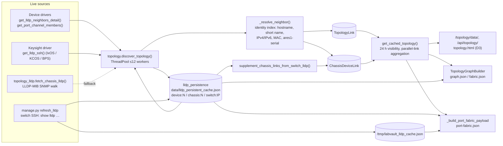
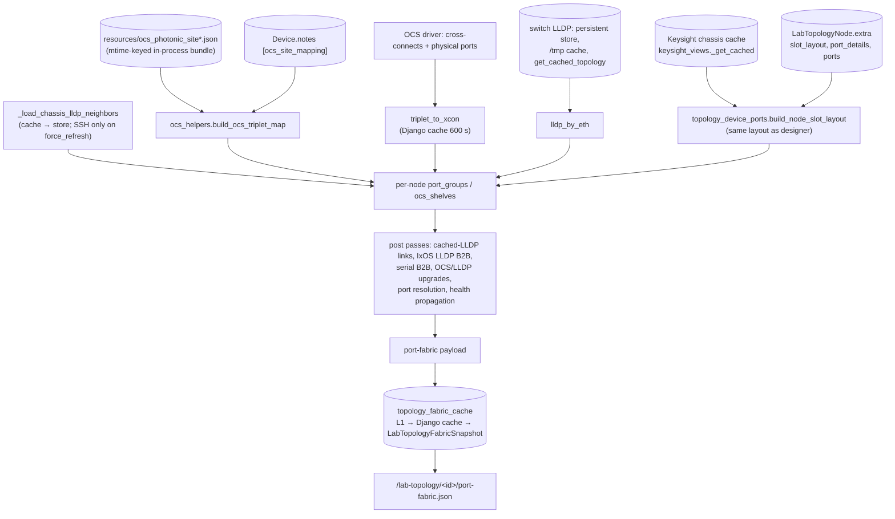

# Subsystem: Topology, LLDP & fabric graphs

This page covers how LabVault discovers physical links (LLDP, transceiver
serials, OCS cross-connects), where it stores them, and how the graph and
fabric JSON used by the UI are built and cached. The lab topology *designer*
(the editable per-lab model, import/export, site JSON, test setups) is covered
in [lab-topology-designer.md](lab-topology-designer.md).

User-facing docs: [user/TOPOLOGY.md](../../user/TOPOLOGY.md),
[user/FABRIC.md](../../user/FABRIC.md).

## Two different "topologies"

| | Device topology map | Lab topology (designer) |
|---|---|---|
| URL | `/topology/` | `/lab-topology/<id>/…` |
| Scope | Whole inventory (every `Device` not in maintenance + every `KeysightChassis`) | One named lab; nodes are chosen by the operator |
| Storage | `TopologyLink`, `ChassisDeviceLink` (discovered) | `LabTopology`, `LabTopologyNode`, `LabTopologyLink` (planned) |
| Built by | `connect/topology.py` (`discover_topology`) | Designer UI, import, presets (see designer doc) |
| Node ids | `"<device_pk>"`, `"chassis-<chassis_pk>"` | `"node_<LabTopologyNode.pk>"` |

The lab-topology fabric views overlay the discovered data (LLDP, OCS,
serial pairs) on top of the planned designer links.

## Data model

| Model | Key fields | Written by |
|---|---|---|
| `TopologyLink` | `device_a/port_a ↔ device_b/port_b`, `lag`, `link_status`, `last_seen` (auto_now), unique on the 4-tuple | `topology._store_topology_links` |
| `ChassisDeviceLink` | `chassis/port_chassis ↔ device/port_device`, `link_status`, `last_seen` | `topology._store_chassis_links`, `supplement_chassis_links_from_switch_lldp` |
| `LabTopologyFabricSnapshot` | `(topology, kind)` unique, `revision`, `payload`, `build_ms`, `meta` | `topology_fabric_cache.save_db_snapshot` |
| `TopologyAuditLog` | `topology`, `actor`, `action`, `detail`, `extra_json`, `ip_address` | `topology_audit.log_topology_action` |

Plus one file store: `data/lldp_persistent_cache.json` (see below).

## LLDP discovery pipeline



Step by step (`connect/topology.py`):

1. Enumerate nodes: all `Device` rows except `status='maintenance'` and all `KeysightChassis`.
2. Build an identity index: FQDN, short hostname, IPv4, IPv6 (`ip_addressing.identity_address_keys`), MAC, and `ares1-<serial>` aliases for AresONE / HTREX / T-Rex chassis.
3. Fetch LLDP in parallel for **online** devices (driver) and online chassis (SSH `get_lldp_ssh` first, SNMP LLDP-MIB fallback). Batch timeout is `max(120, 15 × ceil(tasks / workers))` seconds; a timeout keeps partial results.
4. Merge every result into the persistent store with `persist_entity_neighbors`; endpoints that were not scanned fall back to `get_entity_neighbors` (still inside the 24 h window).
5. Resolve each neighbor (`remote_device`/`system_name` → mgmt IP → chassis-id MAC) and write `TopologyLink` (device↔device, deduplicated bidirectionally, LAG from port-channel members) and `ChassisDeviceLink` (chassis↔device, from either side).
6. Mark unseen links `down` only when **both** endpoints were scanned and the row is older than 24 h.
7. Call `supplement_chassis_links_from_switch_lldp()` to add chassis links seen from Arista/SONiC switch tables.

`get_cached_topology()` reads the DB only (no live I/O): nodes plus links that are `up` or were seen within `LLDP_RETENTION_SECONDS`, aggregated per node pair (port lists capped at 12 with a `+N more` marker). When fewer than 8 chassis links are up it first reruns the switch-LLDP supplement.

### Persistent LLDP store (`lldp_persistence.py`)

- File: `<repo>/data/lldp_persistent_cache.json`, `{version, entities: {"<kind>:<id>": {neighbors, last_scan_ok, last_scan_at, …}}}` with kinds `device`, `chassis`, `switch`.
- Retention: `LLDP_RETENTION_HOURS = 24`. Records are keyed by lower-cased `local_port`; a fresh successful scan replaces the port's record, a missing port survives until 24 h old, and a failed scan (`fresh_scan_ok=False`) only prunes.
- Neighbor record: `{local_port, remote_device, remote_port, mgmt_ip, chassis_id, up, _updated_at}`.
- Whole-file read/modify/write on every call; there is no lock.

### Chassis LLDP helpers (`topology_lldp.py`)

`merge_lldp_into_cards` / `merge_lldp_into_bps_topology` attach neighbors to
chassis-detail card and BPS lane structures by trying many port-label variants
(`1/2`, `1.2`, `Card 1 Port 2`, `c1p2`, `node:iface`).
`synthesize_kcos_b2b_lldp_neighbors` fakes LLDP rows for same-chassis
loopback/DAC legs that share a transceiver serial.

## Link sources and health

| Source | Where | Health / color |
|---|---|---|
| Planned designer link | `LabTopologyLink` | `planned` (grey `#64748b`) |
| Live OCS cross-connect | OCS driver `fetch_crossconnect_list` + `get_ocs_crossconnects`, peers via `ocs_helpers.build_ocs_triplet_map` | `active` (green) or `alarm` (CR/MJ/MN or `oc != OK`) |
| Device LLDP | `get_cached_topology()` | `up` / `stale` (>15 min) / `down` (>24 h) |
| Chassis↔switch LLDP | `ChassisDeviceLink` | same as LLDP |
| Serial match | `topology_dac_finder` | stored as planned links (`dac` or `direct`/b2b) |
| Planned vs observed mismatch | `TopologyGraphBuilder._detect_conflicts` | `conflict` (red) |

Port-level health in Port Fabric uses the vocabulary in
`topology_device_ports.HEALTH_COLOR`: `active`, `alarm`, `lldp_only`, `dac`,
`planned`, `down`, `unused`, `unknown`. IxOS link telemetry wins over abstract
health (`ixos_link_is_down`, `fabric_oper_state`).

## Graph builders

### NormalizedGraph v1 (`topology_graph.py`)

`TopologyGraphBuilder(topo_id).build(live, lldp, ocs, planned, reservations, use_cache)`
returns:

```json
{
  "schema_version": 1, "topology_id": 7, "topo_name": "…",
  "meta": {"generated_at": "…", "cache_hit": false,
           "sources": {"planned": {"ok": true, "at": "…", "error": null}, "ocs_live": {…}, "lldp_db": {…},
                       "chassis_links": {…}, "switch_files": {…}, "reservations": {…}},
           "stats": {"nodes_total": 0, "links_live": 0, "conflicts": 0}},
  "nodes": [{"id": "node_12", "kind": "chassis", "mgmt_ipv4": "192.0.2.31", "mgmt_ipv6": "2001:db8::31",
             "mgmt_display": "…", "ports": [], "reservation": null, "badges": []}],
  "links": [{"id": "plan_5", "type": "planned|lldp|ocs_active", "source": "node_1", "target": "node_2",
             "port_a": "…", "port_b": "…", "health": "…", "provenance": ["planned", "lldp_db"], "color": "#…"}],
  "conflicts": [{"link_ids": ["plan_5", "lldp_…"], "reason": "planned_port_mismatch", "severity": "warning"}]
}
```

Merge rule: one link per endpoint pair; lowest `_priority` wins
(`lldp_db`=2, `chassis_links`=3, `switch_files`=4, `ocs_live`=5, `planned`=6) and
provenance lists are unioned. Adapters: `to_fabric_legacy` (fabric.json shape),
`to_port_fabric_legacy` (minimal), `to_designer_payload`.
`compare_fabric_legacy_vs_graph` runs both implementations for
`graph/compare.json`.

With `topo_id=None` the builder returns the global `/topology/` shape
(`build_global_graph`), used only when `LABVAULT_TOPOLOGY_GRAPH_V3=1`.

### Fabric map (`lab_fabric_map_api`)

Node-level map for `lab_fabric_map.html`: planned links, live OCS links
(unmapped ends anchored to the OCS node) and LLDP edges from
`get_cached_topology()`. When `LABVAULT_GRAPH_FABRIC=1` it is served by
`TopologyGraphBuilder.to_fabric_legacy` instead. Not cached.

### Port fabric (`_build_port_fabric_payload`)

Port-level map for `lab_port_fabric.html`. Response:
`{devices: [{id, label, ip, node_type, port_groups | ocs_shelves, lldp_neighbors, …}], connections: [{src_device, src_port, dst_device, dst_port, type, health, …}], summary, ocs_summary, ocs_error, fetched_at, view_layouts, _timing?}`.



## Caches and TTLs

| Cache | Key / location | TTL / invalidation |
|---|---|---|
| Persistent LLDP | `data/lldp_persistent_cache.json` | 24 h per neighbor record |
| Switch LLDP scratch file | `/tmp/labvault_lldp_cache.json` (written by `refresh_lldp`) | ignored when `fetched_at` > 24 h |
| NormalizedGraph | in-process dict, key `<topo>:<flags>` | 30 s (`CACHE_TTL_SECONDS`); `invalidate_cache()` from `refresh_lldp`, `graph/refresh/`, `/topology/rescan/` |
| Port fabric L1 | in-process dict `pf:l1:…` | 45 s warm / 120 s cold |
| Port fabric Django cache | `port_fabric:v8:<topo>:<revision>:<live>:<lldp>:0` | 45 s warm / 600 s cold |
| Port fabric DB snapshot | `LabTopologyFabricSnapshot(topology, kind)` | valid while `revision` matches; cold path may serve a mismatched snapshot < 1 h old (`db_stale`) |
| Revision | `v1:<updated_at>:<nodes>:<links>:<site-json mtime hash>` | changes on any `LabTopology.save()` or site JSON edit |
| OCS cross-connects (port fabric) | `port_fabric_ocs_xcon:<ocs_ip>` | 600 s |
| OCS cross-connects (scenario) | `ocs_xconnects_<device_pk>` | 60 s |
| Site JSON bundle / triplet map | module globals in `lab_topology_views` | site JSON mtime signature |
| Resource catalog | `lab_resource_catalog:<topo>:live=<0|1>` | 300 s / 600 s; `invalidate_resource_catalog_cache` |
| Catalog chassis port labels | `catalog_chassis_ports:<chassis>` | 300 s |
| PCPU mgmt index | `port_mgmt_ip:<topo>` | 3600 s |
| Usage graph | `lab_usage_graph:…` | 90 s |

`force_refresh=1` on `port-fabric.json` invalidates the fabric cache, runs a
synchronous `refresh_lldp --topo-id`, then schedules a background rebuild
(`schedule_port_fabric_refresh`, daemon thread).

## What refreshes topology data

| Trigger | Effect |
|---|---|
| `POST /topology/rescan/`, `GET /topology/refresh/` | `discover_topology()` in a daemon thread |
| `GET /topology/data/?refresh=1` | synchronous `discover_topology()` (slow) |
| `manage.py lldp_check` | runs `discover_topology()` and prints a report |
| `manage.py refresh_lldp [--ip …] [--topo-id N] [--dry-run]` | SSH to Arista/SONiC switches, writes raw text under `LABVAULT_LLDP_RAW_DIR`, `/tmp` cache, persistent store; invalidates graph cache |
| `manage.py refresh_topology_fabric_cache --topo-id N | --all [--cold-only|--warm-only]` | rebuilds `LabTopologyFabricSnapshot` rows |
| `POST /lab-topology/<id>/graph/refresh/` | clears graph + fabric caches, background rebuild with chassis SSH; `{"sources": ["lldp"]}` also runs `refresh_lldp` for that topology |
| `manage.py populate_topology_v6`, `split_hbg_sub_topologies` | call `refresh_port_fabric_snapshot` after changing topologies |

No periodic worker in this slice refreshes LLDP on its own; schedule
`refresh_lldp` and `refresh_topology_fabric_cache` (or the topology rescan) if
you need fresh data without user action.

## Management addressing (IPv4 / IPv6)

`ip_addressing.py` keeps three concerns apart:

- **Connect** — `resolve_connect_targets(ipv4, ipv6, preferred, hostname)` orders FQDN, IPv4 and a *stored* IPv6 by `preferred_ip_version` (`ipv4`, `ipv6`, `ipv6_slaac`, `dual`; `auto` = `ipv4`).
- **Display** — `display_mgmt_address` / `mgmt_ip_bundle` produce `{device_ip, mgmt_ipv4, mgmt_ipv6, mgmt_display, preferred_ip_version}`. `dual` renders `2001:db8::31 (192.0.2.31)`. When no IPv6 is stored and `mgmt_ipv6_source='dhcpv6'`, a DHCPv6 address is *derived* for display only, and only if `LABVAULT_OCS_DHCPV6_PREFIX` and `LABVAULT_OCS_IPV4_PREFIX` are set and the IPv4 falls in that /24.
- **Identity** — `identity_address_keys` yields lookup keys used by LLDP matching and `topology_ip_index.build_ip_to_node_map`.

Graph nodes carry `mgmt_ipv4`, `mgmt_ipv6`, `mgmt_display`; `device_ip` stays the IPv4 lookup key.

## Feature flags (`topology_flags.py`)

All default off, read once at import.

| Env var | Effect |
|---|---|
| `LABVAULT_GRAPH_FABRIC=1` | `fabric.json` served by `TopologyGraphBuilder` |
| `LABVAULT_TOPOLOGY_GRAPH_V3=1` | `/topology/data/` and `/topology/export/` use `build_global_graph()` |
| `LABVAULT_GRAPH_PORT_FABRIC`, `LABVAULT_GRAPH_DESIGNER`, `LABVAULT_TOPOLOGY_SSE` | defined, not read by views |

## Module reference

### `topology.py`
- `discover_topology() -> {nodes, links, errors}` — full live scan (see pipeline). Side effects: network I/O to every online device and chassis, writes the LLDP store, `TopologyLink`, `ChassisDeviceLink`.
- `get_cached_topology() -> {nodes, links}` — DB-only read for the UI; may write `ChassisDeviceLink` via the supplement.
- `supplement_chassis_links_from_switch_lldp()` — upserts `ChassisDeviceLink` from the persistent switch LLDP store (the raw-file fallback map is empty in this SKU).
- `CHASSIS_NODE_PREFIX = 'chassis-'`.
- Private: `_resolve_neighbor`, `_dedup_key`, `_store_topology_links`, `_store_chassis_links`, `_aggregate_parallel_links(links, max_per_pair=12)`.

### `lldp_persistence.py`
- `merge_neighbors(existing, fresh, *, fresh_scan_ok) -> (merged, changed)` — pure merge.
- `persist_entity_neighbors(kind, id, fresh, *, fresh_scan_ok) -> list` / `get_entity_neighbors(kind, id) -> list`.
- `persist_switch_lldp_cache(devices_payload)` — merges `{ip: {neighbors, active_os, from_file_fallback}}` (called by `refresh_lldp`).
- `load_switch_lldp_by_ip() -> {ip: [neighbors]}`.

### `topology_lldp.py`
- `fetch_chassis_lldp(ip, community='public', port=161, timeout=10) -> list` — SNMP walk of `lldpRemTable`; `mgmt_ip` is always empty.
- `normalize_chassis_id_for_match(chassis_id)` — MAC → `aa:bb:…`.
- `merge_lldp_into_cards(cards, neighbors)`, `merge_lldp_into_bps_topology(bps, neighbors, ports)` — mutate in place.
- `kcos_connection_local_port(row)`, `synthesize_kcos_b2b_lldp_neighbors(rows, hostname, mgmt_ip)`.

### `topology_lldp_resolve.py`
- `lldp_hostname_aliases(name)`, `build_hostname_to_node_map(nodes)`, `enrich_hostname_map_from_topo(topo, host_map, ip_to_node=None)` (queries nodes/chassis), `resolve_lldp_neighbor_node_id(nbr, ip_to_node, host_to_node) -> node id | ''`.

### `topology_ip_index.py`
- `build_ip_to_node_map(nodes) -> {address_or_host: node_id}` from `mgmt_ipv4`, `mgmt_ipv6`, `mgmt_display`, `label`.

### `topology_graph.py`
- `TopologyGraphBuilder` (see above); `invalidate_cache(topo_id=None)`; `switch_ips_for_topology(topo_id)`; `topology_ids_for_switch_ips(ips)`; `build_global_graph(**kw)`; `validate_topology_payload(topo_id, payload) -> {ok, conflicts, warnings}`; `compare_fabric_legacy_vs_graph(topo_id, live, lldp)` (calls the legacy view with a `RequestFactory` request as the first superuser); plus one manifest-export stub that always returns `not_available`.

### `topology_fabric_cache.py`
- `compute_topology_revision(topo)`, `site_files_signature()`.
- `get_port_fabric_cached(topo_id, revision, *, want_live, want_lldp, force_refresh) -> (payload|None, layer)` — layers `l1`, `django`, `db`, `db_stale`, `miss`.
- `store_port_fabric_cached(...)`, `save_db_snapshot(...)`, `get_db_snapshot(...)`, `invalidate_topology_fabric_cache(topo_id=None) -> deleted`.
- `schedule_port_fabric_refresh(topo_id, *, want_live=True, chassis_ssh=False)` — daemon thread calling `lab_topology_views.refresh_port_fabric_snapshot`.

### `topology_device_ports.py`
Shared slot/port layout used by both the designer port grid and Port Fabric.
- Layout builders: `build_node_slot_layout(node, topo, *, site_port_data, triplet_to_xcon, refresh, ocs_physical_ports, additional_switch_ports)` dispatches to `build_slot_layout` (chassis), `build_ocs_slot_layout`, `build_switch_slot_layout`, `build_server_slot_layout`. Chassis SSH only when `refresh=True`.
- Conversion: `slot_layout_to_port_groups`, `chassis_fabric_port_groups`, `compact_fabric_port_groups`, `ocs_shelves_from_device_shelves`, `ocs_shelves_from_slot_layout`, `ocs_shelves_from_port_groups`.
- Overlays: `apply_ocs_live_to_port_groups`, `merge_ixos_link_state_into_slots`, `build_ixos_link_index`, `merge_lldp_into_fabric_port_groups -> matched count`, `enrich_chassis_slot_layout_with_ocs`.
- State helpers: `ixos_link_is_down`, `fabric_oper_state`, `fabric_state_from_ixos_port`, `fabric_link_type`.
- OCS fanout: `iter_switch_site_ports`, `iter_ocs_fanout_site_ports`, `fanout_port_label_for_triplet`, `fanout_peer_port_label`, `slots_have_ocs_fanout_legs`.
- Data: `load_site_port_data() -> {ip: {port: {triplets, role}}}`, `fetch_triplet_to_xcon_for_topo(topo)` (live OCS I/O), `ocs_health_by_triplet`, `build_fabric_health_lookup`, `persist_layout_on_node(node, layout)` (writes `node.extra`).

### `topology_chassis_ports.py`
- `build_slot_layout(chassis, cached)` — slots/RGs/ports from the Keysight chassis cache (AresONE logical ports 9–24 → RG01–RG08).
- `layout_from_port_details(port_details, *, chassis_type, port_names)`, `merge_layout_with_saved(live, saved_layout)`.

### `topology_dac_finder.py`
Serial-number link discovery — see the designer doc for the workflow.
- `discover_serial_links(topo, *, refresh_cache=False) -> {port_entries, pairs, dac_count, b2b_count}`.
- `apply_serial_links_to_topology(topo, pairs, *, skip_existing=True) -> {created, skipped}` (writes `LabTopologyLink`).
- `apply_lldp_links_to_topology(topo) -> created` — portless `LLDP` links from `get_cached_topology()`.
- `enrich_topology_ports_from_cache(topo, site_data, *, refresh=False) -> updated` — writes `ports`, `port_details`, `slot_layout` on nodes.
- `collect_chassis_port_serials`, `collect_device_port_serials` (Arista/SONiC DOM), `collect_topology_port_serials`, `find_serial_pairs`, `ports_from_chassis_and_site`, `normalize_serial`, `port_label_from_record`.

### `topology_link_validate.py`
- `validate_link_by_flap(link, *, refresh_peer=True) -> {ok, validated, flap_went_down, peer_followed, flap_restored, timeline, …}` — **shuts and re-enables a real switch port**; saves `link.extra['last_validation']`.
- `read_switch_oper_state`, `flap_switch_port`, `read_chassis_port_link`, `pick_flap_end`.

### `topology_export.py`
- `filter_topology_subgraph(nodes, links, tags)` — OR tag match, then keep whole connected components.
- `topology_export_json(nodes, links, *, title, tags)` → `labvault-topology-export-v1`.
- `topology_to_drawio_xml(nodes, links, *, diagram_name)` → `.drawio` with tier swimlanes.
- `assign_tier_positions`, `parse_tags_param`, `node_matches_tags`.

### `topology_resource_catalog.py`
Metric resource keys for timeline/insights (`node_<pk>`, `node_<pk>__<port>`).
- `build_resource_catalog(topo_id, *, live_ports=True)`, `build_enriched_resource_catalog(topo_id, *, live_ports, use_cache, observe_db)` (adds keys seen in the last 48 h of `np_timeseries` rollups/samples/events), `invalidate_resource_catalog_cache(topo_id)` (called from `metric_collectors`).
- PCPU addressing: `chassis_port_metric_label`, `pcpu_mgmt_ip_from_port`, `infer_pcpu_mgmt_ip_from_label`, `resolve_pcpu_mgmt_ip`, `load_port_pcpu_mgmt_index`, `attach_mgmt_ips_to_catalog`. PCPU addresses are chassis-internal `10.0.<card>.<port>` (AresONE: `10.0.1.<RG>`).
- Filters: `restrict_metric_buckets`, `restrict_events_grouped`, `alias_switch_metric_buckets` (copies `Ethernet3/1` counters onto designer labels).
- `_live_chassis_port_labels` calls `driver.get_ports()` (SSH) when `live_ports=True`.

### `topology_card_family.py`
- `normalize_card_family(ixos_type)`, `card_family_matches(requested, ixos_type)`, `infer_line_rate(ixos_type, speed='')`.

### `topology_flags.py`, `topology_audit.py`, `topology_resolve.py`
- Flags as above. `log_topology_action(actor, action, *, topology, detail, extra, request)` never raises. `resolve_topology_by_labname(labname, *, topo_id_hint=None) -> (topo, None) | (None, {error, status})`.

### `ip_addressing.py`
- Parsing: `normalize_ip`, `is_valid_ip`, `is_ipv4`, `is_ipv6`, `is_link_local`, `parse_address_input`, `bracket_host`, `unbracket_host`, `is_fqdn_hostname`.
- Selection: `normalize_preferred`, `pick_ipv6_for_mode`, `resolve_connect_targets`, `resolve_connect_address`, `resolve_mgmt_ipv6`, `resolve_mgmt_ipv6_for_connect`, `derive_dhcpv6_ocs_lab`.
- Display: `display_mgmt_address`, `mgmt_ip_bundle`, `mgmt_ip_bundle_from_entity`, `mgmt_label_text`, `display_addresses`, `ipv6_display_tag`, `enrich_lldp_neighbor_display`, `enrich_lldp_neighbors_for_display` (queries inventory when no index is passed).
- Identity: `identity_address_keys`.

### `hbg_fabric_connectivity.py`
Optional site fabric map (empty by default): `set_fabric_map(mapping, *, ocs_ip, ocs_label)`, `lookup_aresone_fabric`, `fabric_path_label`, `build_site_fabric_summary`, `build_topology_fabric_summary(chassis_mgmt_ips, has_ocs_node)`, `aggregate_fabric_path_ports`, `ocs_fixed_mapping_is_active(fixed_mapping)` (used by `ocs_helpers`).

### `aresone_fanout.py`
Pure AresONE 800GE fanout math (modes 8×1×800G, 8×4×200G, 8×8×100G, 8×16×50G): `plan_aresone_requirement`, `validate_lab_aresone_capacity`, `count_aresone_pools_from_chassis`, `build_aresone_pools_by_rate`, `enrich_chassis_slots_with_pools`. Only exercised by tests in this tree.

## Extension points

- **New LLDP source for a device vendor** — implement `get_lldp_neighbors_detail()` (and optionally `get_port_channel_members()`) on the driver returning `{local_port, remote_device, remote_port, mgmt_ip, chassis_id}` rows; `discover_topology` picks it up. For Keysight chassis implement `get_lldp_ssh(bps_topology=None, chassis_type='')`.
- **New link source in graph.json** — add a `_load_*` method to `TopologyGraphBuilder`, emit links with a unique `id`, `provenance`, `_priority`, and record `_source_ok(name, error)`; call it from `_build_topo`.
- **New link validator** — follow `topology_link_validate.validate_link_by_flap`: take a `LabTopologyLink`, return `{ok, validated, timeline, message}`, persist the result under `link.extra`, and wire a POST view that calls `log_topology_action`.
- **New export format** — add a function to `topology_export.py` that takes the global `nodes/links` lists (after `filter_topology_subgraph`) and a branch on `format=` in `views.topology_export`.
- **New port layout / node shape** — add a `build_<type>_slot_layout` in `topology_device_ports.py` and a branch in `build_node_slot_layout`; Port Fabric consumes it through `slot_layout_to_port_groups`.

## Gotchas

- `get_cached_topology()` is not read-only: with fewer than 8 up chassis links it writes `ChassisDeviceLink` rows.
- `identity_address_keys` adds the first dotted component of every value, so each IPv4 address also registers its first octet (e.g. `192`) as a key. Neighbors whose `remote_device` is a bare IP can therefore match an arbitrary device through the short-name fallback in `_resolve_neighbor`.
- `switch_files` links in `TopologyGraphBuilder` are emitted with `source == target` and are dropped by `_merge_links`, so the 24 h switch store never contributes a graph.json edge on its own.
- `discover_topology` treats a chassis scan with zero neighbors as a failed scan (`fresh_scan_ok` requires a non-empty payload), so chassis LLDP entries age out only by time.
- `/tmp/labvault_lldp_cache.json` is read by the web process without ownership checks.
- Graph cache and port-fabric L1 are per process. With several Gunicorn workers `invalidate_cache` only clears the worker that ran it, and a CLI run of `manage.py refresh_lldp` clears nothing in the web workers. The DB snapshot and revision key keep Port Fabric consistent; graph.json can lag by up to 30 s.
- Port Fabric revision only changes on `LabTopology.save()`. Designer node/link edits through `POST data/` do not bump `updated_at`, so a snapshot built before the edit can be served until another save or `graph/refresh/`.
- Chassis SSH/SNMP and OCS REST calls happen inside request threads for `force_refresh=1`, `refresh=1` on node ports, `fabric.json?live=1` and `graph.json?live=1`.
